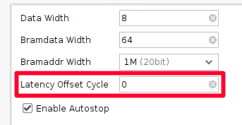

# Specifications of Ethernet Frame Capture

This document describes specifications of the Ethernet Frame Capture implemented on FPGA.

## Basic specifications

- This module outputs the input Ethernet frames as they are with zero latency.
- If the magic word generated by the ef_crafter is included in the input, the timestamp when the frame was received is recorded in the BRAM along with the ID information contained in the frame.
  - Therefore, the input protocols and frame structures that can use the timestamp recording function are limited to those that can be generated by the ef_crafter.
  - See [ef_crafter/specification.md](../ef_crafter/specification.md) for details
- Support 1000BASE-T
- Supported Ethernet frame list
  - Ethernet II
  - IEEE 802.3ac
    - Vlan tag is supported
- MTU is 1500 Byte

### Ethernet Frame Capture block diagram

- The Ethernet Frame Capture consists of the following two parts.
  - ef_capture module
    - This extracts the counter value of the time at which the beginning of AXI4-Stream passed through.
  - timestamp buffer (BRAM)
    - This records the timestamp.
- The Ethernet Frame Capture can be used in either an independent BRAM configuration, where one ef_capture uses one BRAM, or a shared BRAM configuration, where two ef_capture modules share one BRAM.

#### Independent BRAM configuration

- This configuration has a high degree of freedom in terms of what can be done, but consumes a lot of BRAM resources.

#### Shared BRAM configuration

- In this configuration, only one of the ef_capture modules can write to the BRAM, but this reduces BRAM resources.

### Timestamp structure

- The ID is used as is the value contained in the payload.
- The timestamp is the value of a 32-bit reference cycle counter that is driven by the FPGA's 125 MHz clock.
- A common reference counter is referenced even if multiple ef capture implementations are used.

### Timestamping
#### Overview

Place the ef capture at the point where you want to measure latency, and input a frame generated by the ef_crafter, and a timestamp will be automatically recorded in BRAM.
The ef capture itself has zero latency and outputs the input data as is, so it does not affect the behavior of the design.

#### Supported payload structure  

See [ef_crafter/specification.md](../ef_crafter/specification.md) for details

#### Timestamping process
1. When a frame containing a magic word is input, the ID contained in the frame and the timestamp of the time when the beginning of the frame passed are saved.
   - The ID contains the port number that identifies the ef_crafter from which the output originated, as well as the frame number that indicates which frame the ef_crafter generated
2. The timestamp saving process is performed until the BRAM free space is exhausted.
3. To save the timestamp after the BRAM free space is exhausted, the user must perform a reset process.

### Throughput measurement
#### Overview

#### Throughput calculation

1. Obtain consecutive timestamps A and B in one ef_capture and calculate the difference between the timestamps. This is the frame arrival interval I [cycles].
2. Obtain the frame size S [bytes] of timestamp A. 
   - Since the ef_capture does not have a mechanism to record the frame size, the frame size must be referenced from the ID of A. 
   - By checking the frame transmission information written to the BRAM of the ef_crafter corresponding to the `Port No.`, and by checking the payload size and protocol of the Nth frame when the `Frame No.` is N, it is possible to calculate the frame size.
3. The throughput T is T [bytes/cycle] = S / I. If the operating frequency is 125 MHz, one clock hour is 8 ns/cycle, so T' [bytes/ns] = S / (I / 8[ns/cycle]).

### Latency measurement
#### Overview

#### Latency calculation

1. Extract data with the same ID from the BRAM of the two measurement points for which you want to calculate latency.
2. The latency between the measurement points is the difference between the timestamp values of those data multiplied by 8ns.

#### Latency Correction
- If the latency measurement path is closed only inside the FPGA design, no correction process is required.
- In the case where latency is measured from the FPGA design to the outside and back, the latency that occurs inside the FPGA design must be subtracted.

##### Measure latency in FPGA design
- By finding the difference between the latency when connected to the device to be measured and the latency when directly connected with an Ethernet cable, the latency generated in the FPGA design, which is the common part, is excluded, and the latency from input to output of the desired device can be obtained.
- Since the length of the cable used affects latency, it is preferable to make the total length of the two cables used for Latency A measurement the same as the length of the cable used for Latency B measurement.
  - If they are not the same, latency errors will occur due to the difference in cable length.

A: Example of a configuration to measure target latency  
  
B: Example of a configuration to measure the latency of a direct connection  
  
C: Calculating true latency  

##### IP settings when correction values are known
If the latency within the FPGA is constant, a timestamp with the latency already corrected can be recorded by setting the correction value in the IP in advance.
- The correction value that can be entered is 0 or a positive integer, and the timestamp value added by the correction value is recorded. The timestamp is a counter value that is driven by 125 MHz clock, so a correction value of 1 corresponds to 8 ns.
- By inputting the correction value to the IP of the measurement point that passes first of the two measurement points, the difference in timestamps between the measurement points will be shortened by the correction value.  

### Register map for ef_capture module

| Name                                          | Relative Address | Type                          | Initial value   | Description                                                                                                           |
|-----------------------------------------------|------------------|-------------------------------|----------------:|-----------------------------------------------------------------------------------------------------------------------|
| command register                              | 0x0000_0000      | Unsigned Integer 32 bit (R/W) | 0x00000000      | Roles are assigned on a bit-by-bit basis as follows                                                                   |
|                                               |                  |                               |                 | [ 0]: Status reset commands        0 -> do nothing,  1 -> recording status reset                                   |
|                                               |                  |                               |                 | [ 1]: Counter reset commands       0 -> do nothing,  1 -> frame counter reset                                      |
|                                               |                  |                               |                 | [ 2]: Stop commands                0 -> do nothing,  1 -> stop recording                                           |
|                                               |                  |                               |                 | [31:3]: not used                                                                                                      |
| status register                               | 0x0000_0004      | Unsigned Integer 32 bit (R)   | 0x00000000      | 0 -> stopped (BRAM is full or a stop command has been received),  1 -> running                                        |
| frame counter register                        | 0x0000_0008      | Unsigned Integer 32 bit (R)   | 0x00000000      | frame counter value  This value indicates the number of times a frame containing the Magic word has been received. |
| BRAM counter register                         | 0x0000_000C      | Unsigned Integer 32 bit (R)   | 0x00000000      | BRAM counter value   This value indicates the address of the last BRAM written.                                    |

### Register map for BRAM

| Name                                          | Relative Address | Type                          | Initial value   | Description                                                                                           |
|-----------------------------------------------|------------------|-------------------------------|----------------:|-------------------------------------------------------------------------------------------------------|
| ID of the 1st frame                           | 0x0000_0000      | Unsigned Integer 32 bit (R)   | 0x00000000      | The upper 3 bits represent Port No. and the lower 29 bits represent Frame No.                         |
| Timestamp of the 1st frame                    | 0x0000_0004      | Unsigned Integer 32 bit (R)   | 0x00000000      | Multiply by 8 to convert to ns units.                                                                 |
| ID of the 2nd frame                           | 0x0000_0008      | Unsigned Integer 32 bit (R)   | 0x00000000      | The upper 3 bits represent Port No. and the lower 29 bits represent Frame No.                         |
| Timestamp of the 2nd frame                    | 0x0000_000C      | Unsigned Integer 32 bit (R)   | 0x00000000      | Multiply by 8 to convert to ns units.                                                                 |
| :                                             | :                | :                             | :               |                                                                                                       |

#### Note: How to run ef capture

- There is no start operation. Each time a frame containing a magic word is entered, a timestamp is recorded in BRAM and the next write address is incremented.
- The ef_capture enters the stopped state when one of the following condition met:
  - BRAM is full
  - A stop command has been received (write `0x00000004` to the relative address `0x00000000`)
- In the stopped state, no new timestamps are recorded.
  - Even when the ef_capture is in the stopped state, the frame counter will continue to increment each time a frame containing a magic word is input.
  - Frame counter can be reset by writing `0x00000002` to the relative address `0x00000000`.
- To record a new timestamp from the stopped state, write `0x00000001` to the relative address `0x00000000` and reset the ef_capture.
- If you want to perform several operations simultaneously, write the value obtained by taking the OR of each value to the relative address `0x00000000`.
