# Specifications of Ethernet Frame Crafter

This document describes specifications of the Ethernet Frame Crafter implemented on FPGA.

## Basic specifications

- This module generates and transmits frames based on the transmit frame information written to BRAM in advance
- Support 1000BASE-T and 10GBASE-T
- Supported Ethernet frame list
  - Ethernet II
  - IEEE 802.3ac
    - Vlan tag is supported
- MTU is 1500 Byte
- Supported frame size is 64 bytes to 1518 bytes
  - If a VLAN TAG is assigned, the maximum frame size is 1522 Byte
- Supported protocol is UDP or RAW IPv4 frame
  - Since the protocol number corresponding to the RAW IPv4 frame was unknown, 0xFD, which is defined for experimental use, was used
- The interval between frames to be transmitted can be adjusted in 1-cycle units, with a minimum of 20 cycles for a bus width of 8 bits and a minimum of 3 cycles for a bus width of 64 bits

### Ethernet Frame Crafter block diagram

- A Ethernet Frame Crafter consists of a combination of internal and external modules.
  - ef crafter top module
    - fetcher module
    - constructor module
      - IP address LUT (BRAM)
      - MAC address LUT (BRAM)
    - sender module
  - Frame tranmission information buffer (BRAM)
- The top module contains as many core modules (fetcher, constructor and sender) as the number of output ports, so that multiple ef crafters can be started at the same time.
- BRAM, which stores frame transmission information, is an external module whose size can be freely changed.
- BRAM, which is used as the LUT for IP and MAC addresses, is included in the ef crafter module because its size is fixed.

#### fetcher module
The fetcher module reads Frame transmission information from BRAM and handles operation control via register access.

#### constructor module
The constructor module creates a frame header and metadata (such as frame size and gap size for transmission rate adjustment) from data read from the BRAM.  
The generated frame header is 64 bytes in size, and the sender module extends frames larger than that with zero padding.

#### sender module
The sender module outputs AXI4-Stream frame data based on the frame header and metadata.

### Frame structure to be generated

#### Frame size

- The frame size is defined as from the beginning of the Ethernet frame header to the end of the FCS.

#### Header structure
Header size depends on protocol and presence of VLAN TAG.
The following four header sizes are supported.  

The detailed structure of each header is as follows.  

The following is a list of restrictions regarding the header.
For items not listed, you can set any value you like.

##### Restrictions of Ethernet II header
- Ethertype
    - Always set to `0x0800` as IPv4.

##### Restrictions of IPv4 header
- Protocol
    - In the case of UDP, `0x11` is set, and in the case of RAW, `0xFD` is set.
- CFI
    - Always set to `0`.
- TPID
    - If VLAN TAG is present, set to `0x8100`.
- Version/Length
    - Always set to `0x45`, which indicates that it is `IPv4` and that the header size is 20 (= `5` x 4) bytes.
- Services type
    - Always set to `0x00`.
- Identification
    - Always set to `0x0001`.
- Flags/Fragment offset
    - Always set to `0x0000` as fragmentation is not supported.
- TTL
    - Always set to `0x40`.

##### Restrictions of UDP header
- Checksum
    - Always set to `0x0000` as checksum calculation is omitted.

#### Payload structure

The payload begins with a 10-byte magic word and 4-byte ID information for identifying the frame.  
1. Magic word
    - String of characters `AISTSNEFCC`
2. Port number
    - A 3-bit number indicating from which ef crafter the frame was generated
3. Frame number
    - A 29-bit frame number indicating the number of the frame generated by the ef crafter

The magic word is used by the ef_capture to identify the frame to be timestamped, and the ID is saved together with the timestamp to identify which frame is being targeted.

### Frame generation
#### Overview
The ef crafter loads the 16-byte (128-bit) frame transmission information from the external BRAM to generate and transmit frames.

#### Basic function of ef crafter 
- The frames generated by the ef crafter can be broadly divided into normal frames, NOP frames, and EOL frames. 
  - Normal frames: Frames sent from the ef crafter to the outside world
  - NOP frames: Frames that are the same as normal frames, but are not sent to the outside world Used to adjust the frame interval
  - EOL frame: A special frame that indicates the end of a frame sequence
- When the ef crafter starts, it reads the frame information sequentially from the beginning of the BRAM and performs processing according to that information. When an EOL frame is reached, the ef crafter stops.
- If repeat mode is enabled when the ef crafter starts, it does not stop after reaching an EOL frame, but instead continues processing from the beginning of the BRAM again.

#### Transmission Rate Control

- The ef crafter sends frames with the minimum frame interval (equivalent to 20 bytes of IFG+Preamble), but the frame interval can be increased in the following ways
  - NOP frame
  - additional wait
- The size of the NOP frame is the same as that of a normal frame. Therefore, the minimum size is 64 Bytes.
- When additional wait is set, the frame interval after the frame is sent is increased by the specified number of cycles. Possible values are from 0 to 127.
- By using NOP frames and additional weights, any frame interval can be set and the transmission rate can be freely controlled.

### Frame transmission information structure

- EOL flag
  - When the ef crafter reads to the end of the BRAM, it returns to the beginning of the BRAM and repeats the transmission.
  - When the EOL (End of list) flag detects valid data, the operation stops at that point.
  - However, if the repeat setting is enabled, the frame transmission is repeated from the beginning of the BRAM to the frame before the data for which the EOL flag is valid.
- VLAN flag
  - When the VLAN flag is enabled, the VLAN TAG is included in the header.
  - The VLAN ID (VID) and PCP of the VLAN TAG are configurable.
- Without Magic word flag
  - If this flag is set, a string that is not recognized as a Magic word (NotMagicWD) is embedded at the beginning of the payload.  
  - Frames with this flag are normal Ethernet frames, but they are not subject to timestamp recording by the Ethernet Frame Capture.
  - Therefore, if you want to save only the timestamp of a specific frame, set this flag to other frames.
- IP address
  - For IP address, the value stored in frame transmission information is the index number of the lookup table to reduce the data volume.
  - The same lookup table is used for the source and destination.
  - The index number is 8 bits and 256 different values can be used. Since the lookup table is implemented in RAM, it can be updated to any value by rewriting registers.
- MAC address
  - Similarly, for MAC address, the value stored in frame transmission information is the index number of the lookup table to reduce the data volume, too.
  - The same lookup table is used for the source and destination.
  - The index number is 8 bits and 256 different values can be used. Since the lookup table is implemented in RAM, it can be updated to any value by rewriting registers.

#### Example of frame transmission information
- The following settings are common
  - Destination IP address is the 3rd in the table
  - Source IP address is the 5th in the table
  - Destination MAC address is the 3rd in the table
  - Source MAC address is the 5th in the table
  - Destination port number is 1234
  - Source port number is 49152
- UDP, payload size 18 Byte, without VLAN TAG
  - 0x00000000_00900404_04D20202_C0000012
- RAW, payload size 26 Byte, without VLAN TAG
  - 0x00000000_00800404_04D20202_C000001A
- UDP, payload size 1472 Byte, with VLAN TAG (PCP = 1, VID = 1)
  - 0x00000000_00990404_04D20202_C00005C0
- RAW, payload size 1480 Byte, with VLAN TAG (PCP = 1, VID = 1)
  - 0x00000000_00890404_04D20202_C00005C8
- UDP, payload size 18 Byte, without VLAN TAG, NOP frame
  - 0x00000000_00D00404_04D20202_C0000012
- UDP, payload size 18 Byte, without VLAN TAG, NOP frame, additional delay 1 cycle
  - 0x00000000_01D00404_04D20202_C0000012
- EOL frame
  - 0x00000000_00000000_00000000_00000000

Note: [FrameTransmissionInformation.xlsx](../../util/ef_crafter/FrameTransmissionInformation.xlsx) can be used for value calculations

### Register map for ef_crafter module

| Name                                          | Relative Address | Type                          | Initial value   | Description                                                                                           |
|-----------------------------------------------|------------------|-------------------------------|----------------:|-------------------------------------------------------------------------------------------------------|
| command register                              | 0x0000_0000      | Unsigned Integer 32 bit (R/W) | 0x00000000      | Roles are assigned on a bit-by-bit basis as follows                                                   |
|                                               |                  |                               |                 | [ 0]: Operation control commands for ef crafter 0       0 -> stop,  1 -> run                       |
|                                               |                  |                               |                 | [ 1]: Repeat control commands for ef crafter 0          0 -> disable repeat,  1 -> enable repeat   |
|                                               |                  |                               |                 | [ 2]: Counter reset commands for ef crafter 0      0 -> do nothing,  1 -> reset frame counter      |
|                                               |                  |                               |                 | [ 3]: Operation control commands for ef crafter 1  0 -> stop,  1 -> run                            |
|                                               |                  |                               |                 | [ 4]: Repeat control commands for ef crafter 1     0 -> disable repeat,  1 -> enable repeat        |
|                                               |                  |                               |                 | [ 5]: Counter reset commands for ef crafter 1      0 -> do nothing,  1 -> reset frame counter      |
|                                               |                  |                               |                 | [ 6]: Operation control commands for ef crafter 2  0 -> stop,  1 -> run                            |
|                                               |                  |                               |                 | [ 7]: Repeat control commands for ef crafter 2     0 -> disable repeat,  1 -> enable repeat        |
|                                               |                  |                               |                 | [ 8]: Counter reset commands for ef crafter 2      0 -> do nothing,  1 -> reset frame counter      |
|                                               |                  |                               |                 | [ 9]: Operation control commands for ef crafter 3  0 -> stop,  1 -> run                            |
|                                               |                  |                               |                 | [10]: Repeat control commands for ef crafter 3     0 -> disable repeat,  1 -> enable repeat        |
|                                               |                  |                               |                 | [11]: Counter reset commands for ef crafter 3      0 -> do nothing,  1 -> reset frame counter      |
|                                               |                  |                               |                 | [31:12]: not used                                                                                     |
| status register of ef crafter 0               | 0x0000_0004      | Unsigned Integer 32 bit (R)   | 0x00000000      | Roles are assigned on a bit-by-bit basis as follows                                                   |
|                                               |                  |                               |                 | [ 0]: Running status                                    0 -> stoped,  1 -> running                 |
|                                               |                  |                               |                 | [ 1]: Repeat status                                     0 -> repeat disable,  1 -> repeat enable   |
|                                               |                  |                               |                 | [31:2]: reserved                                                                                      |
| frame counter register of ef crafter 0        | 0x0000_0008      | Unsigned Integer 32 bit (R)   | 0x00000000      | frame counter value of ef crafter 0                                                                   |
| loop counter register of ef crafter 0         | 0x0000_000C      | Unsigned Integer 32 bit (R)   | 0x00000000      | loop counter value of ef crafter 0                                                                    |
| reserved                                      | 0x0000_0010      | Unsigned Integer 32 bit (R/W) | 0x00000000      | reserved                                                                                              |
| status register of ef crafter 1               | 0x0000_0014      | Unsigned Integer 32 bit (R)   | 0x00000000      | Roles are assigned on a bit-by-bit basis as follows                                                   |
|                                               |                  |                               |                 | [ 0]: Running status                                    0 -> stoped,  1 -> running                 |
|                                               |                  |                               |                 | [ 1]: Repeat status                                     0 -> repeat disable,  1 -> repeat enable   |
|                                               |                  |                               |                 | [31:2]: reserved                                                                                      |
| frame counter register of ef crafter 1        | 0x0000_0018      | Unsigned Integer 32 bit (R)   | 0x00000000      | frame counter value of ef crafter 1                                                                   |
| loop counter register of ef crafter 1         | 0x0000_001C      | Unsigned Integer 32 bit (R)   | 0x00000000      | loop counter value of ef crafter 1                                                                    |
| reserved                                      | 0x0000_0020      | Unsigned Integer 32 bit (R/W) | 0x00000000      | reserved                                                                                              |
| status register of ef crafter 2               | 0x0000_0024      | Unsigned Integer 32 bit (R)   | 0x00000000      | Roles are assigned on a bit-by-bit basis as follows                                                   |
|                                               |                  |                               |                 | [ 0]: Running status                                    0 -> stoped,  1 -> running                 |
|                                               |                  |                               |                 | [ 1]: Repeat status                                     0 -> repeat disable,  1 -> repeat enable   |
|                                               |                  |                               |                 | [31:2]: reserved                                                                                      |
| frame counter register of ef crafter 2        | 0x0000_0028      | Unsigned Integer 32 bit (R)   | 0x00000000      | frame counter value of ef crafter 2                                                                   |
| loop counter register of ef crafter 2         | 0x0000_002C      | Unsigned Integer 32 bit (R)   | 0x00000000      | loop counter value of ef crafter 2                                                                    |
| reserved                                      | 0x0000_0030      | Unsigned Integer 32 bit (R/W) | 0x00000000      | reserved                                                                                              |
| status register of ef crafter 3               | 0x0000_0034      | Unsigned Integer 32 bit (R)   | 0x00000000      | Roles are assigned on a bit-by-bit basis as follows                                                   |
|                                               |                  |                               |                 | [ 0]: Running status                                    0 -> stoped,  1 -> running                 |
|                                               |                  |                               |                 | [ 1]: Repeat status                                     0 -> repeat disable,  1 -> repeat enable   |
|                                               |                  |                               |                 | [31:2]: reserved                                                                                      |
| frame counter register of ef crafter 3        | 0x0000_0038      | Unsigned Integer 32 bit (R)   | 0x00000000      | frame counter value of ef crafter 3                                                                   |
| loop counter register of ef crafter 3         | 0x0000_003C      | Unsigned Integer 32 bit (R)   | 0x00000000      | loop counter value of ef crafter 3                                                                    |

### Register map for BRAM

| Name                                            | Relative Address | Type                            | Initial value   | Description                                                                                       |
|-------------------------------------------------|------------------|---------------------------------|----------------:|---------------------------------------------------------------------------------------------------
| Frame transmission information of the 1st frame | 0x0000_0000      | Unsigned Integer 128 bit (W/R)  | 0x00000000000000000000000000000000 |                                                                                |
| Frame transmission information of the 2nd frame | 0x0000_0010      | Unsigned Integer 128 bit (W/R)  | 0x00000000000000000000000000000000 |                                                                                |
| :                                               | :                | :                               | :                                  |                                                                                |

### Register map for look-up-table module of IP address

| Name                                          | Relative Address | Type                          | Initial value   | Description                                                                                           |
|-----------------------------------------------|------------------|-------------------------------|----------------:|-------------------------------------------------------------------------------------------------------|
| IP address corresponding to Index number 0    | 0x0000_0000      | Unsigned Integer 32 bit (R/W) | (*1)            |                                                                                                       |
| IP address corresponding to Index number 1    | 0x0000_0004      | Unsigned Integer 32 bit (R/W) | (*1)            |                                                                                                       |
| :                                             | :                | :                             | :               |                                                                                                       |
| IP address corresponding to Index number 255  | 0x0000_0FFC      | Unsigned Integer 32 bit (R/W) | (*1)            |                                                                                                       |

- (*1): Value defined in device/ip/efcc/ef_crafter/lut_ipaddr_rom.coe

### Register map for look-up-table module of MAC address

| Name                                          | Relative Address | Type                          | Initial value   | Description                                                                                           |
|-----------------------------------------------|------------------|-------------------------------|----------------:|-------------------------------------------------------------------------------------------------------|
| MAC address corresponding to Index number 0   | 0x0000_0000      | Unsigned Integer 64 bit (R/W) | (*2)            | Write the value to the lower 48 bits of 64 bits                                                       |
| MAC address corresponding to Index number 1   | 0x0000_0008      | Unsigned Integer 64 bit (R/W) | (*2)            | Write the value to the lower 48 bits of 64 bits                                                       |
| :                                             | :                | :                             | :               |                                                                                                       |
| MAC address corresponding to Index number 255 | 0x0000_1FF8      | Unsigned Integer 64 bit (R/W) | (*2)            | Write the value to the lower 48 bits of 64 bits                                                       |

- (*2): Value defined in device/ip/efcc/ef_crafter/lut_macaddr_rom.coe

#### Note: How to run ef crafter

- Write frame transmission information to BRAM in advance
- In order to run ef crafter 0 without repeat, write `0x00000001` to relative address `0x00000000`
  - If the least significant bit of the value read from the relative address `0x00000000` is `1`, ef crafter 0 running; if `0`, it is stopped because a EOL flag is detected.
- In order to run ef crafter 0 with repeat, write `0x00000003` to relative address `0x00000000`
  - Repeat is enabled, so it does not stop automatically. Stops by writing `0x00000000` to the relative address `0x00000000`.
- In order to run ef crafter 0 ~ 3 with repeat, write `0x00003333` to relative address `0x00000000`
  - Up to 4 ef crafters can be started simultaneously
- In order to stop all ef crafter, write `0x00000000` to relative address `0x00000000`

#### Note: How to rewrite the IP address lookup table

- In order to rewrite the IP address of index `0` to `192.168.0.1`, write `0xc0a80001` to relative address `0x00000000`

#### Note: How to rewrite the MAC address lookup table

- In order to rewrite the MAC address of index `0` to `00:1b:21:ee:a5:0c`, write `0x21eea50c` to relative address `0x00000000` and `0x0000001b` to relative address `0x00000004`

