# 10G Sample design

This document describes the design of a 10G TSN EFCC with 8 ef_crafters and 16 ef_capture implemented in FPGA.

## Overview

- This design, which implements 8 ef_crafters and 16 ef captures, is capable of measuring the latency of frames output from the ef_crafters.
- Users can connect any input port (ef_crafter or MAC RX) to any output port (MAC TX), and measure latency of any connection.
  - For details, see [Configuration examples for each use case](#configuration-examples-for-each-use-case).
- As the Alveo U45N or U250 has two QSFP28 ports, you will need to use a QSFP+ to SFP+ breakout cable to connect it to 10GbE devices.

## Requirements

The design was implemented and validated using the following environment

### Hardware

- AMD Alveo U45N (or U250)
- Cable corresponding to the destination slot
  - SFP+ (10GbE Network Switch, etc.)
    - Breakout cable: QSFP28 to SFP28 or QSFP+ to SFP+
  - QSFP28 or QSFP+ (FPGA, etc.)
    - QSFP28 cable or QSFP+ cable

### Software

- Ubuntu 20.04.3 LTS
- Vivado v2022.1
  - Set the `PATH` environment variable for Vivado properly
- CMake 3.14 or later

## Hardware Connections

- The FPGA has two QSFP28 slots
- The port numbers corresponding to each slot are as follows
  - U45N
    - The slot near the PCIe edge: Port 0, 1, 2 and 3
    - The slot far from the PCIe edge: Ports 4, 5, 6 and 7
  - U250
    - The slot near the PCIe edge: Ports 4, 5, 6 and 7
    - The slot far from the PCIe edge: Port 0, 1, 2 and 3
- Connect the QSFP+ end of the breakout cable to the FPGA and the SFP+ end to the latency target

## Notes
- This design uses the Port0 MAC-TX clock as the common clock for the FPGA logic and the Port0 MAC-TX reset as the common reset for the FPGA logic.
- Do not connect unstable devices to Port0, as this may cause the FPGA to reset. It is okay to leave Port0 unconnected.

## Difference from the design for 1G

1. Different MAC configuration
   - 1G: AMD's TEMAC IP
   - 10G: AMD's 10G Ethernet Subsystem (without MAC) IP + [Fixstars' 10G MAC IP (xg_mac)](https://github.com/fixstars/xg_mac)
2. Number of ports available
   - 1G: 4 ports
   - 10G: 8 port
3. Clock frequency
   - 1G: 125 MHz
   - 10G: 156.25 MHz
4. AXIS4-Stream data bit width
   - 1G: 8 bits / cycle
   - 10G: 64 bits / cycle
5. Number of frames (including NOP and EOL frames) that can be written to the BRAM of the ef_crafter
   - 1G: 8192 frames per port
   - 10G: 32768 frames per port
6. Number of timestamps that the ef_capture can store in BRAM
   - 1G: 32768 per port (shared between TX and RX)
   - 10G: 65536 per TX port and 65536 per RX port 
7. BRAM sharing in the ef capture
   - 1G: TX and RX share BRAM, so only one can be measured at a time
      - This is done to use the limited BRAM resources efficiently
   - 10G: TX and RX BRAM are independent, so both can be measured at the same time
8. The base address and size of the register map have been changed.
    | Register name                         | 1G base address | 1G register range | 10G base address | 10G register range | Notes                                                                 |
    |---------------------------------------|-----------------|-------------------|------------------|--------------------|-----------------------------------------------------------------------|
    | TX Timestamp 0                        | 0x4000_0000     | 256 KBytes (32768 timestamps) | 0x4000_0000      | 512 KBytes (65536 timestamps) | In 1G, the BRAM is shared, so the register address is the same as RX  |
    | TX Timestamp 1                        | 0x4100_0000     | 256 KBytes (32768 timestamps) | 0x4100_0000      | 512 KBytes (65536 timestamps) | In 1G, the BRAM is shared, so the register address is the same as RX  |
    | TX Timestamp 2                        | 0x4200_0000     | 256 KBytes (32768 timestamps) | 0x4200_0000      | 512 KBytes (65536 timestamps) | In 1G, the BRAM is shared, so the register address is the same as RX  |
    | TX Timestamp 3                        | 0x4300_0000     | 256 KBytes (32768 timestamps) | 0x4300_0000      | 512 KBytes (65536 timestamps) | In 1G, the BRAM is shared, so the register address is the same as RX  |
    | TX Timestamp 4                        | N/A             | N/A                           | 0x4400_0000      | 512 KBytes (65536 timestamps) |                                                                       |
    | TX Timestamp 5                        | N/A             | N/A                           | 0x4500_0000      | 512 KBytes (65536 timestamps) |                                                                       |
    | TX Timestamp 6                        | N/A             | N/A                           | 0x4600_0000      | 512 KBytes (65536 timestamps) |                                                                       |
    | TX Timestamp 7                        | N/A             | N/A                           | 0x4700_0000      | 512 KBytes (65536 timestamps) |                                                                       |
    | RX Timestamp 0                        | 0x4000_0000     | 256 KBytes (32768 timestamps) | 0x4080_0000      | 512 KBytes (65536 timestamps) | In 1G, the BRAM is shared, so the register address is the same as TX  |
    | RX Timestamp 1                        | 0x4100_0000     | 256 KBytes (32768 timestamps) | 0x4180_0000      | 512 KBytes (65536 timestamps) | In 1G, the BRAM is shared, so the register address is the same as TX  |
    | RX Timestamp 2                        | 0x4200_0000     | 256 KBytes (32768 timestamps) | 0x4280_0000      | 512 KBytes (65536 timestamps) | In 1G, the BRAM is shared, so the register address is the same as TX  |
    | RX Timestamp 3                        | 0x4300_0000     | 256 KBytes (32768 timestamps) | 0x4380_0000      | 512 KBytes (65536 timestamps) | In 1G, the BRAM is shared, so the register address is the same as TX  |
    | RX Timestamp 4                        | N/A             | N/A                           | 0x4480_0000      | 512 KBytes (65536 timestamps) |                                                                       |
    | RX Timestamp 5                        | N/A             | N/A                           | 0x4580_0000      | 512 KBytes (65536 timestamps) |                                                                       |
    | RX Timestamp 6                        | N/A             | N/A                           | 0x4680_0000      | 512 KBytes (65536 timestamps) |                                                                       |
    | RX Timestamp 7                        | N/A             | N/A                           | 0x4780_0000      | 512 KBytes (65536 timestamps) |                                                                       |
    | ef capture TX 0       | 0x4F00_0000     | 128 Bytes                     | 0x4F00_0000      | 128 Bytes                     | Control and status register                                           |
    | ef capture TX 1       | 0x4F01_0000     | 128 Bytes                     | 0x4F01_0000      | 128 Bytes                     | Control and status register                                           |
    | ef capture TX 2       | 0x4F02_0000     | 128 Bytes                     | 0x4F02_0000      | 128 Bytes                     | Control and status register                                           |
    | ef capture TX 3       | 0x4F03_0000     | 128 Bytes                     | 0x4F03_0000      | 128 Bytes                     | Control and status register                                           |
    | ef capture TX 4       | N/A             | N/A                           | 0x4F04_0000      | 128 Bytes                     | Control and status register                                           |
    | ef capture TX 5       | N/A             | N/A                           | 0x4F05_0000      | 128 Bytes                     | Control and status register                                           |
    | ef capture TX 6       | N/A             | N/A                           | 0x4F06_0000      | 128 Bytes                     | Control and status register                                           |
    | ef capture TX 7       | N/A             | N/A                           | 0x4F07_0000      | 128 Bytes                     | Control and status register                                           |
    | ef capture RX 0       | 0x4F04_0000     | 128 Bytes                     | 0x4F00_8000      | 128 Bytes                     | Control and status register                                           |
    | ef capture RX 1       | 0x4F05_0000     | 128 Bytes                     | 0x4F01_8000      | 128 Bytes                     | Control and status register                                           |
    | ef capture RX 2       | 0x4F06_0000     | 128 Bytes                     | 0x4F02_8000      | 128 Bytes                     | Control and status register                                           |
    | ef capture RX 3       | 0x4F07_0000     | 128 Bytes                     | 0x4F03_8000      | 128 Bytes                     | Control and status register                                           |
    | ef capture RX 4       | N/A             | N/A                           | 0x4F04_8000      | 128 Bytes                     | Control and status register                                           |
    | ef capture RX 5       | N/A             | N/A                           | 0x4F05_8000      | 128 Bytes                     | Control and status register                                           |
    | ef capture RX 6       | N/A             | N/A                           | 0x4F06_8000      | 128 Bytes                     | Control and status register                                           |
    | ef capture RX 7       | N/A             | N/A                           | 0x4F07_8000      | 128 Bytes                     | Control and status register                                           |
    | Frame transmission information 0      | 0x5000_0000     | 128 KBytes (8192 frames)      | 0x5000_0000      | 512 KBytes (32768 frames)     |                                                                       |
    | Frame transmission information 1      | 0x5100_0000     | 128 KBytes (8192 frames)      | 0x5100_0000      | 512 KBytes (32768 frames)     |                                                                       |
    | Frame transmission information 2      | 0x5200_0000     | 128 KBytes (8192 frames)      | 0x5200_0000      | 512 KBytes (32768 frames)     |                                                                       |
    | Frame transmission information 3      | 0x5300_0000     | 128 KBytes (8192 frames)      | 0x5300_0000      | 512 KBytes (32768 frames)     |                                                                       |
    | Frame transmission information 4      | N/A             | N/A                           | 0x5010_0000      | 512 KBytes (32768 frames)     |                                                                       |
    | Frame transmission information 5      | N/A             | N/A                           | 0x5110_0000      | 512 KBytes (32768 frames)     |                                                                       |
    | Frame transmission information 6      | N/A             | N/A                           | 0x5210_0000      | 512 KBytes (32768 frames)     |                                                                       |
    | Frame transmission information 7      | N/A             | N/A                           | 0x5310_0000      | 512 KBytes (32768 frames)     |                                                                       |
    | IP address Look up table 0            | 0x5400_0000     | 4 KBytes (256 indices)        | 0x5400_0000      | 4 KBytes (256 indices)        |                                                                       |
    | IP address Look up table 1            | 0x5500_0000     | 4 KBytes (256 indices)        | 0x5500_0000      | 4 KBytes (256 indices)        |                                                                       |
    | IP address Look up table 2            | 0x5600_0000     | 4 KBytes (256 indices)        | 0x5600_0000      | 4 KBytes (256 indices)        |                                                                       |
    | IP address Look up table 3            | 0x5700_0000     | 4 KBytes (256 indices)        | 0x5700_0000      | 4 KBytes (256 indices)        |                                                                       |
    | IP address Look up table 4            | N/A             | N/A                           | 0x5410_0000      | 4 KBytes (256 indices)        |                                                                       |
    | IP address Look up table 5            | N/A             | N/A                           | 0x5510_0000      | 4 KBytes (256 indices)        |                                                                       |
    | IP address Look up table 6            | N/A             | N/A                           | 0x5610_0000      | 4 KBytes (256 indices)        |                                                                       |
    | IP address Look up table 7            | N/A             | N/A                           | 0x5710_0000      | 4 KBytes (256 indices)        |                                                                       |
    | MAC address Look up table 0           | 0x5800_0000     | 8 KBytes (256 indices)        | 0x5800_0000      | 8 KBytes (256 indices)        |                                                                       |
    | MAC address Look up table 1           | 0x5900_0000     | 8 KBytes (256 indices)        | 0x5900_0000      | 8 KBytes (256 indices)        |                                                                       |
    | MAC address Look up table 2           | 0x5A00_0000     | 8 KBytes (256 indices)        | 0x5A00_0000      | 8 KBytes (256 indices)        |                                                                       |
    | MAC address Look up table 3           | 0x5B00_0000     | 8 KBytes (256 indices)        | 0x5B00_0000      | 8 KBytes (256 indices)        |                                                                       |
    | MAC address Look up table 4           | N/A             | N/A                           | 0x5810_0000      | 8 KBytes (256 indices)        |                                                                       |
    | MAC address Look up table 5           | N/A             | N/A                           | 0x5910_0000      | 8 KBytes (256 indices)        |                                                                       |
    | MAC address Look up table 6           | N/A             | N/A                           | 0x5A10_0000      | 8 KBytes (256 indices)        |                                                                       |
    | MAC address Look up table 7           | N/A             | N/A                           | 0x5B10_0000      | 8 KBytes (256 indices)        |                                                                       |
    | ef_crafter                            | 0x5F00_0000     | 128 Bytes                     | 0x5F00_0000      | 128 Bytes                     | Control and status register                                           |
    | AXI4-Stream Switch (main switch)      | 0x6000_0000     | 64 KBytes                     | 0x6000_0000      | 4 KBytes                      |                                                                       |
    | AXI4-Stream Switch (ef_crafter switch)| N/A             | N/A                           | 0x6000_1000      | 4 KBytes                      |                                                                       |

### Limitations of Maximum Execution Rate in AXI4-Stream

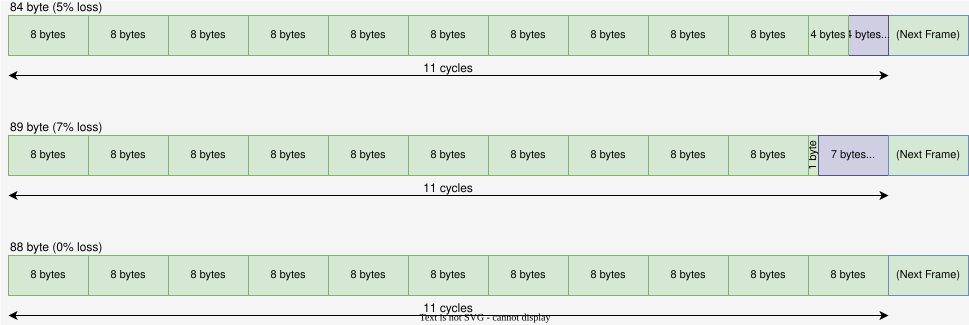

- In 10GbE, the PHY has a width of 64 bits. Each frame is divided into 64-bit data segments starting from the beginning and passed to the PHY. If the frame size at the physical layer is not a multiple of 64 bits, the remaining portion of the last 64-bit data segment is padded with zeros.
- Within the FPGA, frames are handled as 64-bit wide AXI4-Stream, but because the next frame cannot be started within the padding section, a loss of up to 7 bytes, or 56 bits, can occur depending on the frame size.
  - With the minimum frame (84 bytes at the physical layer), it consumes 11 cycles (the same number of cycles as with 88 bytes) within the FPGA, resulting in a 4-byte loss. Therefore, the maximum execution rate is approximately 95% (5% loss).
    - (10Gbps / (88 bytes x 8)) / (10Gbps / (84 bytes x 8)) = 0.9545
  - The largest loss occurs when the physical layer is 89 bytes, it consumes 12 cycles (the same number of cycles as with 96 bytes), resulting in a 7-byte loss. Therefore, the maximum execution rate of approximately 93% (7% loss).
    - (10Gbps / (96 bytes x 8)) / (10Gbps / (89 bytes x 8)) = 0.9326
  - When the physical layer is a multiple of 8 bytes, there is no loss and the maximum effective rate is 100%.

## Information for developers: Differences between U45N and U250 versions

1. PMA + PCS block configuration
   - The number of instances of the 10G Ethernet subsystem (without MAC) performing PMA + PCS processing differs because the transceiver configuration is different for each board.
     - The transceiver configuration for the U45N is GTY x1 + GTM x2, so there are three instances. 
     - The transceiver configuration for the U250 is GTY x2, so there are two instances.
2. Differences in BRAM and URAM resource allocation
   - The U250's resources are divided into multiple SLRs (Super Logic Regions), and using resources that span multiple SRLs will degrade performance.
   - The U250 reduces the number of BRAMs used and increases the number of URAMs used so that no module uses more than two SLRs.
3. Adding SLR Crossover Settings
   - As mentioned above, using resources that span SLRs reduces performance. The following is done to avoid this reduction.
     - A constraint is added to the XDC file specifying the SLRs used by the module.
     - Registers with SLR crossing settings are added to the interconnect portion of data that spans multiple SLRs.

## Block diagram


- Solid lines indicate data flow
  - Inside FPGA, data bus is AXI4-Stream 64 bit
- Dashed lines indicate clock domain boundaries
  - Inside FPGA, clock frequency is 156.25 MHz

### MAC block


- The block that bridge data between PHY and inside FPGA
  - PHY: XGMII
  - Inside FPGA : AXI4-Stream
    - The tlast signal becomes Hi in the final beat of AXI4-Stream
- Remove Preamble, SFD and PCS from input Ethernet frame
- Conversely, add Preamble, SFD and PCS to output Ethernet frame
- The inside consists of the following modules
  - [xg_mac](https://github.com/fixstars/xg_mac): 10G Ethernet MAC for Xilinx FPGA
  - 10G Ethernet Subsystem (without MAC): AMD/Xilinx official IP for 10 Gigabit Ethernet PCS/PMA

### Ref. Counter block

- This block generates reference cycle counter for each module
- The timer is managed as unsigned integer 32 bit
  - The value is zero when the power is turned on, and is incremented every one cycle
    - i.e. 1 count per 1 ps @ 156.25 MHz
  - In other words, the counter resets to 0 every 27.4 seconds, so when doing post-processing of the time stamp, it is necessary to take into account the possibility of overflow of the counter

### ef_crafter block

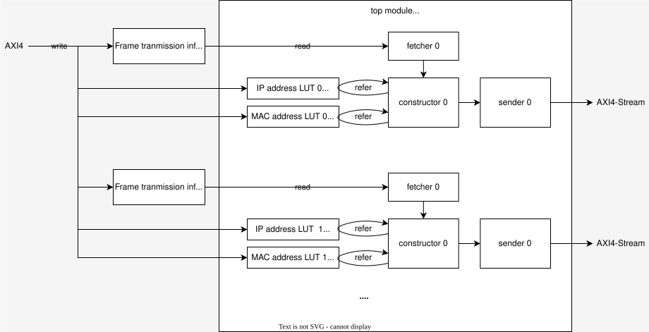

- The block generate and transmit frames based on the transmit frame information written to BRAM in advance
  - See [ef_crafter/specification.md](../ef_crafter/specification.md) for details
- The BRAM size for each ef_crafter is 512 KBytes, which can store transmission information for 32768 frames

### ef_capture block


- This block records the timestamp of the frame in which the magic word is embedded in the BRAM.
  - Each port has an independent ef_capture for TX and RX
  - TX and RX can be recorded simultaneously
  - See [ef_capture/specification.md](../ef_capture/specification.md) for details
- The BRAM size for each ef capture is 512 KBytes, which can record timestamps for 65536 frames

#### About adjusting the latency correction value
The latency correction values described in the `Latency Correction` chapter of [ef_capture/specification.md](../ef_capture/specification.md) are as follows for the U250, which uses only one type of high‑speed serial transceiver called GTY.
- U250: 81 cycles or 518.4 ns

On the other hand, the U45N uses, in addition to the same GTY as the U250, a high‑speed serial transceiver called GTM with different characteristics.  
Ports using GTM have about 17 cycles higher latency for both transmission and reception compared to ports using GTY.  
Therefore, for the U45N, the following latency correction is required depending on the combination of ports used.
- U45N (GTY -> GTY): 81 cycles or 518.4 ns (same as U250)
- U45N (GTY -> GTM): 98 cycles or 627.2 ns (+17 cycles compared to U250)
- U45N (GTM -> GTY): 98 cycles or 627.2 ns (+17 cycles compared to U250)
- U45N (GTM -> GTM): 115 cycles or 736.0 ns (+34 cycles compared to U250)

To ensure that the appropriate correction value is applied automatically, the offset value of U45N is set as follows.  
Since latency is calculated by subtracting the TX timestamp from the RX timestamp, the correction value is obtained by subtracting the RX‑side offset from the TX‑side offset,   which matches the correction value corresponding to the GT combinations mentioned above.

|                  | ef_capture offset (TX side)    | ef_capture offset (RX side)  |
| ------           | ------        | ------       |
| Port 0 - 3 (GTY) |    98 cycle   |  17 cycle    |
| Port 4 - 7 (GTM) |   115 cycle   |   0 cycle    |

Since all ports of the U250 use only GTY, the offset value for the U250 is set as follows.

|                  | ef_capture offset (TX side)    | ef_capture offset (RX side)  |
| ------           | ------        | ------       |
| Port 0 - 7 (GTY) |    81 cycle   |  0 cycle     |

These correction values are based on actual measurement results when using a 3m cable, but since the latency may change depending on the length and material of the cable, it is necessary to check whether the latency correction values are appropriate in the actual environment where it will be used.

To verify the correction value, you just need to check that the latency when the cable is directly connected is 0 cycles.  
However, because the measurement resolution is 1 cycle, the measurement will include an error of 1 cycle.

If the absolute value of the measured latency is 2 cycles or more, you will need to correct the correction value using one of the following methods.
- Change the setting value of the ef_capture IP for TX by the amount of the error, and re-implement the design.
- Adjust for the error when calculating the difference in the timestamp in the latency measurement.

#### BRAM switch

- This design has no BRAM switch.

### AXI4-Stream Switch block


- This block consists of two parts: the main switch and the ef_crafter switch.
- The reason for the two separate blocks is that the AXI4-Stream Switch IP used has a maximum number of 16 output ports and it was not possible to switch inputs and drop unused inputs at the same time.
- The internals consist of the following modules
  - AXI4 stream switch: official AMD/Xilinx Ethernet MAC layer IP
  - Frame Dropper: In-house developed frame dropper IP


- The main switch dynamically switches which of the eight MAC inputs and eight ef_crafters are output to which MAC.
- It also drops MAC RX inputs when they are not in use.
- The drop ports are used from the most recent to the oldest, so which MAC inputs are connected depends on the configuration.


- When the ef_crafter input is in use, the ef_crafter switch outputs the ef_crafter input from the port with the same number as the input.
- When the ef_crafter is not in use, it is connected to the drop port with the corresponding number and the input is dropped.
- The ef_crafter switch does not change the port number, so each input has two options: it can be connected to the main switch or it can be dropped.

### How to configure two AXI4-Stream Switches
- The main switch is used in the same way as the 1G design.
- The only difference is that you don't need to connect it to the drop port even if you are not using the ef_crafter input.
- The ef_crafter switch must switch between outputting the input to the main switch and dropping it, depending on whether each ef_crafter input is used by the main switch or not.
- To avoid configuration errors it is strongly recommended to use the helper script described below.
  - The output destination is specified by the helper script runtime argument ([config_axis_switch_10g.tcl](... /... /util/ef_crafter/config_axis_switch_10g.tcl)).
  - The user **MUST**  call a helper script after writing the bitstream.
    - If the helper script is not called, the behaviour of the switch is undefined.
  - The helper script can be found in [config_axis_switch_10g.tcl](../../util/ef_crafter/config_axis_switch_10g.tcl) in the comments.

## Helper scripts
- Helper scripts are provided to make it easy to set up the ef_crafter and ef capture.
- See below for instructions on how to use them.
  - [Helper scripts for ef_crafter](../../util/ef_crafter/README.md)
  - [Helper scripts for ef capture](../../util/ef_capture/README.md)
  - [Python scripts for ef_crafter and ef capture](../../util/common/README.md)
- Note: There is a Python module that can do the same or more than the helper script. Please see the [Jupyter Notebook example](../../example_10g/README.md) for usage.

## Basic uses of this design
1. Connect the Ethernet ports of the TSN EFCC to the Ethernet ports of the target for latency measurement
2. Write bitstream to FPGA
   - U45N
     - build-device/vivado/sample_design-10g/sample_design-10g_u45n.prj/sample_design-10g_u45n.runs/impl_1/design_1_wrapper.bit
   - U250
     - build-device/vivado/sample_design-10g/sample_design-10g_u250.prj/sample_design-10g_u250.runs/impl_1/design_1_wrapper.bit
3. Write frame transmission information to BRAM to update FDB
   - Ports on TSN Switch connected to this design will not have FDB automatically updated
   ```sh
   $ xsdb write_frameinfo.tcl
   ```
4. Configure AXI4-Stream Switch (*1)
   ```sh
   $ xsdb config_axis_switch_10g.tcl <arguments>
   ```
5. Run all ef_crafter without repeats
   ```sh
   $ xsdb control_ef_crafter_10g.tcl 0xFF
   ```
6. Reset BRAM write status of the ef_capture
   ```sh
   $ xsdb send_command.tcl 1 1
   ```
7. Write frame transmission information to BRAM for what you want to measure latency
   ```sh
   $ xsdb write_frameinfo.tcl
   ```
8. Run all ef_crafter with repeats
   ```sh
   $ xsdb control_ef_crafter_10g 0xFF 0xFF
   ```
9. Read out the timestamps on the host PC
   Timestamp of port 0
   ```sh
   $ xsdb get_timestamp.tcl 0x40000000 65536
   ```
   Timestamp of port 1
   ```sh
   $ xsdb get_timestamp.tcl 0x41000000 65536
   ```
   Timestamp of port 2
   ```sh
   $ xsdb get_timestamp.tcl 0x42000000 65536
   ```
   Timestamp of port 3
   ```sh
   $ xsdb get_timestamp.tcl 0x43000000 65536
   ```
   Timestamp of port 4
   ```sh
   $ xsdb get_timestamp.tcl 0x44000000 65536
   ```
   Timestamp of port 5
   ```sh
   $ xsdb get_timestamp.tcl 0x45000000 65536
   ```
   Timestamp of port 6
   ```sh
   $ xsdb get_timestamp.tcl 0x46000000 65536
   ```
   Timestamp of port 7
   ```sh
   $ xsdb get_timestamp.tcl 0x47000000 65536
   ```
10. Perform post-processing and calculate the throughput and latency of the host PC
   Note: [postprocessing.xlsx](../../util/ef_capture/postprocessing.xlsx) can be used for post processing of timestamps
[ef_capture/specification.md](../ef_capture/specification.md)
- (*1): See [Configuration examples for each use case](#configuration-examples-for-each-use-case) for arguments
- Note: There is a Python module that can do the same or more than the helper script. Please see the [Jupyter Notebook example](../../example_10g/README.md) for usage.

## Configuration examples for each use case
### Use case 1

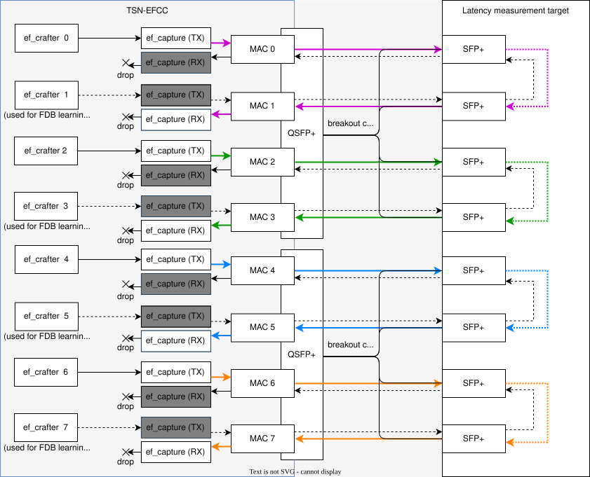

#### Description
- In this use case, the latency of the following two independent communication channels is measured.
   - MAC 0 -> target -> MAC 1
   - MAC 2 -> target -> MAC 3
   - MAC 4 -> target -> MAC 5
   - MAC 6 -> target -> MAC 7

#### Register Configuration
##### AXI4-Stream Switch
- All MAC inputs are set to `-1` because they are not used.
- The eight ef_crafters are connected to the MAC outputs with the same number.
  - The odd numbered ef_crafters are only used to learn the MAC addresses of the measurement target, so they are not used for the latency measurement itself.
```sh
$ xsdb config_axis_switch_10g.tcl -1 -1 -1 -1 -1 -1 -1 -1 0 1 2 3 4 5 6 7
```

### Use case 2

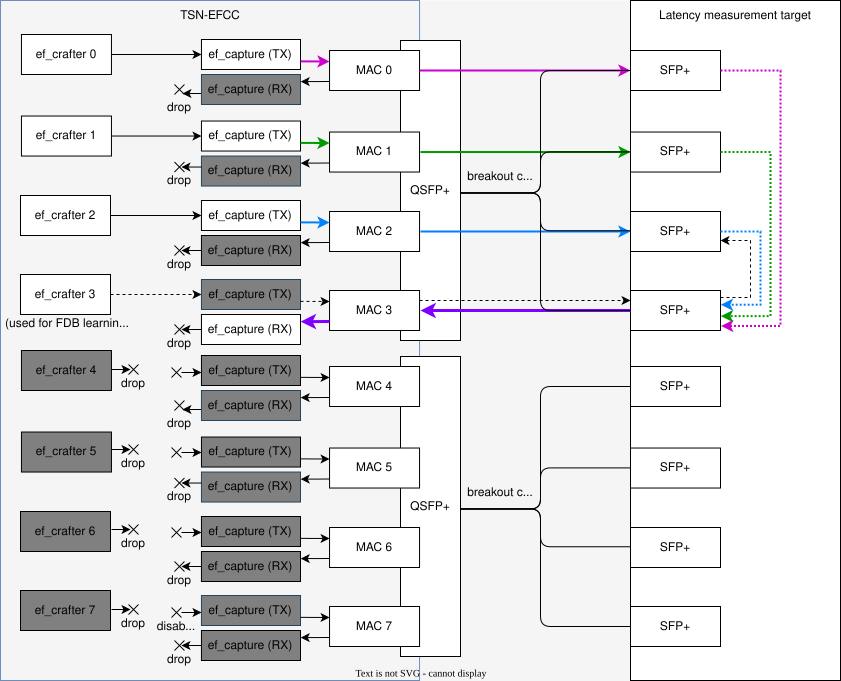

#### Description
- In this use case, three different latencies are measured until the data input to the three ports of the measurement target is output from one common port.
   - MAC 0 -> target -> MAC 3
   - MAC 1 -> target -> MAC 3
   - MAC 2 -> target -> MAC 3
- The data generated by the three ef_crafters are recorded with the ef capture of MAC 0 to MAC 2, respectively, before being output.
- By setting the latency measument target to output all input frames to MAC3, the ef capture of MAC 3 records all received times.

#### Register Configuration
##### AXI4-Stream Switch
- All eight MAC inputs are set to `-1` in order to drop them.
- The four ef_crafters from 0 to 3 are connected in order to the outputs of MAC 0 to MAC 3.
- The remaining four ef_crafters are not used, so set `-1` to drop them.
```sh
$ xsdb config_axis_switch_10g.tcl -1 -1 -1 -1 -1 -1 -1 -1 0 1 2 3 -1 -1 -1 -1
```

### Use case 3

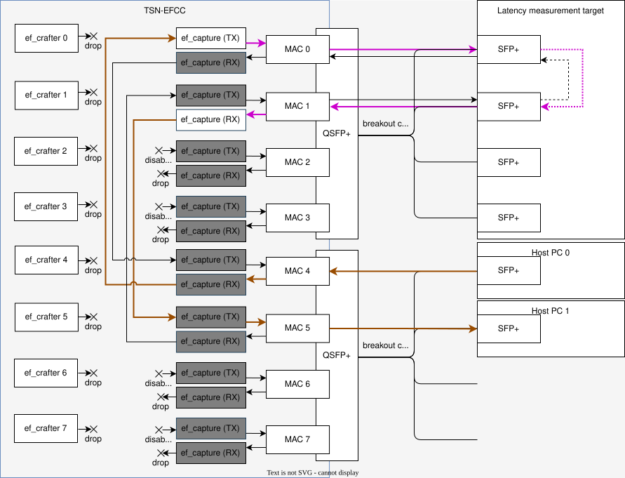

#### Description
- In this use case, the one-way latency that occurs when Host PC 0 communicates with Host PC 1 is measured.
   ```mermaid
   graph LR

   Host0-->target-->Host1
   style Host0 fill:#A0A0A0
   style Host1 fill:#A0A0A0
   ```
- To do this, the connection is made as follows.
   ```mermaid
   graph LR

   Host0-->MAC4-->MAC0-->target-->MAC1-->MAC5-->Host1
   style Host0 fill:#A0A0A0
   style Host1 fill:#A0A0A0
   ```
- MAC 0 and MAC 1, which are close to the target, are used for time stamp recording, and MAC 4 and MAC 5 are not used.
- In order to use the ef_capture, it is necessary to send a frame containing a magic word, so we will use [Scapy](https://scapy.net/) to generate a frame.  
The following is an example Python script that generates and sends a UDP frame with a magic word.
   ```python
   from scapy.all import *

   port_id=0

   dst_ip="192.168.1.2"
   send_if="enp1s0"

   payload_size=1472

   dst_port=123

   protocol=1  # 0: RAW IPv4 frame, 1: UDP frame

   use_vlan=False
   vlan_pcp=0 # 0-7 (3 bit)
   vlan_id=0  # 0-4095 (12 bit)

   for fcnt in range(1):
      num = port_id * 2 ** 29 + fcnt
      binary = num.to_bytes(4,'little')
      if protocol:  # UDP frame
         if use_vlan:
            frame1 = Ether()/Dot1Q(prio=vlan_pcp, vlan=vlan_id)/IP(dst=dst_ip)/UDP(dport=dst_port)/Raw(load="AISTSNEFCC")/Raw(load=binary)/Raw(RandString(size=payload_size-14))
         else:
            frame1 = Ether()/IP(dst=dst_ip)/UDP(dport=dst_port)/Raw(load="AISTSNEFCC")/Raw(load=binary)/Raw(RandString(size=payload_size-14))
      else:         # RAW IPv4 frame
         if use_vlan:
            frame1 = Ether()/Dot1Q(prio=vlan_pcp, vlan=vlan_id)/IP(dst=dst_ip)/Raw(load="AISTSNEFCC")/Raw(load=binary)/Raw(RandString(size=payload_size_byte-14))
         else:
            frame1 = Ether()/IP(dst=dst_ip)/Raw(load="AISTSNEFCC")/Raw(load=binary)/Raw(RandString(size=payload_size_byte-14))

      sendp(frame1,iface=send_if)
   ```

#### Register Configuration
##### AXI4-Stream Switch
- To allow bidirectional communication between NIC 0 and NIC 1 of the Host PC via the TSN EFCC and the measurement target, the following connection should be made.
   - MAC0 RX -> MAC4 TX
   - MAC1 RX -> MAC5 TX
   - MAC4 RX -> MAC0 TX
   - MAC5 RX -> MAC1 TX
- Drop all ef_crafter inputs.
```sh
$ xsdb config_axis_switch_10g.tcl 4 5 -1 -1 0 1 -1 -1 -1 -1 -1 -1 -1 -1 -1 -1
```

### Use case 4

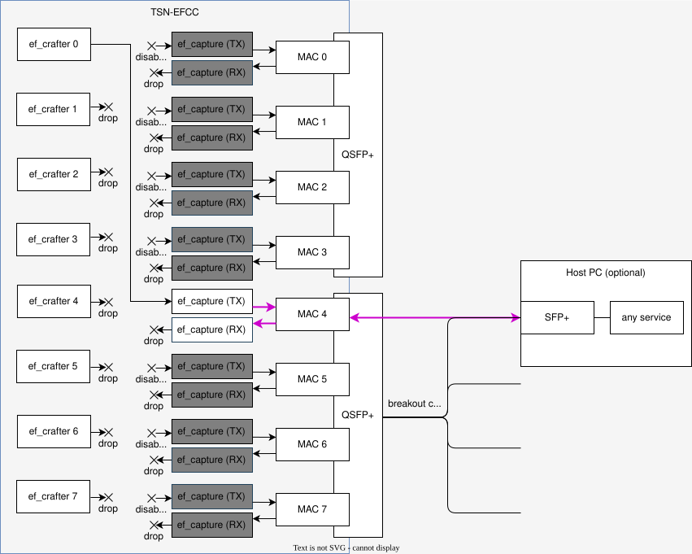

#### Description
- In this use case, a round-trip latency is measured from sending a frame to the latency measurement target, such as an echo server, to receiving it back.
- In this design, both the TX and RX timestamps can be recorded in MAC 0.
- The MAC 4 RX can also be output to another port for connection to another device.

#### Register Configuration
##### AXI4-Stream Switch
- Drop all MAC inputs.
- Connect ef_crafter 0 to MAC 4 TX and drop the other ef_crafters.
```sh
$ xsdb config_axis_switch_10g.tcl -1 -1 -1 -1 -1 -1 -1 -1 4 -1 -1 -1 -1 -1 -1 -1
```

## Register map
- For the differences between 1G and this design, see [Difference from the design for 1G](#difference-from-the-design-for-1g)


| Name                                                    | Register Address | Type                          | Initial value   | Description                                                                                                                |
|---------------------------------------------------------|------------------|-------------------------------|----------------:|----------------------------------------------------------------------------------------------------------------------------|
| Commit hash                                             | 0x0010_0000      | Hexadecimal 32 bit (R)        | -               | The 8-digit Git commit hash used to build the bitstream                                                                    |
| Timestamp (port 0 TX)                                   | 0x4000_0000      | -                             | -               | Include following registers                                                                                                |
|  ├ ID (1st frame)                                       |  ├ + 0x0_0000    | Unsigned Integer 32 bit (R)   | 0x00000000      | The upper 3 bits represent Port No. and the lower 29 bits represent Frame No.                                              |
|  ├ Timestamp (1st frame)                                |  ├ + 0x0_0004    | Unsigned Integer 32 bit (R)   | 0x00000000      | Multiply by 8 to convert to ns units.                                                                                      |
|  ├ ID (2nd frame)                                       |  ├ + 0x0_0008    | Unsigned Integer 32 bit (R)   | 0x00000000      | The upper 3 bits represent Port No. and the lower 29 bits represent Frame No.                                              |
|  ├ Timestamp (2nd frame)                                |  ├ + 0x0_000C    | Unsigned Integer 32 bit (R)   | 0x00000000      | Multiply by 8 to convert to ns units.                                                                                      |
|    ...                                                  |     ...          | ...                           | ...             | ...                                                                                                                        |
|  ├ ID (65536th frame)                                   |  ├ + 0x7_FFF8    | Unsigned Integer 32 bit (R)   | 0x00000000      | The upper 3 bits represent Port No. and the lower 29 bits represent Frame No.                                              |
|  ├ Timestamp (65536th frame)                            |  ├ + 0x7_FFFC    | Unsigned Integer 32 bit (R)   | 0x00000000      | Multiply by 8 to convert to ns units.                                                                                      |
| Timestamp (port 0 RX)                                   | 0x4080_0000      | -                             | -               | Include following registers                                                                                                |
|  ├ ID (1st frame)                                       |  ├ + 0x0_0000    | Unsigned Integer 32 bit (R)   | 0x00000000      | The upper 3 bits represent Port No. and the lower 29 bits represent Frame No.                                              |
|  ├ Timestamp (1st frame)                                |  ├ + 0x0_0004    | Unsigned Integer 32 bit (R)   | 0x00000000      | Multiply by 8 to convert to ns units.                                                                                      |
|  ├ ID (2nd frame)                                       |  ├ + 0x0_0008    | Unsigned Integer 32 bit (R)   | 0x00000000      | The upper 3 bits represent Port No. and the lower 29 bits represent Frame No.                                              |
|  ├ Timestamp (2nd frame)                                |  ├ + 0x0_000C    | Unsigned Integer 32 bit (R)   | 0x00000000      | Multiply by 8 to convert to ns units.                                                                                      |
|    ...                                                  |     ...          | ...                           | ...             | ...                                                                                                                        |
|  ├ ID (65536th frame)                                   |  ├ + 0x7_FFF8    | Unsigned Integer 32 bit (R)   | 0x00000000      | The upper 3 bits represent Port No. and the lower 29 bits represent Frame No.                                              |
|  ├ Timestamp (65536th frame)                            |  ├ + 0x7_FFFC    | Unsigned Integer 32 bit (R)   | 0x00000000      | Multiply by 8 to convert to ns units.                                                                                      |
| Timestamp (port 1 TX)                                   | 0x4100_0000      | -                             | -               | Include following registers                                                                                                |
|  ├ ID (1st frame)                                       |  ├ + 0x0_0000    | Unsigned Integer 32 bit (R)   | 0x00000000      | The upper 3 bits represent Port No. and the lower 29 bits represent Frame No.                                              |
|  ├ Timestamp (1st frame)                                |  ├ + 0x0_0004    | Unsigned Integer 32 bit (R)   | 0x00000000      | Multiply by 8 to convert to ns units.                                                                                      |
|  ├ ID (2nd frame)                                       |  ├ + 0x0_0008    | Unsigned Integer 32 bit (R)   | 0x00000000      | The upper 3 bits represent Port No. and the lower 29 bits represent Frame No.                                              |
|  ├ Timestamp (2nd frame)                                |  ├ + 0x0_000C    | Unsigned Integer 32 bit (R)   | 0x00000000      | Multiply by 8 to convert to ns units.                                                                                      |
|    ...                                                  |     ...          | ...                           | ...             | ...                                                                                                                        |
|  ├ ID (65536th frame)                                   |  ├ + 0x7_FFF8    | Unsigned Integer 32 bit (R)   | 0x00000000      | The upper 3 bits represent Port No. and the lower 29 bits represent Frame No.                                              |
|  ├ Timestamp (65536th frame)                            |  ├ + 0x7_FFFC    | Unsigned Integer 32 bit (R)   | 0x00000000      | Multiply by 8 to convert to ns units.                                                                                      |
| Timestamp (port 1 RX)                                   | 0x4180_0000      | -                             | -               | Include following registers                                                                                                |
|  ├ ID (1st frame)                                       |  ├ + 0x0_0000    | Unsigned Integer 32 bit (R)   | 0x00000000      | The upper 3 bits represent Port No. and the lower 29 bits represent Frame No.                                              |
|  ├ Timestamp (1st frame)                                |  ├ + 0x0_0004    | Unsigned Integer 32 bit (R)   | 0x00000000      | Multiply by 8 to convert to ns units.                                                                                      |
|  ├ ID (2nd frame)                                       |  ├ + 0x0_0008    | Unsigned Integer 32 bit (R)   | 0x00000000      | The upper 3 bits represent Port No. and the lower 29 bits represent Frame No.                                              |
|  ├ Timestamp (2nd frame)                                |  ├ + 0x0_000C    | Unsigned Integer 32 bit (R)   | 0x00000000      | Multiply by 8 to convert to ns units.                                                                                      |
|    ...                                                  |     ...          | ...                           | ...             | ...                                                                                                                        |
|  ├ ID (65536th frame)                                   |  ├ + 0x7_FFF8    | Unsigned Integer 32 bit (R)   | 0x00000000      | The upper 3 bits represent Port No. and the lower 29 bits represent Frame No.                                              |
|  ├ Timestamp (65536th frame)                            |  ├ + 0x7_FFFC    | Unsigned Integer 32 bit (R)   | 0x00000000      | Multiply by 8 to convert to ns units.                                                                                      |
| Timestamp (port 2 TX)                                   | 0x4200_0000      | -                             | -               | Include following registers                                                                                                |
|  ├ ID (1st frame)                                       |  ├ + 0x0_0000    | Unsigned Integer 32 bit (R)   | 0x00000000      | The upper 3 bits represent Port No. and the lower 29 bits represent Frame No.                                              |
|  ├ Timestamp (1st frame)                                |  ├ + 0x0_0004    | Unsigned Integer 32 bit (R)   | 0x00000000      | Multiply by 8 to convert to ns units.                                                                                      |
|  ├ ID (2nd frame)                                       |  ├ + 0x0_0008    | Unsigned Integer 32 bit (R)   | 0x00000000      | The upper 3 bits represent Port No. and the lower 29 bits represent Frame No.                                              |
|  ├ Timestamp (2nd frame)                                |  ├ + 0x0_000C    | Unsigned Integer 32 bit (R)   | 0x00000000      | Multiply by 8 to convert to ns units.                                                                                      |
|    ...                                                  |     ...          | ...                           | ...             | ...                                                                                                                        |
|  ├ ID (65536th frame)                                   |  ├ + 0x7_FFF8    | Unsigned Integer 32 bit (R)   | 0x00000000      | The upper 3 bits represent Port No. and the lower 29 bits represent Frame No.                                              |
|  ├ Timestamp (65536th frame)                            |  ├ + 0x7_FFFC    | Unsigned Integer 32 bit (R)   | 0x00000000      | Multiply by 8 to convert to ns units.                                                                                      |
| Timestamp (port 2 RX)                                   | 0x4280_0000      | -                             | -               | Include following registers                                                                                                |
|  ├ ID (1st frame)                                       |  ├ + 0x0_0000    | Unsigned Integer 32 bit (R)   | 0x00000000      | The upper 3 bits represent Port No. and the lower 29 bits represent Frame No.                                              |
|  ├ Timestamp (1st frame)                                |  ├ + 0x0_0004    | Unsigned Integer 32 bit (R)   | 0x00000000      | Multiply by 8 to convert to ns units.                                                                                      |
|  ├ ID (2nd frame)                                       |  ├ + 0x0_0008    | Unsigned Integer 32 bit (R)   | 0x00000000      | The upper 3 bits represent Port No. and the lower 29 bits represent Frame No.                                              |
|  ├ Timestamp (2nd frame)                                |  ├ + 0x0_000C    | Unsigned Integer 32 bit (R)   | 0x00000000      | Multiply by 8 to convert to ns units.                                                                                      |
|    ...                                                  |     ...          | ...                           | ...             | ...                                                                                                                        |
|  ├ ID (65536th frame)                                   |  ├ + 0x7_FFF8    | Unsigned Integer 32 bit (R)   | 0x00000000      | The upper 3 bits represent Port No. and the lower 29 bits represent Frame No.                                              |
|  ├ Timestamp (65536th frame)                            |  ├ + 0x7_FFFC    | Unsigned Integer 32 bit (R)   | 0x00000000      | Multiply by 8 to convert to ns units.                                                                                      |
| Timestamp (port 3 TX)                                   | 0x4300_0000      | -                             | -               | Include following registers                                                                                                |
|  ├ ID (1st frame)                                       |  ├ + 0x0_0000    | Unsigned Integer 32 bit (R)   | 0x00000000      | The upper 3 bits represent Port No. and the lower 29 bits represent Frame No.                                              |
|  ├ Timestamp (1st frame)                                |  ├ + 0x0_0004    | Unsigned Integer 32 bit (R)   | 0x00000000      | Multiply by 8 to convert to ns units.                                                                                      |
|  ├ ID (2nd frame)                                       |  ├ + 0x0_0008    | Unsigned Integer 32 bit (R)   | 0x00000000      | The upper 3 bits represent Port No. and the lower 29 bits represent Frame No.                                              |
|  ├ Timestamp (2nd frame)                                |  ├ + 0x0_000C    | Unsigned Integer 32 bit (R)   | 0x00000000      | Multiply by 8 to convert to ns units.                                                                                      |
|    ...                                                  |     ...          | ...                           | ...             | ...                                                                                                                        |
|  ├ ID (65536th frame)                                   |  ├ + 0x7_FFF8    | Unsigned Integer 32 bit (R)   | 0x00000000      | The upper 3 bits represent Port No. and the lower 29 bits represent Frame No.                                              |
|  ├ Timestamp (65536th frame)                            |  ├ + 0x7_FFFC    | Unsigned Integer 32 bit (R)   | 0x00000000      | Multiply by 8 to convert to ns units.                                                                                      |
| Timestamp (port 3 RX)                                   | 0x4380_0000      | -                             | -               | Include following registers                                                                                                |
|  ├ ID (1st frame)                                       |  ├ + 0x0_0000    | Unsigned Integer 32 bit (R)   | 0x00000000      | The upper 3 bits represent Port No. and the lower 29 bits represent Frame No.                                              |
|  ├ Timestamp (1st frame)                                |  ├ + 0x0_0004    | Unsigned Integer 32 bit (R)   | 0x00000000      | Multiply by 8 to convert to ns units.                                                                                      |
|  ├ ID (2nd frame)                                       |  ├ + 0x0_0008    | Unsigned Integer 32 bit (R)   | 0x00000000      | The upper 3 bits represent Port No. and the lower 29 bits represent Frame No.                                              |
|  ├ Timestamp (2nd frame)                                |  ├ + 0x0_000C    | Unsigned Integer 32 bit (R)   | 0x00000000      | Multiply by 8 to convert to ns units.                                                                                      |
|    ...                                                  |     ...          | ...                           | ...             | ...                                                                                                                        |
|  ├ ID (65536th frame)                                   |  ├ + 0x7_FFF8    | Unsigned Integer 32 bit (R)   | 0x00000000      | The upper 3 bits represent Port No. and the lower 29 bits represent Frame No.                                              |
|  ├ Timestamp (65536th frame)                            |  ├ + 0x7_FFFC    | Unsigned Integer 32 bit (R)   | 0x00000000      | Multiply by 8 to convert to ns units.                                                                                      |
| Timestamp (port 4 TX)                                   | 0x4400_0000      | -                             | -               | Include following registers                                                                                                |
|  ├ ID (1st frame)                                       |  ├ + 0x0_0000    | Unsigned Integer 32 bit (R)   | 0x00000000      | The upper 3 bits represent Port No. and the lower 29 bits represent Frame No.                                              |
|  ├ Timestamp (1st frame)                                |  ├ + 0x0_0004    | Unsigned Integer 32 bit (R)   | 0x00000000      | Multiply by 8 to convert to ns units.                                                                                      |
|  ├ ID (2nd frame)                                       |  ├ + 0x0_0008    | Unsigned Integer 32 bit (R)   | 0x00000000      | The upper 3 bits represent Port No. and the lower 29 bits represent Frame No.                                              |
|  ├ Timestamp (2nd frame)                                |  ├ + 0x0_000C    | Unsigned Integer 32 bit (R)   | 0x00000000      | Multiply by 8 to convert to ns units.                                                                                      |
|    ...                                                  |     ...          | ...                           | ...             | ...                                                                                                                        |
|  ├ ID (65536th frame)                                   |  ├ + 0x7_FFF8    | Unsigned Integer 32 bit (R)   | 0x00000000      | The upper 3 bits represent Port No. and the lower 29 bits represent Frame No.                                              |
|  ├ Timestamp (65536th frame)                            |  ├ + 0x7_FFFC    | Unsigned Integer 32 bit (R)   | 0x00000000      | Multiply by 8 to convert to ns units.                                                                                      |
| Timestamp (port 4 RX)                                   | 0x4480_0000      | -                             | -               | Include following registers                                                                                                |
|  ├ ID (1st frame)                                       |  ├ + 0x0_0000    | Unsigned Integer 32 bit (R)   | 0x00000000      | The upper 3 bits represent Port No. and the lower 29 bits represent Frame No.                                              |
|  ├ Timestamp (1st frame)                                |  ├ + 0x0_0004    | Unsigned Integer 32 bit (R)   | 0x00000000      | Multiply by 8 to convert to ns units.                                                                                      |
|  ├ ID (2nd frame)                                       |  ├ + 0x0_0008    | Unsigned Integer 32 bit (R)   | 0x00000000      | The upper 3 bits represent Port No. and the lower 29 bits represent Frame No.                                              |
|  ├ Timestamp (2nd frame)                                |  ├ + 0x0_000C    | Unsigned Integer 32 bit (R)   | 0x00000000      | Multiply by 8 to convert to ns units.                                                                                      |
|    ...                                                  |     ...          | ...                           | ...             | ...                                                                                                                        |
|  ├ ID (65536th frame)                                   |  ├ + 0x7_FFF8    | Unsigned Integer 32 bit (R)   | 0x00000000      | The upper 3 bits represent Port No. and the lower 29 bits represent Frame No.                                              |
|  ├ Timestamp (65536th frame)                            |  ├ + 0x7_FFFC    | Unsigned Integer 32 bit (R)   | 0x00000000      | Multiply by 8 to convert to ns units.                                                                                      |
| Timestamp (port 5 TX)                                   | 0x4500_0000      | -                             | -               | Include following registers                                                                                                |
|  ├ ID (1st frame)                                       |  ├ + 0x0_0000    | Unsigned Integer 32 bit (R)   | 0x00000000      | The upper 3 bits represent Port No. and the lower 29 bits represent Frame No.                                              |
|  ├ Timestamp (1st frame)                                |  ├ + 0x0_0004    | Unsigned Integer 32 bit (R)   | 0x00000000      | Multiply by 8 to convert to ns units.                                                                                      |
|  ├ ID (2nd frame)                                       |  ├ + 0x0_0008    | Unsigned Integer 32 bit (R)   | 0x00000000      | The upper 3 bits represent Port No. and the lower 29 bits represent Frame No.                                              |
|  ├ Timestamp (2nd frame)                                |  ├ + 0x0_000C    | Unsigned Integer 32 bit (R)   | 0x00000000      | Multiply by 8 to convert to ns units.                                                                                      |
|    ...                                                  |     ...          | ...                           | ...             | ...                                                                                                                        |
|  ├ ID (65536th frame)                                   |  ├ + 0x7_FFF8    | Unsigned Integer 32 bit (R)   | 0x00000000      | The upper 3 bits represent Port No. and the lower 29 bits represent Frame No.                                              |
|  ├ Timestamp (65536th frame)                            |  ├ + 0x7_FFFC    | Unsigned Integer 32 bit (R)   | 0x00000000      | Multiply by 8 to convert to ns units.                                                                                      |
| Timestamp (port 5 RX)                                   | 0x4580_0000      | -                             | -               | Include following registers                                                                                                |
|  ├ ID (1st frame)                                       |  ├ + 0x0_0000    | Unsigned Integer 32 bit (R)   | 0x00000000      | The upper 3 bits represent Port No. and the lower 29 bits represent Frame No.                                              |
|  ├ Timestamp (1st frame)                                |  ├ + 0x0_0004    | Unsigned Integer 32 bit (R)   | 0x00000000      | Multiply by 8 to convert to ns units.                                                                                      |
|  ├ ID (2nd frame)                                       |  ├ + 0x0_0008    | Unsigned Integer 32 bit (R)   | 0x00000000      | The upper 3 bits represent Port No. and the lower 29 bits represent Frame No.                                              |
|  ├ Timestamp (2nd frame)                                |  ├ + 0x0_000C    | Unsigned Integer 32 bit (R)   | 0x00000000      | Multiply by 8 to convert to ns units.                                                                                      |
|    ...                                                  |     ...          | ...                           | ...             | ...                                                                                                                        |
|  ├ ID (65536th frame)                                   |  ├ + 0x7_FFF8    | Unsigned Integer 32 bit (R)   | 0x00000000      | The upper 3 bits represent Port No. and the lower 29 bits represent Frame No.                                              |
|  ├ Timestamp (65536th frame)                            |  ├ + 0x7_FFFC    | Unsigned Integer 32 bit (R)   | 0x00000000      | Multiply by 8 to convert to ns units.                                                                                      |
| Timestamp (port 6 TX)                                   | 0x4600_0000      | -                             | -               | Include following registers                                                                                                |
|  ├ ID (1st frame)                                       |  ├ + 0x0_0000    | Unsigned Integer 32 bit (R)   | 0x00000000      | The upper 3 bits represent Port No. and the lower 29 bits represent Frame No.                                              |
|  ├ Timestamp (1st frame)                                |  ├ + 0x0_0004    | Unsigned Integer 32 bit (R)   | 0x00000000      | Multiply by 8 to convert to ns units.                                                                                      |
|  ├ ID (2nd frame)                                       |  ├ + 0x0_0008    | Unsigned Integer 32 bit (R)   | 0x00000000      | The upper 3 bits represent Port No. and the lower 29 bits represent Frame No.                                              |
|  ├ Timestamp (2nd frame)                                |  ├ + 0x0_000C    | Unsigned Integer 32 bit (R)   | 0x00000000      | Multiply by 8 to convert to ns units.                                                                                      |
|    ...                                                  |     ...          | ...                           | ...             | ...                                                                                                                        |
|  ├ ID (65536th frame)                                   |  ├ + 0x7_FFF8    | Unsigned Integer 32 bit (R)   | 0x00000000      | The upper 3 bits represent Port No. and the lower 29 bits represent Frame No.                                              |
|  ├ Timestamp (65536th frame)                            |  ├ + 0x7_FFFC    | Unsigned Integer 32 bit (R)   | 0x00000000      | Multiply by 8 to convert to ns units.                                                                                      |
| Timestamp (port 6 RX)                                   | 0x4680_0000      | -                             | -               | Include following registers                                                                                                |
|  ├ ID (1st frame)                                       |  ├ + 0x0_0000    | Unsigned Integer 32 bit (R)   | 0x00000000      | The upper 3 bits represent Port No. and the lower 29 bits represent Frame No.                                              |
|  ├ Timestamp (1st frame)                                |  ├ + 0x0_0004    | Unsigned Integer 32 bit (R)   | 0x00000000      | Multiply by 8 to convert to ns units.                                                                                      |
|  ├ ID (2nd frame)                                       |  ├ + 0x0_0008    | Unsigned Integer 32 bit (R)   | 0x00000000      | The upper 3 bits represent Port No. and the lower 29 bits represent Frame No.                                              |
|  ├ Timestamp (2nd frame)                                |  ├ + 0x0_000C    | Unsigned Integer 32 bit (R)   | 0x00000000      | Multiply by 8 to convert to ns units.                                                                                      |
|    ...                                                  |     ...          | ...                           | ...             | ...                                                                                                                        |
|  ├ ID (65536th frame)                                   |  ├ + 0x7_FFF8    | Unsigned Integer 32 bit (R)   | 0x00000000      | The upper 3 bits represent Port No. and the lower 29 bits represent Frame No.                                              |
|  ├ Timestamp (65536th frame)                            |  ├ + 0x7_FFFC    | Unsigned Integer 32 bit (R)   | 0x00000000      | Multiply by 8 to convert to ns units.                                                                                      |
| Timestamp (port 7 TX)                                   | 0x4700_0000      | -                             | -               | Include following registers                                                                                                |
|  ├ ID (1st frame)                                       |  ├ + 0x0_0000    | Unsigned Integer 32 bit (R)   | 0x00000000      | The upper 3 bits represent Port No. and the lower 29 bits represent Frame No.                                              |
|  ├ Timestamp (1st frame)                                |  ├ + 0x0_0004    | Unsigned Integer 32 bit (R)   | 0x00000000      | Multiply by 8 to convert to ns units.                                                                                      |
|  ├ ID (2nd frame)                                       |  ├ + 0x0_0008    | Unsigned Integer 32 bit (R)   | 0x00000000      | The upper 3 bits represent Port No. and the lower 29 bits represent Frame No.                                              |
|  ├ Timestamp (2nd frame)                                |  ├ + 0x0_000C    | Unsigned Integer 32 bit (R)   | 0x00000000      | Multiply by 8 to convert to ns units.                                                                                      |
|    ...                                                  |     ...          | ...                           | ...             | ...                                                                                                                        |
|  ├ ID (65536th frame)                                   |  ├ + 0x7_FFF8    | Unsigned Integer 32 bit (R)   | 0x00000000      | The upper 3 bits represent Port No. and the lower 29 bits represent Frame No.                                              |
|  ├ Timestamp (65536th frame)                            |  ├ + 0x7_FFFC    | Unsigned Integer 32 bit (R)   | 0x00000000      | Multiply by 8 to convert to ns units.                                                                                      |
| Timestamp (port 7 RX)                                   | 0x4780_0000      | -                             | -               | Include following registers                                                                                                |
|  ├ ID (1st frame)                                       |  ├ + 0x0_0000    | Unsigned Integer 32 bit (R)   | 0x00000000      | The upper 3 bits represent Port No. and the lower 29 bits represent Frame No.                                              |
|  ├ Timestamp (1st frame)                                |  ├ + 0x0_0004    | Unsigned Integer 32 bit (R)   | 0x00000000      | Multiply by 8 to convert to ns units.                                                                                      |
|  ├ ID (2nd frame)                                       |  ├ + 0x0_0008    | Unsigned Integer 32 bit (R)   | 0x00000000      | The upper 3 bits represent Port No. and the lower 29 bits represent Frame No.                                              |
|  ├ Timestamp (2nd frame)                                |  ├ + 0x0_000C    | Unsigned Integer 32 bit (R)   | 0x00000000      | Multiply by 8 to convert to ns units.                                                                                      |
|    ...                                                  |     ...          | ...                           | ...             | ...                                                                                                                        |
|  ├ ID (65536th frame)                                   |  ├ + 0x7_FFF8    | Unsigned Integer 32 bit (R)   | 0x00000000      | The upper 3 bits represent Port No. and the lower 29 bits represent Frame No.                                              |
|  ├ Timestamp (65536th frame)                            |  ├ + 0x7_FFFC    | Unsigned Integer 32 bit (R)   | 0x00000000      | Multiply by 8 to convert to ns units.                                                                                      |
| ef_capture (port 0 TX) | 0x4F00_0000      | -                             | -               | Include following registers                                                                                                |
|  ├ command register                                     |  ├ + 0x0000      | Unsigned Integer 32 bit (R/W) | 0x00000000      | Roles are assigned on a bit-by-bit basis as follows                                                                        |
|  ├                                                      |  ├               |                               |                 | [ 0]: Status reset commands      <br> 0 -> do nothing,  1 -> recording status reset                                        |
|  ├                                                      |  ├               |                               |                 | [ 1]: Counter reset commands     <br> 0 -> do nothing,  1 -> frame counter reset                                           |
|  ├                                                      |  ├               |                               |                 | [31:2]: not used                                                                                                           |
|  ├ status register                                      |  ├ + 0x0004      | Unsigned Integer 32 bit (R)   | 0x00000000      | 0 -> stopped (BRAM is full or a stop command has been received),  1 -> running (*2)                                        |
|  ├ frame counter register                               |  ├ + 0x0008      | Unsigned Integer 32 bit (R)   | 0x00000000      | frame counter value (*2) <br>This value indicates the number of times a frame containing the Magic word has been received. |
|  ├ BRAM counter register                                |  ├ + 0x000C      | Unsigned Integer 32 bit (R)   | 0x00000000      | BRAM counter value  (*2) <br>This value indicates the address of the last BRAM written.                                    |
| ef_capture (port 1 TX) | 0x4F01_0000      | -                             | -               | Include following registers                                                                                                |
|  ├ command register                                     |  ├ + 0x0000      | Unsigned Integer 32 bit (R/W) | 0x00000000      | Roles are assigned on a bit-by-bit basis as follows                                                                        |
|  ├                                                      |  ├               |                               |                 | [ 0]: Status reset commands      <br> 0 -> do nothing,  1 -> recording status reset                                        |
|  ├                                                      |  ├               |                               |                 | [ 1]: Counter reset commands     <br> 0 -> do nothing,  1 -> frame counter reset                                           |
|  ├                                                      |  ├               |                               |                 | [31:2]: not used                                                                                                           |
|  ├ status register                                      |  ├ + 0x0004      | Unsigned Integer 32 bit (R)   | 0x00000000      | 0 -> stopped (BRAM is full or a stop command has been received),  1 -> running (*2)                                        |
|  ├ frame counter register                               |  ├ + 0x0008      | Unsigned Integer 32 bit (R)   | 0x00000000      | frame counter value (*2) <br>This value indicates the number of times a frame containing the Magic word has been received. |
|  ├ BRAM counter register                                |  ├ + 0x000C      | Unsigned Integer 32 bit (R)   | 0x00000000      | BRAM counter value (*2)  <br>This value indicates the address of the last BRAM written.                                    |
| ef_capture (port 2 TX) | 0x4F02_0000      | -                             | -               | Include following registers                                                                                                |
|  ├ command register                                     |  ├ + 0x0000      | Unsigned Integer 32 bit (R/W) | 0x00000000      | Roles are assigned on a bit-by-bit basis as follows                                                                        |
|  ├                                                      |  ├               |                               |                 | [ 0]: Status reset commands      <br> 0 -> do nothing,  1 -> recording status reset                                        |
|  ├                                                      |  ├               |                               |                 | [ 1]: Counter reset commands     <br> 0 -> do nothing,  1 -> frame counter reset                                           |
|  ├                                                      |  ├               |                               |                 | [31:2]: not used                                                                                                           |
|  ├ status register                                      |  ├ + 0x0004      | Unsigned Integer 32 bit (R)   | 0x00000000      | 0 -> stopped (BRAM is full or a stop command has been received),  1 -> running (*2)                                        |
|  ├ frame counter register                               |  ├ + 0x0008      | Unsigned Integer 32 bit (R)   | 0x00000000      | frame counter value (*2) <br>This value indicates the number of times a frame containing the Magic word has been received. |
|  ├ BRAM counter register                                |  ├ + 0x000C      | Unsigned Integer 32 bit (R)   | 0x00000000      | BRAM counter value (*2)  <br>This value indicates the address of the last BRAM written.                                    |
| ef_capture (port 3 TX) | 0x4F03_0000      | -                             | -               | Include following registers                                                                                                |
|  ├ command register                                     |  ├ + 0x0000      | Unsigned Integer 32 bit (R/W) | 0x00000000      | Roles are assigned on a bit-by-bit basis as follows                                                                        |
|  ├                                                      |  ├               |                               |                 | [ 0]: Status reset commands      <br> 0 -> do nothing,  1 -> recording status reset                                        |
|  ├                                                      |  ├               |                               |                 | [ 1]: Counter reset commands     <br> 0 -> do nothing,  1 -> frame counter reset                                           |
|  ├                                                      |  ├               |                               |                 | [31:2]: not used                                                                                                           |
|  ├ status register                                      |  ├ + 0x0004      | Unsigned Integer 32 bit (R)   | 0x00000000      | 0 -> stopped (BRAM is full or a stop command has been received),  1 -> running (*2)                                        |
|  ├ frame counter register                               |  ├ + 0x0008      | Unsigned Integer 32 bit (R)   | 0x00000000      | frame counter value (*2) <br>This value indicates the number of times a frame containing the Magic word has been received. |
|  ├ BRAM counter register                                |  ├ + 0x000C      | Unsigned Integer 32 bit (R)   | 0x00000000      | BRAM counter value (*2)  <br>This value indicates the address of the last BRAM written.                                    |
| ef_capture (port 4 TX) | 0x4F04_0000      | -                             | -               | Include following registers                                                                                                |
|  ├ command register                                     |  ├ + 0x0000      | Unsigned Integer 32 bit (R/W) | 0x00000000      | Roles are assigned on a bit-by-bit basis as follows                                                                        |
|  ├                                                      |  ├               |                               |                 | [ 0]: Status reset commands      <br> 0 -> do nothing,  1 -> recording status reset                                        |
|  ├                                                      |  ├               |                               |                 | [ 1]: Counter reset commands     <br> 0 -> do nothing,  1 -> frame counter reset                                           |
|  ├                                                      |  ├               |                               |                 | [31:2]: not used                                                                                                           |
|  ├ status register                                      |  ├ + 0x0004      | Unsigned Integer 32 bit (R)   | 0x00000000      | 0 -> stopped (BRAM is full or a stop command has been received),  1 -> running (*2)                                        |
|  ├ frame counter register                               |  ├ + 0x0008      | Unsigned Integer 32 bit (R)   | 0x00000000      | frame counter value (*2) <br>This value indicates the number of times a frame containing the Magic word has been received. |
|  ├ BRAM counter register                                |  ├ + 0x000C      | Unsigned Integer 32 bit (R)   | 0x00000000      | BRAM counter value (*2)  <br>This value indicates the address of the last BRAM written.                                    |
| ef_capture (port 5 TX) | 0x4F05_0000      | -                             | -               | Include following registers                                                                                                |
|  ├ command register                                     |  ├ + 0x0000      | Unsigned Integer 32 bit (R/W) | 0x00000000      | Roles are assigned on a bit-by-bit basis as follows                                                                        |
|  ├                                                      |  ├               |                               |                 | [ 0]: Status reset commands      <br> 0 -> do nothing,  1 -> recording status reset                                        |
|  ├                                                      |  ├               |                               |                 | [ 1]: Counter reset commands     <br> 0 -> do nothing,  1 -> frame counter reset                                           |
|  ├                                                      |  ├               |                               |                 | [31:2]: not used                                                                                                           |
|  ├ status register                                      |  ├ + 0x0004      | Unsigned Integer 32 bit (R)   | 0x00000000      | 0 -> stopped (BRAM is full or a stop command has been received),  1 -> running (*2)                                        |
|  ├ frame counter register                               |  ├ + 0x0008      | Unsigned Integer 32 bit (R)   | 0x00000000      | frame counter value (*2) <br>This value indicates the number of times a frame containing the Magic word has been received. |
|  ├ BRAM counter register                                |  ├ + 0x000C      | Unsigned Integer 32 bit (R)   | 0x00000000      | BRAM counter value (*2)  <br>This value indicates the address of the last BRAM written.                                    |
| ef_capture (port 6 TX) | 0x4F06_0000      | -                             | -               | Include following registers                                                                                                |
|  ├ command register                                     |  ├ + 0x0000      | Unsigned Integer 32 bit (R/W) | 0x00000000      | Roles are assigned on a bit-by-bit basis as follows                                                                        |
|  ├                                                      |  ├               |                               |                 | [ 0]: Status reset commands      <br> 0 -> do nothing,  1 -> recording status reset                                        |
|  ├                                                      |  ├               |                               |                 | [ 1]: Counter reset commands     <br> 0 -> do nothing,  1 -> frame counter reset                                           |
|  ├                                                      |  ├               |                               |                 | [31:2]: not used                                                                                                           |
|  ├ status register                                      |  ├ + 0x0004      | Unsigned Integer 32 bit (R)   | 0x00000000      | 0 -> stopped (BRAM is full or a stop command has been received),  1 -> running (*2)                                        |
|  ├ frame counter register                               |  ├ + 0x0008      | Unsigned Integer 32 bit (R)   | 0x00000000      | frame counter value (*2) <br>This value indicates the number of times a frame containing the Magic word has been received. |
|  ├ BRAM counter register                                |  ├ + 0x000C      | Unsigned Integer 32 bit (R)   | 0x00000000      | BRAM counter value (*2)  <br>This value indicates the address of the last BRAM written.                                    |
| ef_capture (port 7 TX) | 0x4F07_0000      | -                             | -               | Include following registers                                                                                                |
|  ├ command register                                     |  ├ + 0x0000      | Unsigned Integer 32 bit (R/W) | 0x00000000      | Roles are assigned on a bit-by-bit basis as follows                                                                        |
|  ├                                                      |  ├               |                               |                 | [ 0]: Status reset commands      <br> 0 -> do nothing,  1 -> recording status reset                                        |
|  ├                                                      |  ├               |                               |                 | [ 1]: Counter reset commands     <br> 0 -> do nothing,  1 -> frame counter reset                                           |
|  ├                                                      |  ├               |                               |                 | [31:2]: not used                                                                                                           |
|  ├ status register                                      |  ├ + 0x0004      | Unsigned Integer 32 bit (R)   | 0x00000000      | 0 -> stopped (BRAM is full or a stop command has been received),  1 -> running (*2)                                        |
|  ├ frame counter register                               |  ├ + 0x0008      | Unsigned Integer 32 bit (R)   | 0x00000000      | frame counter value (*2) <br>This value indicates the number of times a frame containing the Magic word has been received. |
|  ├ BRAM counter register                                |  ├ + 0x000C      | Unsigned Integer 32 bit (R)   | 0x00000000      | BRAM counter value (*2)  <br>This value indicates the address of the last BRAM written.                                    |
| ef_capture (port 0 RX) | 0x4F00_8000      | -                             | -               | Include following registers                                                                                                |
|  ├ command register                                     |  ├ + 0x0000      | Unsigned Integer 32 bit (R/W) | 0x00000000      | Roles are assigned on a bit-by-bit basis as follows                                                                        |
|  ├                                                      |  ├               |                               |                 | [ 0]: Status reset commands      <br> 0 -> do nothing,  1 -> recording status reset                                        |
|  ├                                                      |  ├               |                               |                 | [ 1]: Counter reset commands     <br> 0 -> do nothing,  1 -> frame counter reset                                           |
|  ├                                                      |  ├               |                               |                 | [31:2]: not used                                                                                                           |
|  ├ status register                                      |  ├ + 0x0004      | Unsigned Integer 32 bit (R)   | 0x00000000      | 0 -> stopped (BRAM is full or a stop command has been received),  1 -> running (*2)                                        |
|  ├ frame counter register                               |  ├ + 0x0008      | Unsigned Integer 32 bit (R)   | 0x00000000      | frame counter value (*2) <br>This value indicates the number of times a frame containing the Magic word has been received. |
|  ├ BRAM counter register                                |  ├ + 0x000C      | Unsigned Integer 32 bit (R)   | 0x00000000      | BRAM counter value (*2)  <br>This value indicates the address of the last BRAM written.                                    |
| ef_capture (port 1 RX) | 0x4F01_8000      | -                             | -               | Include following registers                                                                                                |
|  ├ command register                                     |  ├ + 0x0000      | Unsigned Integer 32 bit (R/W) | 0x00000000      | Roles are assigned on a bit-by-bit basis as follows                                                                        |
|  ├                                                      |  ├               |                               |                 | [ 0]: Status reset commands      <br> 0 -> do nothing,  1 -> recording status reset                                        |
|  ├                                                      |  ├               |                               |                 | [ 1]: Counter reset commands     <br> 0 -> do nothing,  1 -> frame counter reset                                           |
|  ├                                                      |  ├               |                               |                 | [31:2]: not used                                                                                                           |
|  ├ status register                                      |  ├ + 0x0004      | Unsigned Integer 32 bit (R)   | 0x00000000      | 0 -> stopped (BRAM is full or a stop command has been received),  1 -> running (*2)                                        |
|  ├ frame counter register                               |  ├ + 0x0008      | Unsigned Integer 32 bit (R)   | 0x00000000      | frame counter value (*2) <br>This value indicates the number of times a frame containing the Magic word has been received. |
|  ├ BRAM counter register                                |  ├ + 0x000C      | Unsigned Integer 32 bit (R)   | 0x00000000      | BRAM counter value (*2)  <br>This value indicates the address of the last BRAM written.                                    |
| ef_capture (port 2 RX) | 0x4F02_8000      | -                             | -               | Include following registers                                                                                                |
|  ├ command register                                     |  ├ + 0x0000      | Unsigned Integer 32 bit (R/W) | 0x00000000      | Roles are assigned on a bit-by-bit basis as follows                                                                        |
|  ├                                                      |  ├               |                               |                 | [ 0]: Status reset commands      <br> 0 -> do nothing,  1 -> recording status reset                                        |
|  ├                                                      |  ├               |                               |                 | [ 1]: Counter reset commands     <br> 0 -> do nothing,  1 -> frame counter reset                                           |
|  ├                                                      |  ├               |                               |                 | [31:2]: not used                                                                                                           |
|  ├ status register                                      |  ├ + 0x0004      | Unsigned Integer 32 bit (R)   | 0x00000000      | 0 -> stopped (BRAM is full or a stop command has been received),  1 -> running (*2)                                        |
|  ├ frame counter register                               |  ├ + 0x0008      | Unsigned Integer 32 bit (R)   | 0x00000000      | frame counter value (*2) <br>This value indicates the number of times a frame containing the Magic word has been received. |
|  ├ BRAM counter register                                |  ├ + 0x000C      | Unsigned Integer 32 bit (R)   | 0x00000000      | BRAM counter value (*2)  <br>This value indicates the address of the last BRAM written.                                    |
| ef_capture (port 3 RX) | 0x4F03_8000      | -                             | -               | Include following registers                                                                                                |
|  ├ command register                                     |  ├ + 0x0000      | Unsigned Integer 32 bit (R/W) | 0x00000000      | Roles are assigned on a bit-by-bit basis as follows                                                                        |
|  ├                                                      |  ├               |                               |                 | [ 0]: Status reset commands      <br> 0 -> do nothing,  1 -> recording status reset                                        |
|  ├                                                      |  ├               |                               |                 | [ 1]: Counter reset commands     <br> 0 -> do nothing,  1 -> frame counter reset                                           |
|  ├                                                      |  ├               |                               |                 | [31:2]: not used                                                                                                           |
|  ├ status register                                      |  ├ + 0x0004      | Unsigned Integer 32 bit (R)   | 0x00000000      | 0 -> stopped (BRAM is full or a stop command has been received),  1 -> running (*2)                                        |
|  ├ frame counter register                               |  ├ + 0x0008      | Unsigned Integer 32 bit (R)   | 0x00000000      | frame counter value (*2) <br>This value indicates the number of times a frame containing the Magic word has been received. |
|  ├ BRAM counter register                                |  ├ + 0x000C      | Unsigned Integer 32 bit (R)   | 0x00000000      | BRAM counter value (*2)  <br>This value indicates the address of the last BRAM written.                                    |
| ef_capture (port 4 RX) | 0x4F04_8000      | -                             | -               | Include following registers                                                                                                |
|  ├ command register                                     |  ├ + 0x0000      | Unsigned Integer 32 bit (R/W) | 0x00000000      | Roles are assigned on a bit-by-bit basis as follows                                                                        |
|  ├                                                      |  ├               |                               |                 | [ 0]: Status reset commands      <br> 0 -> do nothing,  1 -> recording status reset                                        |
|  ├                                                      |  ├               |                               |                 | [ 1]: Counter reset commands     <br> 0 -> do nothing,  1 -> frame counter reset                                           |
|  ├                                                      |  ├               |                               |                 | [31:2]: not used                                                                                                           |
|  ├ status register                                      |  ├ + 0x0004      | Unsigned Integer 32 bit (R)   | 0x00000000      | 0 -> stopped (BRAM is full or a stop command has been received),  1 -> running (*2)                                        |
|  ├ frame counter register                               |  ├ + 0x0008      | Unsigned Integer 32 bit (R)   | 0x00000000      | frame counter value (*2) <br>This value indicates the number of times a frame containing the Magic word has been received. |
|  ├ BRAM counter register                                |  ├ + 0x000C      | Unsigned Integer 32 bit (R)   | 0x00000000      | BRAM counter value (*2)  <br>This value indicates the address of the last BRAM written.                                    |
| ef_capture (port 5 RX) | 0x4F05_8000      | -                             | -               | Include following registers                                                                                                |
|  ├ command register                                     |  ├ + 0x0000      | Unsigned Integer 32 bit (R/W) | 0x00000000      | Roles are assigned on a bit-by-bit basis as follows                                                                        |
|  ├                                                      |  ├               |                               |                 | [ 0]: Status reset commands      <br> 0 -> do nothing,  1 -> recording status reset                                        |
|  ├                                                      |  ├               |                               |                 | [ 1]: Counter reset commands     <br> 0 -> do nothing,  1 -> frame counter reset                                           |
|  ├                                                      |  ├               |                               |                 | [31:2]: not used                                                                                                           |
|  ├ status register                                      |  ├ + 0x0004      | Unsigned Integer 32 bit (R)   | 0x00000000      | 0 -> stopped (BRAM is full or a stop command has been received),  1 -> running (*2)                                        |
|  ├ frame counter register                               |  ├ + 0x0008      | Unsigned Integer 32 bit (R)   | 0x00000000      | frame counter value (*2) <br>This value indicates the number of times a frame containing the Magic word has been received. |
|  ├ BRAM counter register                                |  ├ + 0x000C      | Unsigned Integer 32 bit (R)   | 0x00000000      | BRAM counter value (*2)  <br>This value indicates the address of the last BRAM written.                                    |
| ef_capture (port 6 RX) | 0x4F06_8000      | -                             | -               | Include following registers                                                                                                |
|  ├ command register                                     |  ├ + 0x0000      | Unsigned Integer 32 bit (R/W) | 0x00000000      | Roles are assigned on a bit-by-bit basis as follows                                                                        |
|  ├                                                      |  ├               |                               |                 | [ 0]: Status reset commands      <br> 0 -> do nothing,  1 -> recording status reset                                        |
|  ├                                                      |  ├               |                               |                 | [ 1]: Counter reset commands     <br> 0 -> do nothing,  1 -> frame counter reset                                           |
|  ├                                                      |  ├               |                               |                 | [31:2]: not used                                                                                                           |
|  ├ status register                                      |  ├ + 0x0004      | Unsigned Integer 32 bit (R)   | 0x00000000      | 0 -> stopped (BRAM is full or a stop command has been received),  1 -> running (*2)                                        |
|  ├ frame counter register                               |  ├ + 0x0008      | Unsigned Integer 32 bit (R)   | 0x00000000      | frame counter value (*2) <br>This value indicates the number of times a frame containing the Magic word has been received. |
|  ├ BRAM counter register                                |  ├ + 0x000C      | Unsigned Integer 32 bit (R)   | 0x00000000      | BRAM counter value (*2)  <br>This value indicates the address of the last BRAM written.                                    |
| ef_capture (port 7 RX) | 0x4F07_8000      | -                             | -               | Include following registers                                                                                                |
|  ├ command register                                     |  ├ + 0x0000      | Unsigned Integer 32 bit (R/W) | 0x00000000      | Roles are assigned on a bit-by-bit basis as follows                                                                        |
|  ├                                                      |  ├               |                               |                 | [ 0]: Status reset commands      <br> 0 -> do nothing,  1 -> recording status reset                                        |
|  ├                                                      |  ├               |                               |                 | [ 1]: Counter reset commands     <br> 0 -> do nothing,  1 -> frame counter reset                                           |
|  ├                                                      |  ├               |                               |                 | [31:2]: not used                                                                                                           |
|  ├ status register                                      |  ├ + 0x0004      | Unsigned Integer 32 bit (R)   | 0x00000000      | 0 -> stopped (BRAM is full or a stop command has been received),  1 -> running (*2)                                        |
|  ├ frame counter register                               |  ├ + 0x0008      | Unsigned Integer 32 bit (R)   | 0x00000000      | frame counter value (*2) <br>This value indicates the number of times a frame containing the Magic word has been received. |
|  ├ BRAM counter register                                |  ├ + 0x000C      | Unsigned Integer 32 bit (R)   | 0x00000000      | BRAM counter value (*2)  <br>This value indicates the address of the last BRAM written.                                    |
| Frame transmission information  (ef_crafter 0)    | 0x5000_0000   | -                              | -                                  | Include following registers                                                      |
|  ├ Frame transmission information of the 1st frame     |  ├ + 0x0_0000 | Unsigned Integer 128 bit (W/R) | 0x00000000000000000000000000000000 |                                                                                  |
|  ├ Frame transmission information of the 2nd frame     |  ├ + 0x0_0010 | Unsigned Integer 128 bit (W/R) | 0x00000000000000000000000000000000 |                                                                                  |
|    ...                                                 |     ...       | ...                            | ...                                | ...                                                                              |
|  ├ Frame transmission information of the 32768th frame |  ├ + 0x7_FFF0 | Unsigned Integer 128 bit (W/R) | 0x00000000000000000000000000000000 |                                                                                  |
| Frame transmission information  (ef_crafter 1)    | 0x5100_0000   | -                              | -                                  | Include following registers                                                      |
|  ├ Frame transmission information of the 1st frame     |  ├ + 0x0_0000 | Unsigned Integer 128 bit (W/R) | 0x00000000000000000000000000000000 |                                                                                  |
|  ├ Frame transmission information of the 2nd frame     |  ├ + 0x0_0010 | Unsigned Integer 128 bit (W/R) | 0x00000000000000000000000000000000 |                                                                                  |
|    ...                                                 |     ...       | ...                            | ...                                | ...                                                                              |
|  ├ Frame transmission information of the 32768th frame |  ├ + 0x7_FFF0 | Unsigned Integer 128 bit (W/R) | 0x00000000000000000000000000000000 |                                                                                  |
| Frame transmission information  (ef_crafter 2)    | 0x5200_0000   | -                              | -                                  | Include following registers                                                      |
|  ├ Frame transmission information of the 1st frame     |  ├ + 0x0_0000 | Unsigned Integer 128 bit (W/R) | 0x00000000000000000000000000000000 |                                                                                  |
|  ├ Frame transmission information of the 2nd frame     |  ├ + 0x0_0010 | Unsigned Integer 128 bit (W/R) | 0x00000000000000000000000000000000 |                                                                                  |
|    ...                                                 |     ...       | ...                            | ...                                | ...                                                                              |
|  ├ Frame transmission information of the 32768th frame |  ├ + 0x7_FFF0 | Unsigned Integer 128 bit (W/R) | 0x00000000000000000000000000000000 |                                                                                  |
| Frame transmission information  (ef_crafter 3)    | 0x5300_0000   | -                              | -                                  | Include following registers                                                      |
|  ├ Frame transmission information of the 1st frame     |  ├ + 0x0_0000 | Unsigned Integer 128 bit (W/R) | 0x00000000000000000000000000000000 |                                                                                  |
|  ├ Frame transmission information of the 2nd frame     |  ├ + 0x0_0010 | Unsigned Integer 128 bit (W/R) | 0x00000000000000000000000000000000 |                                                                                  |
|    ...                                                 |     ...       | ...                            | ...                                | ...                                                                              |
|  ├ Frame transmission information of the 32768th frame |  ├ + 0x7_FFF0 | Unsigned Integer 128 bit (W/R) | 0x00000000000000000000000000000000 |                                                                                  |
| Frame transmission information  (ef_crafter 4)    | 0x5010_0000   | -                              | -                                  | Include following registers                                                      |
|  ├ Frame transmission information of the 1st frame     |  ├ + 0x0_0000 | Unsigned Integer 128 bit (W/R) | 0x00000000000000000000000000000000 |                                                                                  |
|  ├ Frame transmission information of the 2nd frame     |  ├ + 0x0_0010 | Unsigned Integer 128 bit (W/R) | 0x00000000000000000000000000000000 |                                                                                  |
|    ...                                                 |     ...       | ...                            | ...                                | ...                                                                              |
|  ├ Frame transmission information of the 32768th frame |  ├ + 0x7_FFF0 | Unsigned Integer 128 bit (W/R) | 0x00000000000000000000000000000000 |                                                                                  |
| Frame transmission information  (ef_crafter 5)    | 0x5110_0000   | -                              | -                                  | Include following registers                                                      |
|  ├ Frame transmission information of the 1st frame     |  ├ + 0x0_0000 | Unsigned Integer 128 bit (W/R) | 0x00000000000000000000000000000000 |                                                                                  |
|  ├ Frame transmission information of the 2nd frame     |  ├ + 0x0_0010 | Unsigned Integer 128 bit (W/R) | 0x00000000000000000000000000000000 |                                                                                  |
|    ...                                                 |     ...       | ...                            | ...                                | ...                                                                              |
|  ├ Frame transmission information of the 32768th frame |  ├ + 0x7_FFF0 | Unsigned Integer 128 bit (W/R) | 0x00000000000000000000000000000000 |                                                                                  |
| Frame transmission information  (ef_crafter 6)    | 0x5210_0000   | -                              | -                                  | Include following registers                                                      |
|  ├ Frame transmission information of the 1st frame     |  ├ + 0x0_0000 | Unsigned Integer 128 bit (W/R) | 0x00000000000000000000000000000000 |                                                                                  |
|  ├ Frame transmission information of the 2nd frame     |  ├ + 0x0_0010 | Unsigned Integer 128 bit (W/R) | 0x00000000000000000000000000000000 |                                                                                  |
|    ...                                                 |     ...       | ...                            | ...                                | ...                                                                              |
|  ├ Frame transmission information of the 32768th frame |  ├ + 0x7_FFF0 | Unsigned Integer 128 bit (W/R) | 0x00000000000000000000000000000000 |                                                                                  |
| Frame transmission information  (ef_crafter 7)    | 0x5310_0000   | -                              | -                                  | Include following registers                                                      |
|  ├ Frame transmission information of the 1st frame     |  ├ + 0x0_0000 | Unsigned Integer 128 bit (W/R) | 0x00000000000000000000000000000000 |                                                                                  |
|  ├ Frame transmission information of the 2nd frame     |  ├ + 0x0_0010 | Unsigned Integer 128 bit (W/R) | 0x00000000000000000000000000000000 |                                                                                  |
|    ...                                                 |     ...       | ...                            | ...                                | ...                                                                              |
|  ├ Frame transmission information of the 32768th frame |  ├ + 0x7_FFF0 | Unsigned Integer 128 bit (W/R) | 0x00000000000000000000000000000000 |                                                                                  |
| IP address Look up table (ef_crafter 0)       | 0x5400_0000      | -                             | -               | Include following registers                                                                           |
|  ├ IP address corresponding to Index number 0      |  ├ + 0x0000      | Unsigned Integer 32 bit (R/W) | (*3)            |                                                                                                       |
|  ├ IP address corresponding to Index number 1      |  ├ + 0x0004      | Unsigned Integer 32 bit (R/W) | (*3)            |                                                                                                       |
|    ...                                             |     ...          | ...                           | ...             | ...                                                                                                   |
|  ├ IP address corresponding to Index number 255    |  ├ + 0x0FFC      | Unsigned Integer 32 bit (R/W) | (*3)            |                                                                                                       |
| IP address Look up table (ef_crafter 1)       | 0x5500_0000      | -                             | -               | Include following registers                                                                           |
|  ├ IP address corresponding to Index number 0      |  ├ + 0x0000      | Unsigned Integer 32 bit (R/W) | (*3)            |                                                                                                       |
|  ├ IP address corresponding to Index number 1      |  ├ + 0x0004      | Unsigned Integer 32 bit (R/W) | (*3)            |                                                                                                       |
|    ...                                             |     ...          | ...                           | ...             | ...                                                                                                   |
|  ├ IP address corresponding to Index number 255    |  ├ + 0x0FFC      | Unsigned Integer 32 bit (R/W) | (*3)            |                                                                                                       |
| IP address Look up table (ef_crafter 2)       | 0x5600_0000      | -                             | -               | Include following registers                                                                           |
|  ├ IP address corresponding to Index number 0      |  ├ + 0x0000      | Unsigned Integer 32 bit (R/W) | (*3)            |                                                                                                       |
|  ├ IP address corresponding to Index number 1      |  ├ + 0x0004      | Unsigned Integer 32 bit (R/W) | (*3)            |                                                                                                       |
|    ...                                             |     ...          | ...                           | ...             | ...                                                                                                   |
|  ├ IP address corresponding to Index number 255    |  ├ + 0x0FFC      | Unsigned Integer 32 bit (R/W) | (*3)            |                                                                                                       |
| IP address Look up table (ef_crafter 3)       | 0x5700_0000      | -                             | -               | Include following registers                                                                           |
|  ├ IP address corresponding to Index number 0      |  ├ + 0x0000      | Unsigned Integer 32 bit (R/W) | (*3)            |                                                                                                       |
|  ├ IP address corresponding to Index number 1      |  ├ + 0x0004      | Unsigned Integer 32 bit (R/W) | (*3)            |                                                                                                       |
|    ...                                             |     ...          | ...                           | ...             | ...                                                                                                   |
|  ├ IP address corresponding to Index number 255    |  ├ + 0x0FFC      | Unsigned Integer 32 bit (R/W) | (*3)            |                                                                                                       |
| IP address Look up table (ef_crafter 4)       | 0x5410_0000      | -                             | -               | Include following registers                                                                           |
|  ├ IP address corresponding to Index number 0      |  ├ + 0x0000      | Unsigned Integer 32 bit (R/W) | (*3)            |                                                                                                       |
|  ├ IP address corresponding to Index number 1      |  ├ + 0x0004      | Unsigned Integer 32 bit (R/W) | (*3)            |                                                                                                       |
|    ...                                             |     ...          | ...                           | ...             | ...                                                                                                   |
|  ├ IP address corresponding to Index number 255    |  ├ + 0x0FFC      | Unsigned Integer 32 bit (R/W) | (*3)            |                                                                                                       |
| IP address Look up table (ef_crafter 5)       | 0x5510_0000      | -                             | -               | Include following registers                                                                           |
|  ├ IP address corresponding to Index number 0      |  ├ + 0x0000      | Unsigned Integer 32 bit (R/W) | (*3)            |                                                                                                       |
|  ├ IP address corresponding to Index number 1      |  ├ + 0x0004      | Unsigned Integer 32 bit (R/W) | (*3)            |                                                                                                       |
|    ...                                             |     ...          | ...                           | ...             | ...                                                                                                   |
|  ├ IP address corresponding to Index number 255    |  ├ + 0x0FFC      | Unsigned Integer 32 bit (R/W) | (*3)            |                                                                                                       |
| IP address Look up table (ef_crafter 6)       | 0x5610_0000      | -                             | -               | Include following registers                                                                           |
|  ├ IP address corresponding to Index number 0      |  ├ + 0x0000      | Unsigned Integer 32 bit (R/W) | (*3)            |                                                                                                       |
|  ├ IP address corresponding to Index number 1      |  ├ + 0x0004      | Unsigned Integer 32 bit (R/W) | (*3)            |                                                                                                       |
|    ...                                             |     ...          | ...                           | ...             | ...                                                                                                   |
|  ├ IP address corresponding to Index number 255    |  ├ + 0x0FFC      | Unsigned Integer 32 bit (R/W) | (*3)            |                                                                                                       |
| IP address Look up table (ef_crafter 7)       | 0x5710_0000      | -                             | -               | Include following registers                                                                           |
|  ├ IP address corresponding to Index number 0      |  ├ + 0x0000      | Unsigned Integer 32 bit (R/W) | (*3)            |                                                                                                       |
|  ├ IP address corresponding to Index number 1      |  ├ + 0x0004      | Unsigned Integer 32 bit (R/W) | (*3)            |                                                                                                       |
|    ...                                             |     ...          | ...                           | ...             | ...                                                                                                   |
|  ├ IP address corresponding to Index number 255    |  ├ + 0x0FFC      | Unsigned Integer 32 bit (R/W) | (*3)            |                                                                                                       |
| MAC address Look up table (ef_crafter 0)      | 0x5800_0000      | -                             | -               | Include following registers                                                                           |
|  ├ MAC address corresponding to Index number 0     |  ├ + 0x0000      | Unsigned Integer 64 bit (R/W) | (*4)            | Write the value to the lower 48 bits of 64 bits                                                       |
|  ├ MAC address corresponding to Index number 1     |  ├ + 0x0008      | Unsigned Integer 64 bit (R/W) | (*4)            | Write the value to the lower 48 bits of 64 bits                                                       |
|    ...                                             |     ...          | ...                           | ...             | ...                                                                                                   |
|  ├ MAC address corresponding to Index number 255   |  ├ + 0x1FF8      | Unsigned Integer 64 bit (R/W) | (*4)            | Write the value to the lower 48 bits of 64 bits                                                       |
| MAC address Look up table (ef_crafter 1)      | 0x5900_0000      | -                             | -               | Include following registers                                                                           |
|  ├ MAC address corresponding to Index number 0     |  ├ + 0x0000      | Unsigned Integer 64 bit (R/W) | (*4)            | Write the value to the lower 48 bits of 64 bits                                                       |
|  ├ MAC address corresponding to Index number 1     |  ├ + 0x0008      | Unsigned Integer 64 bit (R/W) | (*4)            | Write the value to the lower 48 bits of 64 bits                                                       |
|    ...                                             |     ...          | ...                           | ...             | ...                                                                                                   |
|  ├ MAC address corresponding to Index number 255   |  ├ + 0x1FF8      | Unsigned Integer 64 bit (R/W) | (*4)            | Write the value to the lower 48 bits of 64 bits                                                       |
| MAC address Look up table (ef_crafter 2)      | 0x5A00_0000      | -                             | -               | Include following registers                                                                           |
|  ├ MAC address corresponding to Index number 0     |  ├ + 0x0000      | Unsigned Integer 64 bit (R/W) | (*4)            | Write the value to the lower 48 bits of 64 bits                                                       |
|  ├ MAC address corresponding to Index number 1     |  ├ + 0x0008      | Unsigned Integer 64 bit (R/W) | (*4)            | Write the value to the lower 48 bits of 64 bits                                                       |
|    ...                                             |     ...          | ...                           | ...             | ...                                                                                                   |
|  ├ MAC address corresponding to Index number 255   |  ├ + 0x1FF8      | Unsigned Integer 64 bit (R/W) | (*4)            | Write the value to the lower 48 bits of 64 bits                                                       |
| MAC address Look up table (ef_crafter 3)      | 0x5B00_0000      | -                             | -               | Include following registers                                                                           |
|  ├ MAC address corresponding to Index number 0     |  ├ + 0x0000      | Unsigned Integer 64 bit (R/W) | (*4)            | Write the value to the lower 48 bits of 64 bits                                                       |
|  ├ MAC address corresponding to Index number 1     |  ├ + 0x0008      | Unsigned Integer 64 bit (R/W) | (*4)            | Write the value to the lower 48 bits of 64 bits                                                       |
|    ...                                             |     ...          | ...                           | ...             | ...                                                                                                   |
|  ├ MAC address corresponding to Index number 255   |  ├ + 0x1FF8      | Unsigned Integer 64 bit (R/W) | (*4)            | Write the value to the lower 48 bits of 64 bits                                                       |
| MAC address Look up table (ef_crafter 4)      | 0x5800_0000      | -                             | -               | Include following registers                                                                           |
|  ├ MAC address corresponding to Index number 0     |  ├ + 0x0000      | Unsigned Integer 64 bit (R/W) | (*4)            | Write the value to the lower 48 bits of 64 bits                                                       |
|  ├ MAC address corresponding to Index number 1     |  ├ + 0x0008      | Unsigned Integer 64 bit (R/W) | (*4)            | Write the value to the lower 48 bits of 64 bits                                                       |
|    ...                                             |     ...          | ...                           | ...             | ...                                                                                                   |
|  ├ MAC address corresponding to Index number 255   |  ├ + 0x1FF8      | Unsigned Integer 64 bit (R/W) | (*4)            | Write the value to the lower 48 bits of 64 bits                                                       |
| MAC address Look up table (ef_crafter 5)      | 0x5900_0000      | -                             | -               | Include following registers                                                                           |
|  ├ MAC address corresponding to Index number 0     |  ├ + 0x0000      | Unsigned Integer 64 bit (R/W) | (*4)            | Write the value to the lower 48 bits of 64 bits                                                       |
|  ├ MAC address corresponding to Index number 1     |  ├ + 0x0008      | Unsigned Integer 64 bit (R/W) | (*4)            | Write the value to the lower 48 bits of 64 bits                                                       |
|    ...                                             |     ...          | ...                           | ...             | ...                                                                                                   |
|  ├ MAC address corresponding to Index number 255   |  ├ + 0x1FF8      | Unsigned Integer 64 bit (R/W) | (*4)            | Write the value to the lower 48 bits of 64 bits                                                       |
| MAC address Look up table (ef_crafter 6)      | 0x5A00_0000      | -                             | -               | Include following registers                                                                           |
|  ├ MAC address corresponding to Index number 0     |  ├ + 0x0000      | Unsigned Integer 64 bit (R/W) | (*4)            | Write the value to the lower 48 bits of 64 bits                                                       |
|  ├ MAC address corresponding to Index number 1     |  ├ + 0x0008      | Unsigned Integer 64 bit (R/W) | (*4)            | Write the value to the lower 48 bits of 64 bits                                                       |
|    ...                                             |     ...          | ...                           | ...             | ...                                                                                                   |
|  ├ MAC address corresponding to Index number 255   |  ├ + 0x1FF8      | Unsigned Integer 64 bit (R/W) | (*4)            | Write the value to the lower 48 bits of 64 bits                                                       |
| MAC address Look up table (ef_crafter 7)      | 0x5B00_0000      | -                             | -               | Include following registers                                                                           |
|  ├ MAC address corresponding to Index number 0     |  ├ + 0x0000      | Unsigned Integer 64 bit (R/W) | (*4)            | Write the value to the lower 48 bits of 64 bits                                                       |
|  ├ MAC address corresponding to Index number 1     |  ├ + 0x0008      | Unsigned Integer 64 bit (R/W) | (*4)            | Write the value to the lower 48 bits of 64 bits                                                       |
|    ...                                             |     ...          | ...                           | ...             | ...                                                                                                   |
|  ├ MAC address corresponding to Index number 255   |  ├ + 0x1FF8      | Unsigned Integer 64 bit (R/W) | (*4)            | Write the value to the lower 48 bits of 64 bits                                                       |
| ef_crafter                                    | 0x5F00_0000      | -                             | -               | Include following registers                                                                           |
|  ├ command register                                |  ├ + 0x0000      | Unsigned Integer 32 bit (R/W) | 0x00000000      | Roles are assigned on a bit-by-bit basis as follows                                                   |
|  ├                                                 |  ├               |                               |                 | [ 0]: Operation control commands for ef_crafter 0<br> 0 -> stop,  1 -> run                       |
|  ├                                                 |  ├               |                               |                 | [ 1]: Repeat control commands for ef_crafter 0   <br> 0 -> disable repeat,  1 -> enable repeat   |
|  ├                                                 |  ├               |                               |                 | [ 2]: Counter reset commands for ef_crafter 0    <br> 0 -> do nothing,  1 -> reset frame counter |
|  ├                                                 |  ├               |                               |                 | [ 3]: Operation control commands for ef_crafter 1<br> 0 -> stop,  1 -> run                       |
|  ├                                                 |  ├               |                               |                 | [ 4]: Repeat control commands for ef_crafter 1   <br> 0 -> disable repeat,  1 -> enable repeat   |
|  ├                                                 |  ├               |                               |                 | [ 5]: Counter reset commands for ef_crafter 1    <br> 0 -> do nothing,  1 -> reset frame counter |
|  ├                                                 |  ├               |                               |                 | [ 6]: Operation control commands for ef_crafter 2<br> 0 -> stop,  1 -> run                       |
|  ├                                                 |  ├               |                               |                 | [ 7]: Repeat control commands for ef_crafter 2   <br> 0 -> disable repeat,  1 -> enable repeat   |
|  ├                                                 |  ├               |                               |                 | [ 8]: Counter reset commands for ef_crafter 2    <br> 0 -> do nothing,  1 -> reset frame counter |
|  ├                                                 |  ├               |                               |                 | [ 9]: Operation control commands for ef_crafter 3<br> 0 -> stop,  1 -> run                       |
|  ├                                                 |  ├               |                               |                 | [10]: Repeat control commands for ef_crafter 3   <br> 0 -> disable repeat,  1 -> enable repeat   |
|  ├                                                 |  ├               |                               |                 | [11]: Counter reset commands for ef_crafter 3    <br> 0 -> do nothing,  1 -> reset frame counter |
|  ├                                                 |  ├               |                               |                 | [12]: Operation control commands for ef_crafter 4<br> 0 -> stop,  1 -> run                       |
|  ├                                                 |  ├               |                               |                 | [13]: Repeat control commands for ef_crafter 4   <br> 0 -> disable repeat,  1 -> enable repeat   |
|  ├                                                 |  ├               |                               |                 | [14]: Counter reset commands for ef_crafter 4    <br> 0 -> do nothing,  1 -> reset frame counter |
|  ├                                                 |  ├               |                               |                 | [15]: Operation control commands for ef_crafter 5<br> 0 -> stop,  1 -> run                       |
|  ├                                                 |  ├               |                               |                 | [16]: Repeat control commands for ef_crafter 5   <br> 0 -> disable repeat,  1 -> enable repeat   |
|  ├                                                 |  ├               |                               |                 | [17]: Counter reset commands for ef_crafter 5    <br> 0 -> do nothing,  1 -> reset frame counter |
|  ├                                                 |  ├               |                               |                 | [18]: Operation control commands for ef_crafter 6<br> 0 -> stop,  1 -> run                       |
|  ├                                                 |  ├               |                               |                 | [19]: Repeat control commands for ef_crafter 6   <br> 0 -> disable repeat,  1 -> enable repeat   |
|  ├                                                 |  ├               |                               |                 | [20]: Counter reset commands for ef_crafter 6    <br> 0 -> do nothing,  1 -> reset frame counter |
|  ├                                                 |  ├               |                               |                 | [21]: Operation control commands for ef_crafter 7<br> 0 -> stop,  1 -> run                       |
|  ├                                                 |  ├               |                               |                 | [22]: Repeat control commands for ef_crafter 7   <br> 0 -> disable repeat,  1 -> enable repeat   |
|  ├                                                 |  ├               |                               |                 | [23]: Counter reset commands for ef_crafter 7    <br> 0 -> do nothing,  1 -> reset frame counter |
|  ├                                                 |  ├               |                               |                 | [31:24]: not used                                                                                     |
|  ├ status register of ef_crafter 0            |  ├ + 0x0004      | Unsigned Integer 32 bit (R)   | 0x00000000      | Roles are assigned on a bit-by-bit basis as follows                                                   |
|  ├                                                 |  ├               |                               |                 | [ 0]: Running status                                  <br> 0 -> stoped,  1 -> running                 |
|  ├                                                 |  ├               |                               |                 | [ 1]: Repeat status                                   <br> 0 -> repeat disable,  1 -> repeat enable   |
|  ├                                                 |  ├               |                               |                 | [31:2]: reserved                                                                                      |
|  ├ frame counter register of ef_crafter 0     |  ├ + 0x0008      | Unsigned Integer 32 bit (R)   | 0x00000000      | frame counter value                                                                                   |
|  ├ loop counter register of ef_crafter 0      |  ├ + 0x000C      | Unsigned Integer 32 bit (R)   | 0x00000000      | loop counter value                                                                                    |
|  ├ status register of ef_crafter 1            |  ├ + 0x0014      | Unsigned Integer 32 bit (R)   | 0x00000000      | Roles are assigned on a bit-by-bit basis as follows                                                   |
|  ├                                                 |  ├               |                               |                 | [ 0]: Running status                                  <br> 0 -> stoped,  1 -> running                 |
|  ├                                                 |  ├               |                               |                 | [ 1]: Repeat status                                   <br> 0 -> repeat disable,  1 -> repeat enable   |
|  ├                                                 |  ├               |                               |                 | [31:2]: reserved                                                                                      |
|  ├ frame counter register of ef_crafter 1     |  ├ + 0x0018      | Unsigned Integer 32 bit (R)   | 0x00000000      | frame counter value                                                                                   |
|  ├ loop counter register of ef_crafter 1      |  ├ + 0x001C      | Unsigned Integer 32 bit (R)   | 0x00000000      | loop counter value                                                                                    |
|  ├ status register of ef_crafter 2            |  ├ + 0x0024      | Unsigned Integer 32 bit (R)   | 0x00000000      | Roles are assigned on a bit-by-bit basis as follows                                                   |
|  ├                                                 |  ├               |                               |                 | [ 0]: Running status                                  <br> 0 -> stoped,  1 -> running                 |
|  ├                                                 |  ├               |                               |                 | [ 1]: Repeat status                                   <br> 0 -> repeat disable,  1 -> repeat enable   |
|  ├                                                 |  ├               |                               |                 | [31:2]: reserved                                                                                      |
|  ├ frame counter register of ef_crafter 2     |  ├ + 0x0028      | Unsigned Integer 32 bit (R)   | 0x00000000      | frame counter value                                                                                   |
|  ├ loop counter register of ef_crafter 2      |  ├ + 0x002C      | Unsigned Integer 32 bit (R)   | 0x00000000      | loop counter value                                                                                    |
|  ├ status register of ef_crafter 3            |  ├ + 0x0034      | Unsigned Integer 32 bit (R)   | 0x00000000      | Roles are assigned on a bit-by-bit basis as follows                                                   |
|  ├                                                 |  ├               |                               |                 | [ 0]: Running status                                  <br> 0 -> stoped,  1 -> running                 |
|  ├                                                 |  ├               |                               |                 | [ 1]: Repeat status                                   <br> 0 -> repeat disable,  1 -> repeat enable   |
|  ├                                                 |  ├               |                               |                 | [31:2]: reserved                                                                                      |
|  ├ frame counter register of ef_crafter 3     |  ├ + 0x0038      | Unsigned Integer 32 bit (R)   | 0x00000000      | frame counter value                                                                                   |
|  ├ loop counter register of ef_crafter 3      |  ├ + 0x003C      | Unsigned Integer 32 bit (R)   | 0x00000000      | loop counter value                                                                                    |
|  ├ status register of ef_crafter 4            |  ├ + 0x0044      | Unsigned Integer 32 bit (R)   | 0x00000000      | Roles are assigned on a bit-by-bit basis as follows                                                   |
|  ├                                                 |  ├               |                               |                 | [ 0]: Running status                                  <br> 0 -> stoped,  1 -> running                 |
|  ├                                                 |  ├               |                               |                 | [ 1]: Repeat status                                   <br> 0 -> repeat disable,  1 -> repeat enable   |
|  ├                                                 |  ├               |                               |                 | [31:2]: reserved                                                                                      |
|  ├ frame counter register of ef_crafter 4     |  ├ + 0x0048      | Unsigned Integer 32 bit (R)   | 0x00000000      | frame counter value                                                                                   |
|  ├ loop counter register of ef_crafter 4      |  ├ + 0x004C      | Unsigned Integer 32 bit (R)   | 0x00000000      | loop counter value                                                                                    |
|  ├ status register of ef_crafter 5            |  ├ + 0x0054      | Unsigned Integer 32 bit (R)   | 0x00000000      | Roles are assigned on a bit-by-bit basis as follows                                                   |
|  ├                                                 |  ├               |                               |                 | [ 0]: Running status                                  <br> 0 -> stoped,  1 -> running                 |
|  ├                                                 |  ├               |                               |                 | [ 1]: Repeat status                                   <br> 0 -> repeat disable,  1 -> repeat enable   |
|  ├                                                 |  ├               |                               |                 | [31:2]: reserved                                                                                      |
|  ├ frame counter register of ef_crafter 5     |  ├ + 0x0058      | Unsigned Integer 32 bit (R)   | 0x00000000      | frame counter value                                                                                   |
|  ├ loop counter register of ef_crafter 5      |  ├ + 0x005C      | Unsigned Integer 32 bit (R)   | 0x00000000      | loop counter value                                                                                    |
|  ├ status register of ef_crafter 6            |  ├ + 0x0064      | Unsigned Integer 32 bit (R)   | 0x00000000      | Roles are assigned on a bit-by-bit basis as follows                                                   |
|  ├                                                 |  ├               |                               |                 | [ 0]: Running status                                  <br> 0 -> stoped,  1 -> running                 |
|  ├                                                 |  ├               |                               |                 | [ 1]: Repeat status                                   <br> 0 -> repeat disable,  1 -> repeat enable   |
|  ├                                                 |  ├               |                               |                 | [31:2]: reserved                                                                                      |
|  ├ frame counter register of ef_crafter 6     |  ├ + 0x0068      | Unsigned Integer 32 bit (R)   | 0x00000000      | frame counter value                                                                                   |
|  ├ loop counter register of ef_crafter 6      |  ├ + 0x006C      | Unsigned Integer 32 bit (R)   | 0x00000000      | loop counter value                                                                                    |
|  ├ status register of ef_crafter 7            |  ├ + 0x0074      | Unsigned Integer 32 bit (R)   | 0x00000000      | Roles are assigned on a bit-by-bit basis as follows                                                   |
|  ├                                                 |  ├               |                               |                 | [ 0]: Running status                                  <br> 0 -> stoped,  1 -> running                 |
|  ├                                                 |  ├               |                               |                 | [ 1]: Repeat status                                   <br> 0 -> repeat disable,  1 -> repeat enable   |
|  ├                                                 |  ├               |                               |                 | [31:2]: reserved                                                                                      |
|  ├ frame counter register of ef_crafter 7     |  ├ + 0x0078      | Unsigned Integer 32 bit (R)   | 0x00000000      | frame counter value                                                                                   |
|  ├ loop counter register of ef_crafter 7      |  ├ + 0x007C      | Unsigned Integer 32 bit (R)   | 0x00000000      | loop counter value                                                                                    |
| AXI4-Stream Switch (main switch)                   | 0x6000_0000      | -                             | -               | Include following registers                                                                           |
|  ├ control register                                |  ├ + 0x0000      | Unsigned Integer 32 bit (R/W) | 0x00000000      | Roles are assigned on a bit-by-bit basis as follows                                                   |
|  ├                                                 |  ├               |                               |                 | [0]: reserved                                                                                         |
|  ├                                                 |  ├               |                               |                 | [1]: Writing 1 reflects the register setting of each port                                             |
|  ├                                                 |  ├               |                               |                 | [31:2]: reserved                                                                                      |
|  ├ output setting register for port 0 (MAC 0 TX)   |  ├ + 0x0040      | Unsigned Integer 32 bit (R/W) | 0x80000000      | 0x00000000 -> Use input port 0 (MAC 0 RX)<br>0x00000001 -> Use input port 1 (MAC 1 RX)<br>0x00000002 -> Use input port 2 (MAC 2 RX)<br>0x00000003 -> Use input port 3 (MAC 3 RX)<br>0x00000004 -> Use input port 4 (MAC 4 RX)<br>0x00000005 -> Use input port 5 (MAC 5 RX)<br>0x00000006 -> Use input port 6 (MAC 6 RX)<br>0x00000007 -> Use input port 7 (MAC 7 RX)<br>0x00000008 -> Use input port 8 (ef_crafter 0)<br>0x00000009 -> Use input port 9 (ef_crafter 1)<br>0x0000000A -> Use input port 10 (ef_crafter 2)<br>0x0000000B -> Use input port 11 (ef_crafter 3)0x0000000C -> Use input port 12 (ef_crafter 4)<br>0x0000000D -> Use input port 13 (ef_crafter 5)<br>0x0000000E -> Use input port 14 (ef_crafter 6)<br>0x0000000F -> Use input port 15 (ef_crafter 7)<br>0x80000000 -> Output port disable|
|  ├ output setting register for port 1 (MAC 1 TX)   |  ├ + 0x0044      | Unsigned Integer 32 bit (R/W) | 0x80000000      | 0x00000000 -> Use input port 0 (MAC 0 RX)<br>0x00000001 -> Use input port 1 (MAC 1 RX)<br>0x00000002 -> Use input port 2 (MAC 2 RX)<br>0x00000003 -> Use input port 3 (MAC 3 RX)<br>0x00000004 -> Use input port 4 (MAC 4 RX)<br>0x00000005 -> Use input port 5 (MAC 5 RX)<br>0x00000006 -> Use input port 6 (MAC 6 RX)<br>0x00000007 -> Use input port 7 (MAC 7 RX)<br>0x00000008 -> Use input port 8 (ef_crafter 0)<br>0x00000009 -> Use input port 9 (ef_crafter 1)<br>0x0000000A -> Use input port 10 (ef_crafter 2)<br>0x0000000B -> Use input port 11 (ef_crafter 3)0x0000000C -> Use input port 12 (ef_crafter 4)<br>0x0000000D -> Use input port 13 (ef_crafter 5)<br>0x0000000E -> Use input port 14 (ef_crafter 6)<br>0x0000000F -> Use input port 15 (ef_crafter 7)<br>0x80000000 -> Output port disable|
|  ├ output setting register for port 2 (MAC 2 TX)   |  ├ + 0x0048      | Unsigned Integer 32 bit (R/W) | 0x80000000      | 0x00000000 -> Use input port 0 (MAC 0 RX)<br>0x00000001 -> Use input port 1 (MAC 1 RX)<br>0x00000002 -> Use input port 2 (MAC 2 RX)<br>0x00000003 -> Use input port 3 (MAC 3 RX)<br>0x00000004 -> Use input port 4 (MAC 4 RX)<br>0x00000005 -> Use input port 5 (MAC 5 RX)<br>0x00000006 -> Use input port 6 (MAC 6 RX)<br>0x00000007 -> Use input port 7 (MAC 7 RX)<br>0x00000008 -> Use input port 8 (ef_crafter 0)<br>0x00000009 -> Use input port 9 (ef_crafter 1)<br>0x0000000A -> Use input port 10 (ef_crafter 2)<br>0x0000000B -> Use input port 11 (ef_crafter 3)0x0000000C -> Use input port 12 (ef_crafter 4)<br>0x0000000D -> Use input port 13 (ef_crafter 5)<br>0x0000000E -> Use input port 14 (ef_crafter 6)<br>0x0000000F -> Use input port 15 (ef_crafter 7)<br>0x80000000 -> Output port disable|
|  ├ output setting register for port 3 (MAC 3 TX)   |  ├ + 0x004C      | Unsigned Integer 32 bit (R/W) | 0x80000000      | 0x00000000 -> Use input port 0 (MAC 0 RX)<br>0x00000001 -> Use input port 1 (MAC 1 RX)<br>0x00000002 -> Use input port 2 (MAC 2 RX)<br>0x00000003 -> Use input port 3 (MAC 3 RX)<br>0x00000004 -> Use input port 4 (MAC 4 RX)<br>0x00000005 -> Use input port 5 (MAC 5 RX)<br>0x00000006 -> Use input port 6 (MAC 6 RX)<br>0x00000007 -> Use input port 7 (MAC 7 RX)<br>0x00000008 -> Use input port 8 (ef_crafter 0)<br>0x00000009 -> Use input port 9 (ef_crafter 1)<br>0x0000000A -> Use input port 10 (ef_crafter 2)<br>0x0000000B -> Use input port 11 (ef_crafter 3)0x0000000C -> Use input port 12 (ef_crafter 4)<br>0x0000000D -> Use input port 13 (ef_crafter 5)<br>0x0000000E -> Use input port 14 (ef_crafter 6)<br>0x0000000F -> Use input port 15 (ef_crafter 7)<br>0x80000000 -> Output port disable|
|  ├ output setting register for port 4 (MAC 4 TX)   |  ├ + 0x0050      | Unsigned Integer 32 bit (R/W) | 0x80000000      | 0x00000000 -> Use input port 0 (MAC 0 RX)<br>0x00000001 -> Use input port 1 (MAC 1 RX)<br>0x00000002 -> Use input port 2 (MAC 2 RX)<br>0x00000003 -> Use input port 3 (MAC 3 RX)<br>0x00000004 -> Use input port 4 (MAC 4 RX)<br>0x00000005 -> Use input port 5 (MAC 5 RX)<br>0x00000006 -> Use input port 6 (MAC 6 RX)<br>0x00000007 -> Use input port 7 (MAC 7 RX)<br>0x00000008 -> Use input port 8 (ef_crafter 0)<br>0x00000009 -> Use input port 9 (ef_crafter 1)<br>0x0000000A -> Use input port 10 (ef_crafter 2)<br>0x0000000B -> Use input port 11 (ef_crafter 3)0x0000000C -> Use input port 12 (ef_crafter 4)<br>0x0000000D -> Use input port 13 (ef_crafter 5)<br>0x0000000E -> Use input port 14 (ef_crafter 6)<br>0x0000000F -> Use input port 15 (ef_crafter 7)<br>0x80000000 -> Output port disable|
|  ├ output setting register for port 5 (MAC 5 TX)   |  ├ + 0x0054      | Unsigned Integer 32 bit (R/W) | 0x80000000      | 0x00000000 -> Use input port 0 (MAC 0 RX)<br>0x00000001 -> Use input port 1 (MAC 1 RX)<br>0x00000002 -> Use input port 2 (MAC 2 RX)<br>0x00000003 -> Use input port 3 (MAC 3 RX)<br>0x00000004 -> Use input port 4 (MAC 4 RX)<br>0x00000005 -> Use input port 5 (MAC 5 RX)<br>0x00000006 -> Use input port 6 (MAC 6 RX)<br>0x00000007 -> Use input port 7 (MAC 7 RX)<br>0x00000008 -> Use input port 8 (ef_crafter 0)<br>0x00000009 -> Use input port 9 (ef_crafter 1)<br>0x0000000A -> Use input port 10 (ef_crafter 2)<br>0x0000000B -> Use input port 11 (ef_crafter 3)0x0000000C -> Use input port 12 (ef_crafter 4)<br>0x0000000D -> Use input port 13 (ef_crafter 5)<br>0x0000000E -> Use input port 14 (ef_crafter 6)<br>0x0000000F -> Use input port 15 (ef_crafter 7)<br>0x80000000 -> Output port disable|
|  ├ output setting register for port 6 (MAC 6 TX)   |  ├ + 0x0058      | Unsigned Integer 32 bit (R/W) | 0x80000000      | 0x00000000 -> Use input port 0 (MAC 0 RX)<br>0x00000001 -> Use input port 1 (MAC 1 RX)<br>0x00000002 -> Use input port 2 (MAC 2 RX)<br>0x00000003 -> Use input port 3 (MAC 3 RX)<br>0x00000004 -> Use input port 4 (MAC 4 RX)<br>0x00000005 -> Use input port 5 (MAC 5 RX)<br>0x00000006 -> Use input port 6 (MAC 6 RX)<br>0x00000007 -> Use input port 7 (MAC 7 RX)<br>0x00000008 -> Use input port 8 (ef_crafter 0)<br>0x00000009 -> Use input port 9 (ef_crafter 1)<br>0x0000000A -> Use input port 10 (ef_crafter 2)<br>0x0000000B -> Use input port 11 (ef_crafter 3)0x0000000C -> Use input port 12 (ef_crafter 4)<br>0x0000000D -> Use input port 13 (ef_crafter 5)<br>0x0000000E -> Use input port 14 (ef_crafter 6)<br>0x0000000F -> Use input port 15 (ef_crafter 7)<br>0x80000000 -> Output port disable|
|  ├ output setting register for port 7 (MAC 7 TX)   |  ├ + 0x005C      | Unsigned Integer 32 bit (R/W) | 0x80000000      | 0x00000000 -> Use input port 0 (MAC 0 RX)<br>0x00000001 -> Use input port 1 (MAC 1 RX)<br>0x00000002 -> Use input port 2 (MAC 2 RX)<br>0x00000003 -> Use input port 3 (MAC 3 RX)<br>0x00000004 -> Use input port 4 (MAC 4 RX)<br>0x00000005 -> Use input port 5 (MAC 5 RX)<br>0x00000006 -> Use input port 6 (MAC 6 RX)<br>0x00000007 -> Use input port 7 (MAC 7 RX)<br>0x00000008 -> Use input port 8 (ef_crafter 0)<br>0x00000009 -> Use input port 9 (ef_crafter 1)<br>0x0000000A -> Use input port 10 (ef_crafter 2)<br>0x0000000B -> Use input port 11 (ef_crafter 3)0x0000000C -> Use input port 12 (ef_crafter 4)<br>0x0000000D -> Use input port 13 (ef_crafter 5)<br>0x0000000E -> Use input port 14 (ef_crafter 6)<br>0x0000000F -> Use input port 15 (ef_crafter 7)<br>0x80000000 -> Output port disable|
|  ├ output setting register for port 8 (Drop port 0)|  ├ + 0x0060      | Unsigned Integer 32 bit (R/W) | 0x80000000      | 0x00000000 -> Drop input port 0 (MAC 0 RX)<br>0x00000001 -> Drop input port 1 (MAC 1 RX)<br>0x00000002 -> Drop input port 2 (MAC 2 RX)<br>0x00000003 -> Drop input port 3 (MAC 3 RX)<br>0x00000004 -> Drop input port 4 (MAC 4 RX)<br>0x00000005 -> Drop input port 5 (MAC 5 RX)<br>0x00000006 -> Drop input port 6 (MAC 6 RX)<br>0x00000007 -> Drop input port 7 (MAC 7 RX)<br>0x80000000 -> Output port disable|
|  ├ output setting register for port 9 (Drop port 1)|  ├ + 0x0064      | Unsigned Integer 32 bit (R/W) | 0x80000000      | 0x00000000 -> Drop input port 0 (MAC 0 RX)<br>0x00000001 -> Drop input port 1 (MAC 1 RX)<br>0x00000002 -> Drop input port 2 (MAC 2 RX)<br>0x00000003 -> Drop input port 3 (MAC 3 RX)<br>0x00000004 -> Drop input port 4 (MAC 4 RX)<br>0x00000005 -> Drop input port 5 (MAC 5 RX)<br>0x00000006 -> Drop input port 6 (MAC 6 RX)<br>0x00000007 -> Drop input port 7 (MAC 7 RX)<br>0x80000000 -> Output port disable|
|    ...                                             |    ...           | ...                           | ...             | ...                                                         |
|  ├ output setting register for port 15 (Drop port 7)| ├ + 0x007C      | Unsigned Integer 32 bit (R/W) | 0x80000000      | 0x00000000 -> Drop input port 0 (MAC 0 RX)<br>0x00000001 -> Drop input port 1 (MAC 1 RX)<br>0x00000002 -> Drop input port 2 (MAC 2 RX)<br>0x00000003 -> Drop input port 3 (MAC 3 RX)<br>0x00000004 -> Drop input port 4 (MAC 4 RX)<br>0x00000005 -> Drop input port 5 (MAC 5 RX)<br>0x00000006 -> Drop input port 6 (MAC 6 RX)<br>0x00000007 -> Drop input port 7 (MAC 7 RX)<br>0x80000000 -> Output port disable|
| AXI4-Stream Switch (ef_crafter switch)                          | 0x6000_1000      | -                             | -               | Include following registers                                                               |
|  ├ control register                                            |  ├ + 0x0000      | Unsigned Integer 32 bit (R/W) | 0x00000000      | Roles are assigned on a bit-by-bit basis as follows                                       |
|  ├                                                             |  ├               |                               |                 | [0]: reserved                                                                             |
|  ├                                                             |  ├               |                               |                 | [1]: Writing 1 reflects the register setting of each port                                 |
|  ├                                                             |  ├               |                               |                 | [31:2]: reserved                                                                          |
|  ├ output setting register for port 0 (main switch's port 8)   |  ├ + 0x0040      | Unsigned Integer 32 bit (R/W) | 0x80000000      | 0x00000000 -> Use input port 0 (ef_crafter 0)<br>0x80000000 -> Output port disable   |
|  ├ output setting register for port 1 (main switch's port 9)   |  ├ + 0x0044      | Unsigned Integer 32 bit (R/W) | 0x80000000      | 0x00000001 -> Use input port 1 (ef_crafter 1)<br>0x80000000 -> Output port disable   |
|  ├ output setting register for port 2 (main switch's port 10)  |  ├ + 0x0048      | Unsigned Integer 32 bit (R/W) | 0x80000000      | 0x00000002 -> Use input port 2 (ef_crafter 2)<br>0x80000000 -> Output port disable   |
|  ├ output setting register for port 3 (main switch's port 11)  |  ├ + 0x004C      | Unsigned Integer 32 bit (R/W) | 0x80000000      | 0x00000003 -> Use input port 3 (ef_crafter 3)<br>0x80000000 -> Output port disable   |
|  ├ output setting register for port 4 (main switch's port 12)  |  ├ + 0x0050      | Unsigned Integer 32 bit (R/W) | 0x80000000      | 0x00000004 -> Use input port 4 (ef_crafter 4)<br>0x80000000 -> Output port disable   |
|  ├ output setting register for port 5 (main switch's port 13)  |  ├ + 0x0054      | Unsigned Integer 32 bit (R/W) | 0x80000000      | 0x00000005 -> Use input port 5 (ef_crafter 5)<br>0x80000000 -> Output port disable   |
|  ├ output setting register for port 6 (main switch's port 14)  |  ├ + 0x0058      | Unsigned Integer 32 bit (R/W) | 0x80000000      | 0x00000006 -> Use input port 6 (ef_crafter 6)<br>0x80000000 -> Output port disable   |
|  ├ output setting register for port 7 (main switch's port 15)  |  ├ + 0x005C      | Unsigned Integer 32 bit (R/W) | 0x80000000      | 0x00000007 -> Use input port 7 (ef_crafter 7)<br>0x80000000 -> Output port disable   |
|  ├ output setting register for port 8 (Drop port 0)            |  ├ + 0x0060      | Unsigned Integer 32 bit (R/W) | 0x80000000      | 0x00000000 -> Drop input port 0 (ef_crafter 0)<br>0x80000000 -> Output port disable  |
|  ├ output setting register for port 9 (Drop port 1)            |  ├ + 0x0064      | Unsigned Integer 32 bit (R/W) | 0x80000000      | 0x00000000 -> Drop input port 1 (ef_crafter 1)<br>0x80000000 -> Output port disable  |
|  ├ output setting register for port 10 (Drop port 2)           |  ├ + 0x0068      | Unsigned Integer 32 bit (R/W) | 0x80000000      | 0x00000000 -> Drop input port 2 (ef_crafter 2)<br>0x80000000 -> Output port disable  |
|  ├ output setting register for port 11 (Drop port 3)           |  ├ + 0x006C      | Unsigned Integer 32 bit (R/W) | 0x80000000      | 0x00000000 -> Drop input port 3 (ef_crafter 3)<br>0x80000000 -> Output port disable  |
|  ├ output setting register for port 12 (Drop port 4)           |  ├ + 0x0070      | Unsigned Integer 32 bit (R/W) | 0x80000000      | 0x00000000 -> Drop input port 0 (ef_crafter 0)<br>0x80000000 -> Output port disable  |
|  ├ output setting register for port 13 (Drop port 5)           |  ├ + 0x0074      | Unsigned Integer 32 bit (R/W) | 0x80000000      | 0x00000000 -> Drop input port 1 (ef_crafter 1)<br>0x80000000 -> Output port disable  |
|  ├ output setting register for port 14 (Drop port 6)           |  ├ + 0x0078      | Unsigned Integer 32 bit (R/W) | 0x80000000      | 0x00000000 -> Drop input port 2 (ef_crafter 2)<br>0x80000000 -> Output port disable  |
|  ├ output setting register for port 15 (Drop port 7)           |  ├ + 0x007C      | Unsigned Integer 32 bit (R/W) | 0x80000000      | 0x00000000 -> Drop input port 3 (ef_crafter 3)<br>0x80000000 -> Output port disable  |

- (*2): If writing to BRAM is disabled by the BRAM Switch setting, the register values do not match the actual BRAM state
- (*3): Value defined in device/ip/efcc/ef_crafter/lut_ipaddr_rom.coe
- (*4): Value defined in device/ip/efcc/ef_crafter/lut_macaddr_rom.coe

