# 1G Sample design

This document describes the design of a TSN EFCC with four Ethernet Frame Crafters and eight Ethernet Frame Captures implemented in FPGA.

## Overview

- This design, which implements 4 ef crafters and 8 ef_captures, is capable of measuring the latency of frames output from the ef crafters.
- Users can connect any input port (ef crafter or MAC RX) to any output port (MAC TX), and measure latency of any connection.
  - For details, see [Configuration examples for each use case](#configuration-examples-for-each-use-case).

## Requirements

The design was implemented and validated using the following environment

### Hardware

- AMD Kintex 7 FPGA KC705 Evaluation Kit
- Opsero OP031 Ethernet FMC
  - Connect to the "FMC HPC" connector on KC705

### Software

- Ubuntu 20.04.3 LTS
- Vivado v2022.1
  - Set the `PATH` environment variable for Vivado properly
- CMake 3.14 or later

## Block diagram


- Solid lines indicate data flow
  - Inside FPGA, data bus is AXI4-Stream 8 bit
- Dashed lines indicate clock domain boundaries
  - Inside FPGA, clock frequency is 125 MHz

### MAC block


- The block that bridge data between PHY and inside FPGA
  - PHY: RGMII
  - Inside FPGA : AXI4-Stream
    - The tlast signal becomes Hi in the final beat of AXI4-Stream
- Remove Preamble, SFD and PCS from input Ethernet frame
- Conversely, add Preamble, SFD and PCS to output Ethernet frame
- The inside consists of the following modules
  - TEMAC: AMD/Xilinx official IP for MAC layer of Ethernet
  - eth_driver: The contoller for the MAC IP.

### FIFO block

- The FIFO for clock conversion between MAC side and FPGA core side
- They are set to Non-Packet Mode

### Ref. Counter block

- This block generates reference counter for each module
- The timer is managed as unsigned integer 32 bit
  - The value is zero when the power is turned on, and is incremented every one cycle
    - i.e. 1 count per 1 ps @ 125 MHz
  - In other words, the counter resets to 0 every 34.3 seconds, so when doing post-processing of the time stamp, it is necessary to take into account the possibility of overflow of the counter

### ef crafter block


- The block generate and transmit frames based on the transmit frame information written to BRAM in advance
  - See [ef_crafter/specification.md](../ef_crafter/specification.md) for details
- The BRAM size for each ef crafter is 128 KBytes, which can store transmission information for 8192 frames

### ef_capture block


- In order to reduce BRAM resources, it uses a shared BRAM configuration
  - Each MAC can capture either TX or RX timestamps
  - Which one is writable in BRAM can be changed by rewriting registers via AXI4-Lite
  - See [ef_capture/specification.md](../ef_capture/specification.md) for details
- The size of the BRAM shared by the TX and RX ef_captures is 256 KBytes, which can capture timestamps for 32768 frames

#### About adjusting the latency correction value
As the timestamp correction value explained in the `Latency Correction` chapter of [ef_capture/specification.md](../ef_capture/specification.md), the ef_capture IP for TX is set to 100 cycles, or 800 ns.   
This value is based on actual measurement results when using a 2m cable, but since the latency may change depending on the length and material of the cable, it is necessary to check whether the latency correction value is appropriate in the actual environment where it will be used.

To verify the correction value, you just need to check that the latency when the cable is directly connected is 0 cycles.  
However, because the measurement resolution is 1 cycle, the measurement will include an error of 1 cycle.

If the absolute value of the measured latency is 2 cycles or more, you will need to correct the correction value using one of the following methods.
- Change the setting value of the ef_capture IP for TX by the amount of the error, and re-implement the design.
- Adjust for the error when calculating the difference in the timestamp in the latency measurement.

#### BRAM switch



- BRAM switch selects one of the two ef_capture module BRAM access signal inputs for output.
- The output signal can be selected from the AXI4-Lite port.
  - It is possible to set that neither module can write to the BRAM.
- One-stage pipeline registers can be added to the input and output port by IP settings.
  - In this sample design, both input and output pipeline registers are enabled.

### AXI4-Stream Switch block


- This block dynamically switches which of the 4 MAC inputs and 4 ef crafters is output from which MAC.
- The output destination is changed by the runtime argument of the helper script ([config_axis_switch.tcl](../../util/ef_crafter/config_axis_switch.tcl)).
  - When an input port is connected to a drop port, all frames input from that port are dropped.
  - Users **MUST** call the helper script after writing a bitstream.
    - When the helper script is not called, the behavior of the switch is undefined.
  - The usage of the helper script is described in the comments in [config_axis_switch.tcl](../../util/ef_crafter/config_axis_switch.tcl).
- The inside consists of the following modules.
  - AXI4-Stream Switch: AMD/Xilinx official IP for MAC layer of Ethernet
  - Frame Dropper: Our own Frame Dropper IP

## Helper scripts
- Helper scripts are provided to make it easy to set up the ef_crafter and ef_capture.
- See below for instructions on how to use them.
  - [Helper scripts for ef_crafter](../../util/ef_crafter/README.md)
  - [Helper scripts for ef_capture](../../util/ef_capture/README.md)
  - [Python scripts for ef_crafter and ef_capture](../../util/common/README.md)
- Note: There is a Python module that can do the same or more than the helper script. Please see the [Jupyter Notebook example](../../example/README.md) for usage.

## Basic uses of this design
1. Connect the Ethernet ports of the TSN EFCC to the Ethernet ports of the target for latency measurement
2. Write bitstream to FPGA
   - build-device/vivado/sample_design-1g/sample_design-1g.prj/sample_design-1g.runs/impl_1/design_1_wrapper.bit
3. Write frame transmission information to BRAM to update FDB
   - Ports on TSN Switch connected to this design will not have FDB automatically updated
   ```sh
   $ xsdb write_frameinfo.tcl
   ```
4. Configure AXI4-Stream Switch (*1)
   ```sh
   $ xsdb config_axis_switch.tcl <arguments>
   ```
5. Configure BRAM Switch (*1)
   ```sh
   $ xsdb config_bram_switch.tcl <arguments>
   ```
6. Run all ef_crafter without repeats
   ```sh
   $ xsdb control_ef_crafter.tcl 0xF
   ```
7. Reset BRAM write status of the ef_capture
   ```sh
   $ xsdb send_command.tcl 1 1
   ```
8. Write frame transmission information to BRAM for what you want to measure latency
   ```sh
   $ xsdb write_frameinfo.tcl
   ```
9. Run all ef_crafter with repeats
   ```sh
   $ xsdb control_ef_crafter.tcl 0xF 0xF
   ```
10. Read out the timestamps on the host PC
   Timestamp of port 0
   ```sh
   $ xsdb get_timestamp.tcl 0x40000000 32768
   ```
   Timestamp of port 1
   ```sh
   $ xsdb get_timestamp.tcl 0x41000000 32768
   ```
   Timestamp of port 2
   ```sh
   $ xsdb get_timestamp.tcl 0x42000000 32768
   ```
   Timestamp of port 3
   ```sh
   $ xsdb get_timestamp.tcl 0x43000000 32768
   ```
11. Perform post-processing and calculate the throughput and latency of the host PC
   Note: [postprocessing.xlsx](../../util/ef_capture/postprocessing.xlsx) can be used for post processing of timestamps
[ef_capture/specification.md](../ef_capture/specification.md)
- (*1): See [Configuration examples for each use case](#configuration-examples-for-each-use-case) for arguments

## Configuration examples for each use case
### Use case 1


#### Description
- In this use case, the latency of the following two independent communication channels is measured.
   - MAC 0 -> target -> MAC 2
   - MAC 1 -> target -> MAC 3

#### Register Configuration
##### AXI4-Stream Switch
- All MAC inputs are set to `-1` because they are not used.
- The four ef_crafters are connected in sequence to the outputs of MAC 0 through MAC3.
```sh
$ xsdb config_axis_switch.tcl -1 -1 -1 -1 0 1 2 3
```
##### BRAM Switch
- MAC 0 and MAC1 capture TX time, and MAC 2 and MAC3 capture RX time.
```sh
$ xsdb config_bram_switch.tcl 1 1 2 2
```

### Use case 2


#### Description
- In this use case, three different latencies are measured until the data input to the three ports of the measurement target is output from one common port.
   - MAC 0 -> target -> MAC 3
   - MAC 1 -> target -> MAC 3
   - MAC 2 -> target -> MAC 3
- The data generated by the three ef_crafters are captured with the ef_capture of MAC 0 to MAC 2, respectively, before being output.
- By setting the latency measument target to output all input frames to MAC3, the ef_capture of MAC 3 captures all received times.

#### Register Configuration
##### AXI4-Stream Switch
- All MAC inputs are set to `-1` in order to drop them.
- The four ef_crafters are connected in sequence to the outputs of MAC 0 through MAC3.
```sh
$ xsdb config_axis_switch.tcl -1 -1 -1 -1 0 1 2 3
```
##### BRAM Switch
- MAC 0 to MAC2 captures TX time, and MAC3 captures RX time.
```sh
$ xsdb config_bram_switch.tcl 1 1 1 2
```

### Use case 3


#### Description
- In this use case, the one-way latency that occurs when Host PC 0 communicates with Host PC 1 is measured.
   ```mermaid
   graph LR

   Host0-->target-->Host1
   style Host0 fill:#A0A0A0
   style Host1 fill:#A0A0A0
   ```
- To do this, the connection is made as follows.
   ```mermaid
   graph LR

   Host0-->MAC0-->MAC2-->target-->MAC3-->MAC1-->Host1
   style Host0 fill:#A0A0A0
   style Host1 fill:#A0A0A0
   ```
- MAC 2 and MAC 3, which are close to the target, are used for time stamp capturing, and MAC 0 and MAC 1 are not used.
- In order to use the ef_capture, it is necessary to send a frame containing a magic word, so we will use [Scapy](https://scapy.net/) to generate a frame.  
The following is an example Python script that generates and sends a UDP frame with a magic word.
   ```python
   from scapy.all import *

   port_id=0

   dst_ip="192.168.1.2"
   send_if="enp1s0"

   payload_size=1472

   dst_port=123

   protocol=1  # 0: RAW IPv4 frame, 1: UDP frame

   use_vlan=False
   vlan_pcp=0 # 0-7 (3 bit)
   vlan_id=0  # 0-4095 (12 bit)

   for fcnt in range(1):
      num = port_id * 2 ** 29 + fcnt
      binary = num.to_bytes(4,'little')
      if protocol:  # UDP frame
         if use_vlan:
            frame1 = Ether()/Dot1Q(prio=vlan_pcp, vlan=vlan_id)/IP(dst=dst_ip)/UDP(dport=dst_port)/Raw(load="AISTSNEFCC")/Raw(load=binary)/Raw(RandString(size=payload_size-14))
         else:
            frame1 = Ether()/IP(dst=dst_ip)/UDP(dport=dst_port)/Raw(load="AISTSNEFCC")/Raw(load=binary)/Raw(RandString(size=payload_size-14))
      else:         # RAW IPv4 frame
         if use_vlan:
            frame1 = Ether()/Dot1Q(prio=vlan_pcp, vlan=vlan_id)/IP(dst=dst_ip)/Raw(load="AISTSNEFCC")/Raw(load=binary)/Raw(RandString(size=payload_size_byte-14))
         else:
            frame1 = Ether()/IP(dst=dst_ip)/Raw(load="AISTSNEFCC")/Raw(load=binary)/Raw(RandString(size=payload_size_byte-14))

      sendp(frame1,iface=send_if)
   ```

#### Register Configuration
##### AXI4-Stream Switch
- To allow bidirectional communication between NIC 0 and NIC 1 of the Host PC via the TSN EFCC and the measurement target, the following connection should be made.
   - MAC0 RX -> MAC2 TX
   - MAC1 RX -> MAC3 TX
   - MAC2 RX -> MAC0 TX
   - MAC3 RX -> MAC1 TX
- The output of the ef_crafter should be dropped, but only the four MAC settings need to be given as arguments, since the helper script will automatically set the ports to drop if arguments are omitted.
```sh
$ xsdb config_axis_switch.tcl 2 3 0 1
```
##### BRAM Switch
- MAC 0 and MAC 1 are not used, MAC 2 captures TX time, and MAC 3 captures RX time.
```sh
$ xsdb config_bram_switch.tcl 0 0 1 2
```

### Use case 4


#### Description
- In this use case, a round-trip latency is measured from sending a frame to the latency measurement target, such as an echo server, to receiving it back.
- In communication with the target, both TX and RX use MAC0, but the sample design can only captures the timestamp on one side.
- Therefore, MAC0 RX is connected to MAC1 TX, and the latency of the target is calculated from the difference in timestamps between MAC0 TX and MAC1 TX.
  - The Ethernet port of MAC1 can be connected to other devices or not connected to anything.
- In this measurement, an ef_capture for TX is used for input timestamp capturing, not for RX, so the timing of timestamping is delayed more than usual.
   - Although omitted in the use case diagram, there is an AXI4-Stream Switch between the ef_capture (RX) for MAC 0 and the ef_capture (TX) for MAC 1.
      - When capturing with the ef_capture for RX
         ```mermaid
         graph TB

         subgraph MAC0
         MAC0RX[MAC0 RX]
         ITR0["ef_capture (RX)"]
         style ITR0 fill:#A0A0A0
         end

         MAC0RX-->ITR0
         ```
      - When capturing with the ef_capture for TX
         ```mermaid
         graph LR

         subgraph MAC0
         MAC0RX[MAC0 RX]
         ITR0["ef_capture (RX)<br>Latency: 0"]
         style ITR0 stroke-width:3px
         end

         SWITCH[AXI4-Stream Switch<br>Latency: 2 cycle]
         style SWITCH stroke-width:3px
         subgraph MAC1
         ITR1["ef_capture (TX)"]
         style ITR1 fill:#A0A0A0
         end
         MAC0RX-->ITR0-->SWITCH--->ITR1
         ```
   - As you can see by comparing the two diagrams, the ef_capture (TX) of MAC 1 captures the value obtained by adding the latency of the ef_capture (RX) of MAC 0 and the AXI4-Stream Switch to the original timestamp.
      - The ef_capture operates with zero latency for AXI4-Stream, so there is no latency for the ef_capture (RX) of MAC 0.
      - The latency of the AXI4-Stream Switch is 2 cycles according to [this IP document](https://docs.amd.com/r/en-US/pg085-axi4stream-infrastructure/Latency).
   - Therefore, after the usual latency correction, another 2 cycles must be subtracted.

#### Register Configuration
##### AXI4-Stream Switch
- Connect MAC 0 RX to MAC 1 TX and drop the input from the other MAC.
- Connect ef_crafter 0 to MAC 0 TX and drop the other ef_crafters.
```sh
$ xsdb config_axis_switch.tcl 1 -1 -1 -1 0
```
##### BRAM Switch
- Capture the timestamps of MAC 0 TX and MAC 1 TX, and do not use MAC 2 and MAC 3.
```sh
$ xsdb config_bram_switch.tcl 1 1 0 0
```

## Register map

| Name                                                    | Register Address | Type                          | Initial value   | Description                                                                                                                |
|---------------------------------------------------------|------------------|-------------------------------|----------------:|----------------------------------------------------------------------------------------------------------------------------|
| Commit hash                                             | 0x0010_0000      | Hexadecimal 32 bit (R)        | -               | The 8-digit Git commit hash used to build the bitstream                                                                    |
| Timestamp (port 0) (*2)                                 | 0x4000_0000      | -                             | -               | Include following registers                                                                                                |
|  ├ ID (1st frame)                                       |  ├ + 0x0_0000    | Unsigned Integer 32 bit (R)   | 0x00000000      | The upper 3 bits represent Port No. and the lower 29 bits represent Frame No.                                              |
|  ├ Timestamp (1st frame)                                |  ├ + 0x0_0004    | Unsigned Integer 32 bit (R)   | 0x00000000      | Multiply by 8 to convert to ns units.                                                                                      |
|  ├ ID (2nd frame)                                       |  ├ + 0x0_0008    | Unsigned Integer 32 bit (R)   | 0x00000000      | The upper 3 bits represent Port No. and the lower 29 bits represent Frame No.                                              |
|  ├ Timestamp (2nd frame)                                |  ├ + 0x0_000C    | Unsigned Integer 32 bit (R)   | 0x00000000      | Multiply by 8 to convert to ns units.                                                                                      |
|    ...                                                  |     ...          | ...                           | ...             | ...                                                                                                                        |
|  ├ ID (32768th frame)                                   |  ├ + 0x3_FFF8    | Unsigned Integer 32 bit (R)   | 0x00000000      | The upper 3 bits represent Port No. and the lower 29 bits represent Frame No.                                              |
|  ├ Timestamp (32768th frame)                            |  ├ + 0x3_FFFC    | Unsigned Integer 32 bit (R)   | 0x00000000      | Multiply by 8 to convert to ns units.                                                                                      |
| Timestamp (port 1) (*2)                                 | 0x4100_0000      | -                             | -               | Include following registers                                                                                                |
|  ├ ID (1st frame)                                       |  ├ + 0x0_0000    | Unsigned Integer 32 bit (R)   | 0x00000000      | The upper 3 bits represent Port No. and the lower 29 bits represent Frame No.                                              |
|  ├ Timestamp (1st frame)                                |  ├ + 0x0_0004    | Unsigned Integer 32 bit (R)   | 0x00000000      | Multiply by 8 to convert to ns units.                                                                                      |
|  ├ ID (2nd frame)                                       |  ├ + 0x0_0008    | Unsigned Integer 32 bit (R)   | 0x00000000      | The upper 3 bits represent Port No. and the lower 29 bits represent Frame No.                                              |
|  ├ Timestamp (2nd frame)                                |  ├ + 0x0_000C    | Unsigned Integer 32 bit (R)   | 0x00000000      | Multiply by 8 to convert to ns units.                                                                                      |
|    ...                                                  |     ...          | ...                           | ...             | ...                                                                                                                        |
|  ├ ID (32768th frame)                                   |  ├ + 0x3_FFF8    | Unsigned Integer 32 bit (R)   | 0x00000000      | The upper 3 bits represent Port No. and the lower 29 bits represent Frame No.                                              |
|  ├ Timestamp (32768th frame)                            |  ├ + 0x3_FFFC    | Unsigned Integer 32 bit (R)   | 0x00000000      | Multiply by 8 to convert to ns units.                                                                                      |
| Timestamp (port 2) (*2)                                 | 0x4200_0000      | -                             | -               | Include following registers                                                                                                |
|  ├ ID (1st frame)                                       |  ├ + 0x0_0000    | Unsigned Integer 32 bit (R)   | 0x00000000      | The upper 3 bits represent Port No. and the lower 29 bits represent Frame No.                                              |
|  ├ Timestamp (1st frame)                                |  ├ + 0x0_0004    | Unsigned Integer 32 bit (R)   | 0x00000000      | Multiply by 8 to convert to ns units.                                                                                      |
|  ├ ID (2nd frame)                                       |  ├ + 0x0_0008    | Unsigned Integer 32 bit (R)   | 0x00000000      | The upper 3 bits represent Port No. and the lower 29 bits represent Frame No.                                              |
|  ├ Timestamp (2nd frame)                                |  ├ + 0x0_000C    | Unsigned Integer 32 bit (R)   | 0x00000000      | Multiply by 8 to convert to ns units.                                                                                      |
|    ...                                                  |     ...          | ...                           | ...             | ...                                                                                                                        |
|  ├ ID (32768th frame)                                   |  ├ + 0x3_FFF8    | Unsigned Integer 32 bit (R)   | 0x00000000      | The upper 3 bits represent Port No. and the lower 29 bits represent Frame No.                                              |
|  ├ Timestamp (32768th frame)                            |  ├ + 0x3_FFFC    | Unsigned Integer 32 bit (R)   | 0x00000000      | Multiply by 8 to convert to ns units.                                                                                      |
| Timestamp (port 3) (*2)                                 | 0x4300_0000      | -                             | -               | Include following registers                                                                                                |
|  ├ ID (1st frame)                                       |  ├ + 0x0_0000    | Unsigned Integer 32 bit (R)   | 0x00000000      | The upper 3 bits represent Port No. and the lower 29 bits represent Frame No.                                              |
|  ├ Timestamp (1st frame)                                |  ├ + 0x0_0004    | Unsigned Integer 32 bit (R)   | 0x00000000      | Multiply by 8 to convert to ns units.                                                                                      |
|  ├ ID (2nd frame)                                       |  ├ + 0x0_0008    | Unsigned Integer 32 bit (R)   | 0x00000000      | The upper 3 bits represent Port No. and the lower 29 bits represent Frame No.                                              |
|  ├ Timestamp (2nd frame)                                |  ├ + 0x0_000C    | Unsigned Integer 32 bit (R)   | 0x00000000      | Multiply by 8 to convert to ns units.                                                                                      |
|    ...                                                  |     ...          | ...                           | ...             | ...                                                                                                                        |
|  ├ ID (32768th frame)                                   |  ├ + 0x3_FFF8    | Unsigned Integer 32 bit (R)   | 0x00000000      | The upper 3 bits represent Port No. and the lower 29 bits represent Frame No.                                              |
|  ├ Timestamp (32768th frame)                            |  ├ + 0x3_FFFC    | Unsigned Integer 32 bit (R)   | 0x00000000      | Multiply by 8 to convert to ns units.                                                                                      |
| ef_capture (port 0 TX) | 0x4F00_0000      | -                             | -               | Include following registers                                                                                                |
|  ├ command register                                     |  ├ + 0x0000      | Unsigned Integer 32 bit (R/W) | 0x00000000      | Roles are assigned on a bit-by-bit basis as follows                                                                        |
|  ├                                                      |  ├               |                               |                 | [ 0]: Status reset commands      <br> 0 -> do nothing,  1 -> capturing status reset                                        |
|  ├                                                      |  ├               |                               |                 | [ 1]: Counter reset commands     <br> 0 -> do nothing,  1 -> frame counter reset                                           |
|  ├                                                      |  ├               |                               |                 | [31:2]: not used                                                                                                           |
|  ├ status register                                      |  ├ + 0x0004      | Unsigned Integer 32 bit (R)   | 0x00000000      | 0 -> stopped (BRAM is full),  1 -> running (*3)                                                                            |
|  ├ frame counter register                               |  ├ + 0x0008      | Unsigned Integer 32 bit (R)   | 0x00000000      | frame counter value (*3) <br>This value indicates the number of times a frame containing the Magic word has been received. |
|  ├ BRAM counter register                                |  ├ + 0x000C      | Unsigned Integer 32 bit (R)   | 0x00000000      | BRAM counter value  (*3) <br>This value indicates the address of the last BRAM written.                                    |
| ef_capture (port 1 TX) | 0x4F01_0000      | -                             | -               | Include following registers                                                                                                |
|  ├ command register                                     |  ├ + 0x0000      | Unsigned Integer 32 bit (R/W) | 0x00000000      | Roles are assigned on a bit-by-bit basis as follows                                                                        |
|  ├                                                      |  ├               |                               |                 | [ 0]: Status reset commands      <br> 0 -> do nothing,  1 -> capturing status reset                                        |
|  ├                                                      |  ├               |                               |                 | [ 1]: Counter reset commands     <br> 0 -> do nothing,  1 -> frame counter reset                                           |
|  ├                                                      |  ├               |                               |                 | [31:2]: not used                                                                                                           |
|  ├ status register                                      |  ├ + 0x0004      | Unsigned Integer 32 bit (R)   | 0x00000000      | 0 -> stopped (BRAM is full),  1 -> running (*3)                                                                            |
|  ├ frame counter register                               |  ├ + 0x0008      | Unsigned Integer 32 bit (R)   | 0x00000000      | frame counter value (*3) <br>This value indicates the number of times a frame containing the Magic word has been received. |
|  ├ BRAM counter register                                |  ├ + 0x000C      | Unsigned Integer 32 bit (R)   | 0x00000000      | BRAM counter value (*3)  <br>This value indicates the address of the last BRAM written.                                    |
| ef_capture (port 2 TX) | 0x4F02_0000      | -                             | -               | Include following registers                                                                                                |
|  ├ command register                                     |  ├ + 0x0000      | Unsigned Integer 32 bit (R/W) | 0x00000000      | Roles are assigned on a bit-by-bit basis as follows                                                                        |
|  ├                                                      |  ├               |                               |                 | [ 0]: Status reset commands      <br> 0 -> do nothing,  1 -> capturing status reset                                        |
|  ├                                                      |  ├               |                               |                 | [ 1]: Counter reset commands     <br> 0 -> do nothing,  1 -> frame counter reset                                           |
|  ├                                                      |  ├               |                               |                 | [31:2]: not used                                                                                                           |
|  ├ status register                                      |  ├ + 0x0004      | Unsigned Integer 32 bit (R)   | 0x00000000      | 0 -> stopped (BRAM is full),  1 -> running (*3)                                                                            |
|  ├ frame counter register                               |  ├ + 0x0008      | Unsigned Integer 32 bit (R)   | 0x00000000      | frame counter value (*3) <br>This value indicates the number of times a frame containing the Magic word has been received. |
|  ├ BRAM counter register                                |  ├ + 0x000C      | Unsigned Integer 32 bit (R)   | 0x00000000      | BRAM counter value (*3)  <br>This value indicates the address of the last BRAM written.                                    |
| ef_capture (port 3 TX) | 0x4F03_0000      | -                             | -               | Include following registers                                                                                                |
|  ├ command register                                     |  ├ + 0x0000      | Unsigned Integer 32 bit (R/W) | 0x00000000      | Roles are assigned on a bit-by-bit basis as follows                                                                        |
|  ├                                                      |  ├               |                               |                 | [ 0]: Status reset commands      <br> 0 -> do nothing,  1 -> capturing status reset                                        |
|  ├                                                      |  ├               |                               |                 | [ 1]: Counter reset commands     <br> 0 -> do nothing,  1 -> frame counter reset                                           |
|  ├                                                      |  ├               |                               |                 | [31:2]: not used                                                                                                           |
|  ├ status register                                      |  ├ + 0x0004      | Unsigned Integer 32 bit (R)   | 0x00000000      | 0 -> stopped (BRAM is full),  1 -> running (*3)                                                                            |
|  ├ frame counter register                               |  ├ + 0x0008      | Unsigned Integer 32 bit (R)   | 0x00000000      | frame counter value (*3) <br>This value indicates the number of times a frame containing the Magic word has been received. |
|  ├ BRAM counter register                                |  ├ + 0x000C      | Unsigned Integer 32 bit (R)   | 0x00000000      | BRAM counter value (*3)  <br>This value indicates the address of the last BRAM written.                                    |
| ef_capture (port 0 RX) | 0x4F04_0000      | -                             | -               | Include following registers                                                                                                |
|  ├ command register                                     |  ├ + 0x0000      | Unsigned Integer 32 bit (R/W) | 0x00000000      | Roles are assigned on a bit-by-bit basis as follows                                                                        |
|  ├                                                      |  ├               |                               |                 | [ 0]: Status reset commands      <br> 0 -> do nothing,  1 -> capturing status reset                                        |
|  ├                                                      |  ├               |                               |                 | [ 1]: Counter reset commands     <br> 0 -> do nothing,  1 -> frame counter reset                                           |
|  ├                                                      |  ├               |                               |                 | [31:2]: not used                                                                                                           |
|  ├ status register                                      |  ├ + 0x0004      | Unsigned Integer 32 bit (R)   | 0x00000000      | 0 -> stopped (BRAM is full),  1 -> running (*3)                                                                            |
|  ├ frame counter register                               |  ├ + 0x0008      | Unsigned Integer 32 bit (R)   | 0x00000000      | frame counter value (*3) <br>This value indicates the number of times a frame containing the Magic word has been received. |
|  ├ BRAM counter register                                |  ├ + 0x000C      | Unsigned Integer 32 bit (R)   | 0x00000000      | BRAM counter value (*3)  <br>This value indicates the address of the last BRAM written.                                    |
| ef_capture (port 1 RX) | 0x4F05_0000      | -                             | -               | Include following registers                                                                                                |
|  ├ command register                                     |  ├ + 0x0000      | Unsigned Integer 32 bit (R/W) | 0x00000000      | Roles are assigned on a bit-by-bit basis as follows                                                                        |
|  ├                                                      |  ├               |                               |                 | [ 0]: Status reset commands      <br> 0 -> do nothing,  1 -> capturing status reset                                        |
|  ├                                                      |  ├               |                               |                 | [ 1]: Counter reset commands     <br> 0 -> do nothing,  1 -> frame counter reset                                           |
|  ├                                                      |  ├               |                               |                 | [31:2]: not used                                                                                                           |
|  ├ status register                                      |  ├ + 0x0004      | Unsigned Integer 32 bit (R)   | 0x00000000      | 0 -> stopped (BRAM is full),  1 -> running (*3)                                                                            |
|  ├ frame counter register                               |  ├ + 0x0008      | Unsigned Integer 32 bit (R)   | 0x00000000      | frame counter value (*3) <br>This value indicates the number of times a frame containing the Magic word has been received. |
|  ├ BRAM counter register                                |  ├ + 0x000C      | Unsigned Integer 32 bit (R)   | 0x00000000      | BRAM counter value (*3)  <br>This value indicates the address of the last BRAM written.                                    |
| ef_capture (port 2 RX) | 0x4F06_0000      | -                             | -               | Include following registers                                                                                                |
|  ├ command register                                     |  ├ + 0x0000      | Unsigned Integer 32 bit (R/W) | 0x00000000      | Roles are assigned on a bit-by-bit basis as follows                                                                        |
|  ├                                                      |  ├               |                               |                 | [ 0]: Status reset commands      <br> 0 -> do nothing,  1 -> capturing status reset                                        |
|  ├                                                      |  ├               |                               |                 | [ 1]: Counter reset commands     <br> 0 -> do nothing,  1 -> frame counter reset                                           |
|  ├                                                      |  ├               |                               |                 | [31:2]: not used                                                                                                           |
|  ├ status register                                      |  ├ + 0x0004      | Unsigned Integer 32 bit (R)   | 0x00000000      | 0 -> stopped (BRAM is full),  1 -> running (*3)                                                                            |
|  ├ frame counter register                               |  ├ + 0x0008      | Unsigned Integer 32 bit (R)   | 0x00000000      | frame counter value (*3) <br>This value indicates the number of times a frame containing the Magic word has been received. |
|  ├ BRAM counter register                                |  ├ + 0x000C      | Unsigned Integer 32 bit (R)   | 0x00000000      | BRAM counter value (*3)  <br>This value indicates the address of the last BRAM written.                                    |
| ef_capture (port 3 RX) | 0x4F07_0000      | -                             | -               | Include following registers                                                                                                |
|  ├ command register                                     |  ├ + 0x0000      | Unsigned Integer 32 bit (R/W) | 0x00000000      | Roles are assigned on a bit-by-bit basis as follows                                                                        |
|  ├                                                      |  ├               |                               |                 | [ 0]: Status reset commands      <br> 0 -> do nothing,  1 -> capturing status reset                                        |
|  ├                                                      |  ├               |                               |                 | [ 1]: Counter reset commands     <br> 0 -> do nothing,  1 -> frame counter reset                                           |
|  ├                                                      |  ├               |                               |                 | [31:2]: not used                                                                                                           |
|  ├ status register                                      |  ├ + 0x0004      | Unsigned Integer 32 bit (R)   | 0x00000000      | 0 -> stopped (BRAM is full),  1 -> running (*3)                                                                            |
|  ├ frame counter register                               |  ├ + 0x0008      | Unsigned Integer 32 bit (R)   | 0x00000000      | frame counter value (*3) <br>This value indicates the number of times a frame containing the Magic word has been received. |
|  ├ BRAM counter register                                |  ├ + 0x000C      | Unsigned Integer 32 bit (R)   | 0x00000000      | BRAM counter value (*3)  <br>This value indicates the address of the last BRAM written.                                    |
| Frame transmission information  (ef_crafter 0)    | 0x5000_0000   | -                              | -                                  | Include following registers                                                      |
|  ├ Frame transmission information of the 1st frame     |  ├ + 0x0_0000 | Unsigned Integer 128 bit (W/R) | 0x00000000000000000000000000000000 |                                                                                  |
|  ├ Frame transmission information of the 2nd frame     |  ├ + 0x0_0010 | Unsigned Integer 128 bit (W/R) | 0x00000000000000000000000000000000 |                                                                                  |
|    ...                                                 |     ...       | ...                            | ...                                | ...                                                                              |
|  ├ Frame transmission information of the 8192th frame  |  ├ + 0x3_FFF0 | Unsigned Integer 128 bit (W/R) | 0x00000000000000000000000000000000 |                                                                                  |
| Frame transmission information  (ef_crafter 1)    | 0x5100_0000   | -                              | -                                  | Include following registers                                                      |
|  ├ Frame transmission information of the 1st frame     |  ├ + 0x0_0000 | Unsigned Integer 128 bit (W/R) | 0x00000000000000000000000000000000 |                                                                                  |
|  ├ Frame transmission information of the 2nd frame     |  ├ + 0x0_0010 | Unsigned Integer 128 bit (W/R) | 0x00000000000000000000000000000000 |                                                                                  |
|    ...                                                 |     ...       | ...                            | ...                                | ...                                                                              |
|  ├ Frame transmission information of the 8192th frame  |  ├ + 0x3_FFF0 | Unsigned Integer 128 bit (W/R) | 0x00000000000000000000000000000000 |                                                                                  |
| Frame transmission information  (ef_crafter 2)    | 0x5200_0000   | -                              | -                                  | Include following registers                                                      |
|  ├ Frame transmission information of the 1st frame     |  ├ + 0x0_0000 | Unsigned Integer 128 bit (W/R) | 0x00000000000000000000000000000000 |                                                                                  |
|  ├ Frame transmission information of the 2nd frame     |  ├ + 0x0_0010 | Unsigned Integer 128 bit (W/R) | 0x00000000000000000000000000000000 |                                                                                  |
|    ...                                                 |     ...       | ...                            | ...                                | ...                                                                              |
|  ├ Frame transmission information of the 8192th frame  |  ├ + 0x3_FFF0 | Unsigned Integer 128 bit (W/R) | 0x00000000000000000000000000000000 |                                                                                  |
| Frame transmission information  (ef_crafter 3)    | 0x5300_0000   | -                              | -                                  | Include following registers                                                      |
|  ├ Frame transmission information of the 1st frame     |  ├ + 0x0_0000 | Unsigned Integer 128 bit (W/R) | 0x00000000000000000000000000000000 |                                                                                  |
|  ├ Frame transmission information of the 2nd frame     |  ├ + 0x0_0010 | Unsigned Integer 128 bit (W/R) | 0x00000000000000000000000000000000 |                                                                                  |
|    ...                                                 |     ...       | ...                            | ...                                | ...                                                                              |
|  ├ Frame transmission information of the 8192th frame  |  ├ + 0x3_FFF0 | Unsigned Integer 128 bit (W/R) | 0x00000000000000000000000000000000 |                                                                                  |
| IP address Look up table (ef_crafter 0)       | 0x5400_0000      | -                             | -               | Include following registers                                                                           |
|  ├ IP address corresponding to Index number 0      |  ├ + 0x0000      | Unsigned Integer 32 bit (R/W) | (*4)            |                                                                                                       |
|  ├ IP address corresponding to Index number 1      |  ├ + 0x0004      | Unsigned Integer 32 bit (R/W) | (*4)            |                                                                                                       |
|    ...                                             |     ...          | ...                           | ...             | ...                                                                                                   |
|  ├ IP address corresponding to Index number 255    |  ├ + 0x0FFC      | Unsigned Integer 32 bit (R/W) | (*4)            |                                                                                                       |
| IP address Look up table (ef_crafter 1)       | 0x5500_0000      | -                             | -               | Include following registers                                                                           |
|  ├ IP address corresponding to Index number 0      |  ├ + 0x0000      | Unsigned Integer 32 bit (R/W) | (*4)            |                                                                                                       |
|  ├ IP address corresponding to Index number 1      |  ├ + 0x0004      | Unsigned Integer 32 bit (R/W) | (*4)            |                                                                                                       |
|    ...                                             |     ...          | ...                           | ...             | ...                                                                                                   |
|  ├ IP address corresponding to Index number 255    |  ├ + 0x0FFC      | Unsigned Integer 32 bit (R/W) | (*4)            |                                                                                                       |
| IP address Look up table (ef_crafter 2)       | 0x5600_0000      | -                             | -               | Include following registers                                                                           |
|  ├ IP address corresponding to Index number 0      |  ├ + 0x0000      | Unsigned Integer 32 bit (R/W) | (*4)            |                                                                                                       |
|  ├ IP address corresponding to Index number 1      |  ├ + 0x0004      | Unsigned Integer 32 bit (R/W) | (*4)            |                                                                                                       |
|    ...                                             |     ...          | ...                           | ...             | ...                                                                                                   |
|  ├ IP address corresponding to Index number 255    |  ├ + 0x0FFC      | Unsigned Integer 32 bit (R/W) | (*4)            |                                                                                                       |
| IP address Look up table (ef_crafter 3)       | 0x5700_0000      | -                             | -               | Include following registers                                                                           |
|  ├ IP address corresponding to Index number 0      |  ├ + 0x0000      | Unsigned Integer 32 bit (R/W) | (*4)            |                                                                                                       |
|  ├ IP address corresponding to Index number 1      |  ├ + 0x0004      | Unsigned Integer 32 bit (R/W) | (*4)            |                                                                                                       |
|    ...                                             |     ...          | ...                           | ...             | ...                                                                                                   |
|  ├ IP address corresponding to Index number 255    |  ├ + 0x0FFC      | Unsigned Integer 32 bit (R/W) | (*4)            |                                                                                                       |
| MAC address Look up table (ef_crafter 0)      | 0x5800_0000      | -                             | -               | Include following registers                                                                           |
|  ├ MAC address corresponding to Index number 0     |  ├ + 0x0000      | Unsigned Integer 64 bit (R/W) | (*5)            | Write the value to the lower 48 bits of 64 bits                                                       |
|  ├ MAC address corresponding to Index number 1     |  ├ + 0x0008      | Unsigned Integer 64 bit (R/W) | (*5)            | Write the value to the lower 48 bits of 64 bits                                                       |
|    ...                                             |     ...          | ...                           | ...             | ...                                                                                                   |
|  ├ MAC address corresponding to Index number 255   |  ├ + 0x1FF8      | Unsigned Integer 64 bit (R/W) | (*5)            | Write the value to the lower 48 bits of 64 bits                                                       |
| MAC address Look up table (ef_crafter 1)      | 0x5900_0000      | -                             | -               | Include following registers                                                                           |
|  ├ MAC address corresponding to Index number 0     |  ├ + 0x0000      | Unsigned Integer 64 bit (R/W) | (*5)            | Write the value to the lower 48 bits of 64 bits                                                       |
|  ├ MAC address corresponding to Index number 1     |  ├ + 0x0008      | Unsigned Integer 64 bit (R/W) | (*5)            | Write the value to the lower 48 bits of 64 bits                                                       |
|    ...                                             |     ...          | ...                           | ...             | ...                                                                                                   |
|  ├ MAC address corresponding to Index number 255   |  ├ + 0x1FF8      | Unsigned Integer 64 bit (R/W) | (*5)            | Write the value to the lower 48 bits of 64 bits                                                       |
| MAC address Look up table (ef_crafter 2)      | 0x5A00_0000      | -                             | -               | Include following registers                                                                           |
|  ├ MAC address corresponding to Index number 0     |  ├ + 0x0000      | Unsigned Integer 64 bit (R/W) | (*5)            | Write the value to the lower 48 bits of 64 bits                                                       |
|  ├ MAC address corresponding to Index number 1     |  ├ + 0x0008      | Unsigned Integer 64 bit (R/W) | (*5)            | Write the value to the lower 48 bits of 64 bits                                                       |
|    ...                                             |     ...          | ...                           | ...             | ...                                                                                                   |
|  ├ MAC address corresponding to Index number 255   |  ├ + 0x1FF8      | Unsigned Integer 64 bit (R/W) | (*5)            | Write the value to the lower 48 bits of 64 bits                                                       |
| MAC address Look up table (ef_crafter 3)      | 0x5B00_0000      | -                             | -               | Include following registers                                                                           |
|  ├ MAC address corresponding to Index number 0     |  ├ + 0x0000      | Unsigned Integer 64 bit (R/W) | (*5)            | Write the value to the lower 48 bits of 64 bits                                                       |
|  ├ MAC address corresponding to Index number 1     |  ├ + 0x0008      | Unsigned Integer 64 bit (R/W) | (*5)            | Write the value to the lower 48 bits of 64 bits                                                       |
|    ...                                             |     ...          | ...                           | ...             | ...                                                                                                   |
|  ├ MAC address corresponding to Index number 255   |  ├ + 0x1FF8      | Unsigned Integer 64 bit (R/W) | (*5)            | Write the value to the lower 48 bits of 64 bits                                                       |
| ef_crafter                                    | 0x5F00_0000      | -                             | -               | Include following registers                                                                           |
|  ├ command register                                |  ├ + 0x0000      | Unsigned Integer 32 bit (R/W) | 0x00000000      | Roles are assigned on a bit-by-bit basis as follows                                                   |
|  ├                                                 |  ├               |                               |                 | [ 0]: Operation control commands for ef_crafter 0<br> 0 -> stop,  1 -> run                       |
|  ├                                                 |  ├               |                               |                 | [ 1]: Repeat control commands for ef_crafter 0   <br> 0 -> disable repeat,  1 -> enable repeat   |
|  ├                                                 |  ├               |                               |                 | [ 2]: Counter reset commands for ef_crafter 0    <br> 0 -> do nothing,  1 -> reset frame counter |
|  ├                                                 |  ├               |                               |                 | [ 3]: Operation control commands for ef_crafter 1<br> 0 -> stop,  1 -> run                       |
|  ├                                                 |  ├               |                               |                 | [ 4]: Repeat control commands for ef_crafter 1   <br> 0 -> disable repeat,  1 -> enable repeat   |
|  ├                                                 |  ├               |                               |                 | [ 5]: Counter reset commands for ef_crafter 1    <br> 0 -> do nothing,  1 -> reset frame counter |
|  ├                                                 |  ├               |                               |                 | [ 6]: Operation control commands for ef_crafter 2<br> 0 -> stop,  1 -> run                       |
|  ├                                                 |  ├               |                               |                 | [ 7]: Repeat control commands for ef_crafter 2   <br> 0 -> disable repeat,  1 -> enable repeat   |
|  ├                                                 |  ├               |                               |                 | [ 8]: Counter reset commands for ef_crafter 2    <br> 0 -> do nothing,  1 -> reset frame counter |
|  ├                                                 |  ├               |                               |                 | [ 9]: Operation control commands for ef_crafter 3<br> 0 -> stop,  1 -> run                       |
|  ├                                                 |  ├               |                               |                 | [10]: Repeat control commands for ef_crafter 3   <br> 0 -> disable repeat,  1 -> enable repeat   |
|  ├                                                 |  ├               |                               |                 | [11]: Counter reset commands for ef_crafter 3    <br> 0 -> do nothing,  1 -> reset frame counter |
|  ├                                                 |  ├               |                               |                 | [31:12]: not used                                                                                     |
|  ├ status register of ef_crafter 0            |  ├ + 0x0004      | Unsigned Integer 32 bit (R)   | 0x00000000      | Roles are assigned on a bit-by-bit basis as follows                                                   |
|  ├                                                 |  ├               |                               |                 | [ 0]: Running status                                  <br> 0 -> stoped,  1 -> running                 |
|  ├                                                 |  ├               |                               |                 | [ 1]: Repeat status                                   <br> 0 -> repeat disable,  1 -> repeat enable   |
|  ├                                                 |  ├               |                               |                 | [31:2]: reserved                                                                                      |
|  ├ frame counter register of ef_crafter 0     |  ├ + 0x0008      | Unsigned Integer 32 bit (R)   | 0x00000000      | frame counter value                                                                                   |
|  ├ loop counter register of ef_crafter 0      |  ├ + 0x000C      | Unsigned Integer 32 bit (R)   | 0x00000000      | loop counter value                                                                                    |
|  ├ status register of ef_crafter 1            |  ├ + 0x0014      | Unsigned Integer 32 bit (R)   | 0x00000000      | Roles are assigned on a bit-by-bit basis as follows                                                   |
|  ├                                                 |  ├               |                               |                 | [ 0]: Running status                                  <br> 0 -> stoped,  1 -> running                 |
|  ├                                                 |  ├               |                               |                 | [ 1]: Repeat status                                   <br> 0 -> repeat disable,  1 -> repeat enable   |
|  ├                                                 |  ├               |                               |                 | [31:2]: reserved                                                                                      |
|  ├ frame counter register of ef_crafter 1     |  ├ + 0x0018      | Unsigned Integer 32 bit (R)   | 0x00000000      | frame counter value                                                                                   |
|  ├ loop counter register of ef_crafter 1      |  ├ + 0x001C      | Unsigned Integer 32 bit (R)   | 0x00000000      | loop counter value                                                                                    |
|  ├ status register of ef_crafter 2            |  ├ + 0x0024      | Unsigned Integer 32 bit (R)   | 0x00000000      | Roles are assigned on a bit-by-bit basis as follows                                                   |
|  ├                                                 |  ├               |                               |                 | [ 0]: Running status                                  <br> 0 -> stoped,  1 -> running                 |
|  ├                                                 |  ├               |                               |                 | [ 1]: Repeat status                                   <br> 0 -> repeat disable,  1 -> repeat enable   |
|  ├                                                 |  ├               |                               |                 | [31:2]: reserved                                                                                      |
|  ├ frame counter register of ef_crafter 2     |  ├ + 0x0028      | Unsigned Integer 32 bit (R)   | 0x00000000      | frame counter value                                                                                   |
|  ├ loop counter register of ef_crafter 2      |  ├ + 0x002C      | Unsigned Integer 32 bit (R)   | 0x00000000      | loop counter value                                                                                    |
|  ├ status register of ef_crafter 3            |  ├ + 0x0034      | Unsigned Integer 32 bit (R)   | 0x00000000      | Roles are assigned on a bit-by-bit basis as follows                                                   |
|  ├                                                 |  ├               |                               |                 | [ 0]: Running status                                  <br> 0 -> stoped,  1 -> running                 |
|  ├                                                 |  ├               |                               |                 | [ 1]: Repeat status                                   <br> 0 -> repeat disable,  1 -> repeat enable   |
|  ├                                                 |  ├               |                               |                 | [31:2]: reserved                                                                                      |
|  ├ frame counter register of ef_crafter 3     |  ├ + 0x0038      | Unsigned Integer 32 bit (R)   | 0x00000000      | frame counter value                                                                                   |
|  ├ loop counter register of ef_crafter 3      |  ├ + 0x003C      | Unsigned Integer 32 bit (R)   | 0x00000000      | loop counter value                                                                                    |
| AXI4-Stream Switch                                 | 0x6000_0000      | -                             | -               | Include following registers                                                                           |
|  ├ control register                                |  ├ + 0x0000      | Unsigned Integer 32 bit (R/W) | 0x00000000      | Roles are assigned on a bit-by-bit basis as follows                                                   |
|  ├                                                 |  ├               |                               |                 | [0]: reserved                                                                                         |
|  ├                                                 |  ├               |                               |                 | [1]: Writing 1 reflects the register setting of each port                                             |
|  ├                                                 |  ├               |                               |                 | [31:2]: reserved                                                                                      |
|  ├ output setting register for port 0 (MAC 0 TX)   |  ├ + 0x0040      | Unsigned Integer 32 bit (R/W) | 0x80000000      | 0x00000000 -> Use input port 0 (MAC 0 RX)<br>0x00000001 -> Use input port 1 (MAC 1 RX)<br>0x00000002 -> Use input port 2 (MAC 2 RX)<br>0x00000003 -> Use input port 3 (MAC 3 RX)<br>0x00000004 -> Use input port 4 (ef_crafter 0)<br>0x00000005 -> Use input port 5 (ef_crafter 1)<br>0x00000006 -> Use input port 6 (ef_crafter 2)<br>0x00000007 -> Use input port 7 (ef_crafter 3)<br>0x80000000 -> Output port disable|
|  ├ output setting register for port 1 (MAC 1 TX)   |  ├ + 0x0044      | Unsigned Integer 32 bit (R/W) | 0x80000000      | 0x00000000 -> Use input port 0 (MAC 0 RX)<br>0x00000001 -> Use input port 1 (MAC 1 RX)<br>0x00000002 -> Use input port 2 (MAC 2 RX)<br>0x00000003 -> Use input port 3 (MAC 3 RX)<br>0x00000004 -> Use input port 4 (ef_crafter 0)<br>0x00000005 -> Use input port 5 (ef_crafter 1)<br>0x00000006 -> Use input port 6 (ef_crafter 2)<br>0x00000007 -> Use input port 7 (ef_crafter 3)<br>0x80000000 -> Output port disable|
|  ├ output setting register for port 2 (MAC 2 TX)   |  ├ + 0x0048      | Unsigned Integer 32 bit (R/W) | 0x80000000      | 0x00000000 -> Use input port 0 (MAC 0 RX)<br>0x00000001 -> Use input port 1 (MAC 1 RX)<br>0x00000002 -> Use input port 2 (MAC 2 RX)<br>0x00000003 -> Use input port 3 (MAC 3 RX)<br>0x00000004 -> Use input port 4 (ef_crafter 0)<br>0x00000005 -> Use input port 5 (ef_crafter 1)<br>0x00000006 -> Use input port 6 (ef_crafter 2)<br>0x00000007 -> Use input port 7 (ef_crafter 3)<br>0x80000000 -> Output port disable|
|  ├ output setting register for port 3 (MAC 3 TX)   |  ├ + 0x004C      | Unsigned Integer 32 bit (R/W) | 0x80000000      | 0x00000000 -> Use input port 0 (MAC 0 RX)<br>0x00000001 -> Use input port 1 (MAC 1 RX)<br>0x00000002 -> Use input port 2 (MAC 2 RX)<br>0x00000003 -> Use input port 3 (MAC 3 RX)<br>0x00000004 -> Use input port 4 (ef_crafter 0)<br>0x00000005 -> Use input port 5 (ef_crafter 1)<br>0x00000006 -> Use input port 6 (ef_crafter 2)<br>0x00000007 -> Use input port 7 (ef_crafter 3)<br>0x80000000 -> Output port disable|
|  ├ output setting register for port 4 (Drop port 0)|  ├ + 0x0050      | Unsigned Integer 32 bit (R/W) | 0x80000000      | 0x00000000 -> Drop input port 0 (MAC 0 RX)<br>0x00000001 -> Drop input port 1 (MAC 1 RX)<br>0x00000002 -> Drop input port 2 (MAC 2 RX)<br>0x00000003 -> Drop input port 3 (MAC 3 RX)<br>0x00000004 -> Drop input port 4 (ef_crafter 0)<br>0x00000005 -> Drop input port 5 (ef_crafter 1)<br>0x00000006 -> Drop input port 6 (ef_crafter 2)<br>0x00000007 -> Drop input port 7 (ef_crafter 3)<br>0x80000000 -> Output port disable|
|  ├ output setting register for port 5 (Drop port 1)|  ├ + 0x0054      | Unsigned Integer 32 bit (R/W) | 0x80000000      | 0x00000000 -> Drop input port 0 (MAC 0 RX)<br>0x00000001 -> Drop input port 1 (MAC 1 RX)<br>0x00000002 -> Drop input port 2 (MAC 2 RX)<br>0x00000003 -> Drop input port 3 (MAC 3 RX)<br>0x00000004 -> Drop input port 4 (ef_crafter 0)<br>0x00000005 -> Drop input port 5 (ef_crafter 1)<br>0x00000006 -> Drop input port 6 (ef_crafter 2)<br>0x00000007 -> Drop input port 7 (ef_crafter 3)<br>0x80000000 -> Output port disable|
|    ...                                             |    ...           | ...                           | ...             | ...                                                         |
|  ├ output setting register for port 11 (Drop port 7)| ├ + 0x006C      | Unsigned Integer 32 bit (R/W) | 0x80000000      | 0x00000000 -> Drop input port 0 (MAC 0 RX)<br>0x00000001 -> Drop input port 1 (MAC 1 RX)<br>0x00000002 -> Drop input port 2 (MAC 2 RX)<br>0x00000003 -> Drop input port 3 (MAC 3 RX)<br>0x00000004 -> Drop input port 4 (ef_crafter 0)<br>0x00000005 -> Drop input port 5 (ef_crafter 1)<br>0x00000006 -> Drop input port 6 (ef_crafter 2)<br>0x00000007 -> Drop input port 7 (ef_crafter 3)<br>0x80000000 -> Output port disable|
| BRAM Switch (port 0)                               | 0x4F01_0000      | -                             | -               | Include following registers                                                                           |
|  ├ control register of bram_switch for output port 0| ├ + 0x0000      | Unsigned Integer 32 bit (R/W) | 0x00000000      | Roles are assigned on a bit-by-bit basis as follows                                                   |
|  ├                                                 |  ├               |                               |                 | [1:0]: Selection of inputs that can be written to BRAM<br> 0 -> BRAM disable<br> 1 -> TX timestamp can be written to BRAM<br> 2 -> RX timestamp can be written to BRAM<br> 3 -> TX timestamp can be written to BRAM |
|  ├                                                 |  ├               |                               |                 | [31:2]: reserved                                                                                      |
| BRAM Switch (port 1)                               | 0x4F01_1000      | -                             | -               | Include following registers                                                                           |
|  ├ control register of bram_switch for output port 1| ├ + 0x0000      | Unsigned Integer 32 bit (R/W) | 0x00000000      | Roles are assigned on a bit-by-bit basis as follows                                                   |
|  ├                                                 |  ├               |                               |                 | [1:0]: Selection of inputs that can be written to BRAM<br> 0 -> BRAM disable<br> 1 -> TX timestamp can be written to BRAM<br> 2 -> RX timestamp can be written to BRAM<br> 3 -> TX timestamp can be written to BRAM |
|  ├                                                 |  ├               |                               |                 | [31:2]: reserved                                                                                      |
| BRAM Switch (port 2)                               | 0x4F01_2000      | -                             | -               | Include following registers                                                                           |
|  ├ control register of bram_switch for output port 2| ├ + 0x0000      | Unsigned Integer 32 bit (R/W) | 0x00000000      | Roles are assigned on a bit-by-bit basis as follows                                                   |
|  ├                                                 |  ├               |                               |                 | [1:0]: Selection of inputs that can be written to BRAM<br> 0 -> BRAM disable<br> 1 -> TX timestamp can be written to BRAM<br> 2 -> RX timestamp can be written to BRAM<br> 3 -> TX timestamp can be written to BRAM |
|  ├                                                 |  ├               |                               |                 | [31:2]: reserved                                                                                      |
| BRAM Switch (port 3)                               | 0x4F01_3000      | -                             | -               | Include following registers                                                                           |
|  ├ control register of bram_switch for output port 3| ├ + 0x0000      | Unsigned Integer 32 bit (R/W) | 0x00000000      | Roles are assigned on a bit-by-bit basis as follows                                                   |
|  ├                                                 |  ├               |                               |                 | [1:0]: Selection of inputs that can be written to BRAM<br> 0 -> BRAM disable<br> 1 -> TX timestamp can be written to BRAM<br> 2 -> RX timestamp can be written to BRAM<br> 3 -> TX timestamp can be written to BRAM |
|  ├                                                 |  ├               |                               |                 | [31:2]: reserved                                                                                      |

- (*2): Either TX or RX timestamps are captured depending on the BRAM Switch setting for each port
- (*3): If writing to BRAM is disabled by the BRAM Switch setting, the register values do not match the actual BRAM state
- (*4): Value defined in device/ip/efcc/ef_crafter/lut_ipaddr_rom.coe
- (*5): Value defined in device/ip/efcc/ef_crafter/lut_macaddr_rom.coe

