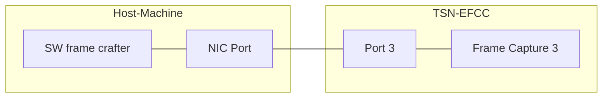
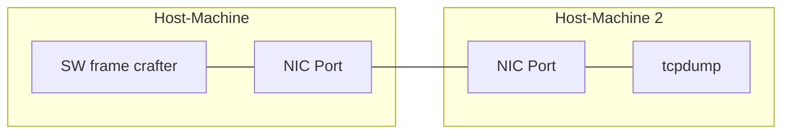

# Evaluation data of frame capture capability of TSN EFCC.

This evaluation evaluates the timestamp correctness of our frame capture compared to hardware timestamp in Intel I210 NIC.  
A software frame crafter sends test frames to our frame capture or Intel I210 NIC at the maximum speed, and evaluates the accuracy of frame intervals.  

## Files

```
├── capture.py          : script to capture input frames by our frame capture
├── fcap                : capture result by our frame capture
├── generate_frame.cpp : implementation of SW frame crafter
├── Makefile            : makefile
├── plot.py             : script to summarize results for our frame capture
├── README.md           : this file
├── summmary_tcpdump.py : script to summarize results for tcpdump
└── tdump               : capture result by tcpdump
```

## Network configuration

### Configuration 1. Capture by our frame capture



### Configuration 2. Capture by tcpdump



## How to run evaluation

### Initial configuration

Run the following commands on each host machine.

```
$ sudo ethtool -C enp4s0 rx-usecs 0
$ sudo ethtool --set-eee enp4s0 eee off

# Disable powersaving for CPU
$ sudo cpupower frequency-set -g performance
```

Build the software frame crafter.

```
$ make
```

### Configuration 1

1. start device capture by `python3 capture.py --recv_timestamp fcap/recv<frame_size>.csv --num_frames <num_frames>` command.
2. generate and transmit test frames by `sudo ./generate_frame.out <ifname> <frame_size> <num_frames>` command.
3. iterate step 1 and 2 for size `60, 100, 300, 500, 700, 900, 1100, 1300, 1514`.
4. run `python3 plot.py` to summarize the results.

`python3 capture.py` command must be called on a host machine which is connected to FPGA device with USB cable.  
After call of capture.py, TSN EFCC starts to wait input frames.

```
$ python3 capture.py --recv_timestamp fcap/recv60.csv --num_frames 10000 --efcc_jtag_target <N>
xsdb server launched.
input MAC0-RX -> Drop
input MAC1-RX -> Drop
input MAC2-RX -> Drop
input MAC3-RX -> Drop
input EFCrafter0 -> Drop
input EFCrafter1 -> Drop
input EFCrafter2 -> Drop
input EFCrafter3 -> Drop
Capture started. Please input frame by generate_frame.out command
```

Secondly, run `./generate_frame.out <ifname> <frame_size> <num_frames>` on host machine.

```
$ sudo ./generate_frame.out enp4s0 60 10000
frame content: 
001122334455aabbccddeeff08004500002e00004000ff11f93dc0a80010c0a8012004dd11d7001a000054534e666978747572650000000000000000
```

If the transmit succeeds, `capture.py` starts to read timestamps from TSN EFCC, and automatically finishs.

```sh
$ python3 capture.py --recv_timestamp fcap/recv60.csv --num_frames 10000 --efcc_jtag_target <N>
...
:
Capture started. Please input frame by generate_frame.out command
read_timestamp: |██████████████████████████████| 10000 / 10000
```

After repeating this step for size `60, 100, 300, 500, 700, 900, 1100, 1300, 1514`, call `plot.py` to summarize the results.  
As the software frame crafter takes some time to saturate, the second result, excluding the first 1000 frames, is the expected result.

```sh
$ python3 plot.py
--------------
Histogram of interval from frame 0
672: {664: 104, 672: 9692, 680: 122, 688: 8, 704: 3, 720: 1, 752: 3, 784: 1, 800: 1, 816: 1, 848: 2, 880: 1, 928: 2, 976: 1, 992: 1, 1024: 1, 1040: 1, 1088: 1, 1104: 2, 1184: 2, 1216: 2, 1232: 1, 1264: 2, 1280: 5, 1296: 3, 1320: 1, 1328: 1, 1344: 1, 1360: 7, 1392: 2, 1408: 3, 1440: 1, 1472: 1, 1520: 2, 1536: 1, 1568: 1, 1648: 1, 1728: 1, 1760: 1, 1888: 1, 1984: 1, 2016: 4, 2024: 1, 2032: 1, 2080: 1, 2112: 1, 2720: 1, 3184: 1}
992: {984: 123, 992: 9724, 1000: 150, 1144: 1, 3120: 1}
2592: {2584: 83, 2592: 9766, 2600: 149, 3024: 1}
4192: {4184: 87, 4192: 9716, 4200: 196}
5792: {5784: 67, 5792: 9714, 5800: 218}
7392: {7384: 50, 7392: 9707, 7400: 242}
8992: {8984: 40, 8992: 9683, 9000: 276}
10592: {10584: 35, 10592: 9652, 10600: 312}
12304: {12296: 22, 12304: 9632, 12312: 345}
--------------
Histogram of interval from frame 1000
672: {664: 95, 672: 8794, 680: 111}
992: {984: 108, 992: 8761, 1000: 131}
2592: {2584: 77, 2592: 8787, 2600: 136}
4192: {4184: 79, 4192: 8744, 4200: 177}
5792: {5784: 59, 5792: 8746, 5800: 195}
7392: {7384: 44, 7392: 8739, 7400: 217}
8992: {8984: 35, 8992: 8717, 9000: 248}
10592: {10584: 31, 10592: 8689, 10600: 280}
12304: {12296: 22, 12304: 8665, 12312: 313}
```

### Configuration 2

1. start tcpdump by `sudo tcpdump -i <ifname> -w tdump/recv60.pcap --time-stamp-precision nano --time-stamp-type adapter_unsynced` command on host machine 2.
2. generate frames by `sudo ./generate_frame.out <ifname> <frame_size> <num_frames>` command on host machine 1.
3. iterate step 1 and 2 for size `60, 100, 300, 500, 700, 900, 1100, 1300, 1514`.
4. run `python3 summary_tcpdump.py` to show histogram of frame interval on host machine 2.

Firstly, start tcpdump with hardware timestamps.  
For details, please see [../synthesized_frame_generation/README.md](../synthesized_frame_generation/README.md) to get meaning of tcpdump options.

```
$ sudo tcpdump -i enp5s0 -w tdump/recv60.pcap --time-stamp-precision nano --time-stamp-type adapter_unsynced
tcpdump: listening on enp5s0, link-type EN10MB (Ethernet), snapshot length 262144 bytes
# After running generate_frame.out, press Ctrl + C to stop tcpdump
10000 frames captured
10000 frames received by filter
0 frames dropped by kernel
```

The step 2 and 3 is the same as Configuration 1.

Finally, call `python3 summary_tcpdump.py` to show the histogram of frame interval on tcpdump.
As mentioned above, the second result is the expected result.

```
$ python3 summary_tcpdump.py
Read tdump/recv60.pcap...
Read tdump/recv100.pcap...
Read tdump/recv300.pcap...
Read tdump/recv500.pcap...
Read tdump/recv700.pcap...
Read tdump/recv900.pcap...
Read tdump/recv1100.pcap...
Read tdump/recv1300.pcap...
Read tdump/recv1514.pcap...
--------------
Histogram of interval difference from frame 0
60: {664.0: 42, 672.0: 9840, 680.0: 47, 688.0: 1, 704.0: 2, 736.0: 1, 768.0: 1, 832.0: 2, 848.0: 4, 880.0: 1, 896.0: 1, 912.0: 1, 928.0: 1, 944.0: 2, 960.0: 3, 976.0: 1, 992.0: 1, 1008.0: 1, 1024.0: 3, 1040.0: 1, 1056.0: 1, 1072.0: 1, 1104.0: 1, 1120.0: 1, 1152.0: 1, 1168.0: 1, 1248.0: 2, 1280.0: 1, 1296.0: 1, 1312.0: 1, 1328.0: 1, 1344.0: 3, 1360.0: 2, 1376.0: 1, 1440.0: 1, 1488.0: 1, 1520.0: 1, 1600.0: 1, 1616.0: 1, 1664.0: 2, 1824.0: 1, 1888.0: 1, 1920.0: 1, 1936.0: 1, 1968.0: 1, 1984.0: 1, 2032.0: 1, 2048.0: 1, 2064.0: 1, 2080.0: 2, 2144.0: 1, 2176.0: 1, 2720.0: 1, 3184.0: 1, 4176.0: 1, 6000.0: 1, 12656.0: 1}
100: {984.0: 49, 992.0: 9892, 1000.0: 57, 3120.0: 1}
300: {2584.0: 40, 2592.0: 9899, 2600.0: 59, 2784.0: 1}
500: {4184.0: 42, 4192.0: 9883, 4200.0: 73, 5344.0: 1}
700: {5784.0: 39, 5792.0: 9877, 5800.0: 82, 6272.0: 1}
900: {7384.0: 31, 7392.0: 9881, 7400.0: 85, 7792.0: 1, 53328.0: 1}
1100: {8984.0: 34, 8992.0: 9864, 9000.0: 101, 18302560293.0: 1}
1300: {10584.0: 29, 10592.0: 9862, 10600.0: 108}
1514: {12296.0: 24, 12304.0: 9860, 12312.0: 115}
--------------
Histogram of interval difference from frame 1000
60: {664.0: 32, 672.0: 8931, 680.0: 36}
100: {984.0: 42, 992.0: 8908, 1000.0: 49}
300: {2584.0: 35, 2592.0: 8912, 2600.0: 52}
500: {4184.0: 37, 4192.0: 8897, 4200.0: 65}
700: {5784.0: 36, 5792.0: 8888, 5800.0: 75}
900: {7384.0: 29, 7392.0: 8892, 7400.0: 78}
1100: {8984.0: 29, 8992.0: 8881, 9000.0: 89, 18302560293.0: 1}
1300: {10584.0: 25, 10592.0: 8878, 10600.0: 96}
1514: {12296.0: 22, 12304.0: 8873, 12312.0: 104}
```

