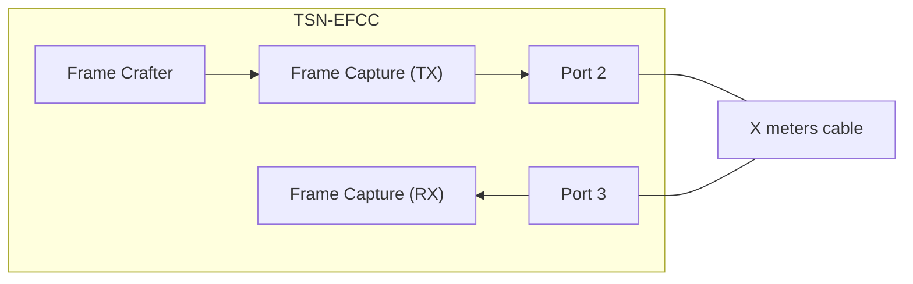
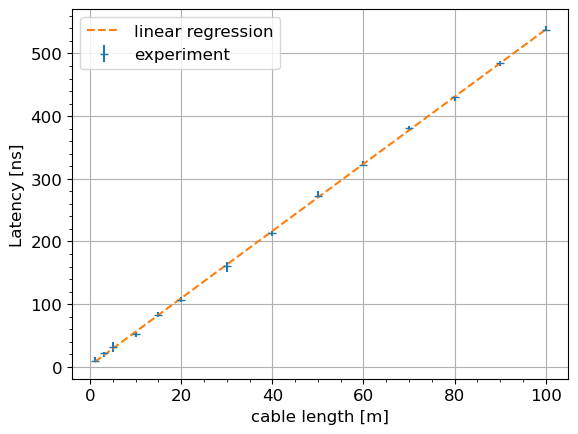
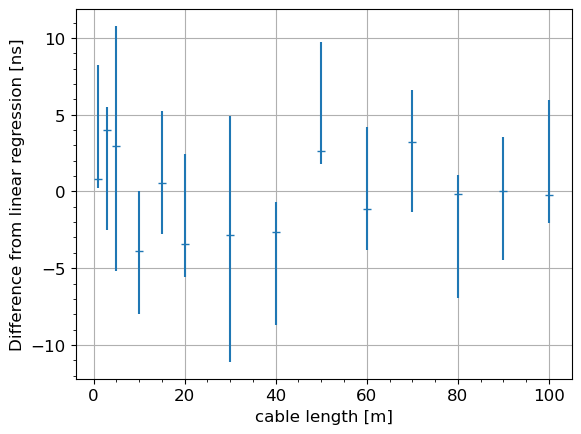

# Evaluation data of latency measurement capability of TSN EFCC.

This evaluation evaluates the latency measurement capability of our TSN EFCC with variable length cables.  

## Files

```
├── eval.py            : evaluation script
├── latencies_diff.png : difference of latency between experimental result and linear regression
├── latencies.png      : latency and linear regression glaph
├── plot.py            : plot script
├── README.md          : this file
└── results            : evaluation result
```

## Network configuration



## How to run evaluation

### 1. Setup

Connect MAC Port 2 and MAC Port 3 by any length cable directly.

### 2. Run evaluation

Set the `CABLE_LENGTH` variable in meters, and evaluate the latency.

```sh
$ export CABLE_LENGTH=30
$ python3 eval.py --result_dir results/len_${CABLE_LENGTH}m --efcc_jtag_target <TARGET>
xsdb server launched.
input MAC0-RX -> Drop
input MAC1-RX -> Drop
input MAC2-RX -> Drop
input MAC3-RX -> Drop
input EFCrafter0 -> MAC2-TX
input EFCrafter1 -> Drop
input EFCrafter2 -> Drop
input EFCrafter3 -> Drop
==== Test sequence ====
Frame0000.ETHER(dst=1, src=2).IPV4(dst=1, src=2).VLAN(id=1, pcp=2).UDP(dst=1, src=2).Payload(length=1472)
EOL()
Start transfer
Done
  status: Sending frames
  repeat: enable
  loopcounter: 0
  framecounter: 1209
  com_running: True
  com_repeat: True
  com_fno_reset: True
  sta_send_done: True
  sta_repeat_done: True
  sta_counter_reset_done: True
read_timestamp: |██████████████████████████████| 1000 / 1000
read_timestamp: |██████████████████████████████| 1000 / 1000
```

### 3. Plot result

Repeat steps 1 and 2 for all cables used in this test.  
Then, plot result with `plot.py` command.  
`--lengths` option means the list of tested cable lengths in meters.

```sh
$ python3 plot.py --lengths 1 3 5 10 15 20 30 40 50 60 70 80 90 100
Result of linear regression: y = 5.356070 * x + 2.429706
```

After the run, [latencies.png](latencies.png) and [latencies_diff.png](latencies_diff.png) are generated.  
The former image plots each latency and the linear regression line, and the latter image plots the difference between each latency and the linear regression value.




