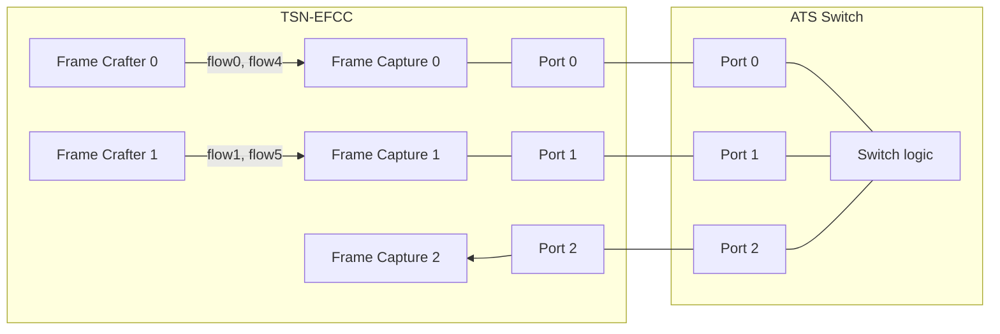
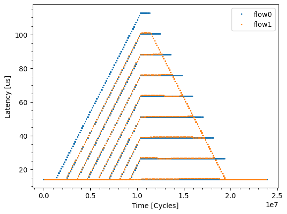
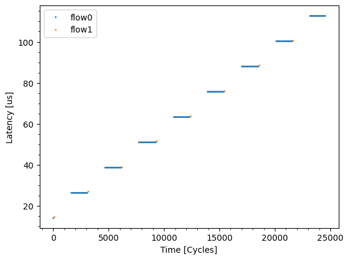

# Evaluation data of generating and capturing multiple flows capability of TSN EFCC.

This evaluation generate and capture multiple flow frames from Frame Crafters, and evaluate frame latencies.  
Each flow has different priorities and prioritized by our developing switch called ATS Switch.  

## Files

```
├── eval.py            : evaluation script for Burst Test Pattern
├── plot.py            : plot script
├── README.md          : this file
└── results            : evaluation result
```

## Network configuration



### Test Pattern

| Name | TC | Length | Burst Length | Rate | Port |
|------|----|--------|--------------|------|------|
| flow0 | 7 | 84   | 1542 * 8 | 100 Mbps | Port 0 |
| flow1 | 5 | 1542 | 1542 * 8 | 100 Mbps | Port 1 |

- Committed Information Rate = 100 Mbps
- Committed Burst Size = 1542 * 8 bytes

## Argument description
### port1_gap
- The input sequence for port 1 is larger than the input sequence for port 0 by the number of bytes (= number of cycles) specified by the `--port1_gap` argument.
- Therefore, if you set `port1_gap` to a value other than 0, the phase between port 0 and port 1 will change every time the sequence completes a cycle.
- The initial value of `167` corresponds to a phase shift of 167 cycles (1336 ns) each time.

### flow1_offset
- Port 1 outputs 8 valid frames (flow 1) and 72 NOP frames (flow 5) in one sequence.
- The `--flow1_offset` argument sets when to transmit flow 1, using the number of NOP frames of flow 5 output before flow 1.
- Specifying `0` for `flow1_offset` aligns the output timing of port 0 (flow 0) and port 1 (flow 1).
- The initial value of `71` is adjusted to start the experiment slightly before the valid frames of port 0 and port 1 begin to overlap.

## Prerequisites

This experiment requires another KC705 board with Opsero OP031 Ethernet FMC, to implement ATS switch.  

1. Clone tsn-switch repository and generate a bitstream for ats-switch design.
    - For details, please see the tsn-switch README.
2. Connect JTAG cables of both KC705 to the same PC.
3. Write [sample-design-1g](../../docs/sample_design-1g/) bitstream to one KC705 board, and ats-switch bitstream to the other KC705 board.
    - Please check the `JTAG2AXI` target of each design here.
4. Connect the each port of each FMC via Ethernet cable
5. set the tsn-switch repository path to `SWITCH_ROOT` environment variable.
    - `export SWITCH_ROOT=<path-to-tsn-switch>`

## How to run evaluation

1. run `python3 eval.py`
2. run `python3 plot.py`

```
$ python3 eval.py --efcc-jtag-target <N> --switch-jtag-target <M> --num_frames 30000 --port1_gap 167 --flow1_offset 72
Evaluation of TSN EFCC
xsdb server launched.
==== Test sequence of Port 0 ====
Frame0000.ETHER(dst=3, src=1).IPV4(dst=3, src=1).VLAN(id=4, pcp=1).UDP(dst=5201, src=1234).Payload(length=1472).Nop()
Frame0001.ETHER(dst=3, src=1).IPV4(dst=8, src=6).VLAN(id=2, pcp=3).UDP(dst=5201, src=1234).Payload(length=14)
Frame0002.ETHER(dst=3, src=1).IPV4(dst=8, src=6).VLAN(id=2, pcp=3).UDP(dst=5201, src=1234).Payload(length=14)
Frame0003.ETHER(dst=3, src=1).IPV4(dst=8, src=6).VLAN(id=2, pcp=3).UDP(dst=5201, src=1234).Payload(length=14)
Frame0004.ETHER(dst=3, src=1).IPV4(dst=8, src=6).VLAN(id=2, pcp=3).UDP(dst=5201, src=1234).Payload(length=14)
Frame0005.ETHER(dst=3, src=1).IPV4(dst=8, src=6).VLAN(id=2, pcp=3).UDP(dst=5201, src=1234).Payload(length=14)
Frame0006.ETHER(dst=3, src=1).IPV4(dst=8, src=6).VLAN(id=2, pcp=3).UDP(dst=5201, src=1234).Payload(length=14)
Frame0007.ETHER(dst=3, src=1).IPV4(dst=8, src=6).VLAN(id=2, pcp=3).UDP(dst=5201, src=1234).Payload(length=14)
Frame0008.ETHER(dst=3, src=1).IPV4(dst=8, src=6).VLAN(id=2, pcp=3).UDP(dst=5201, src=1234).Payload(length=14)
Frame0009.ETHER(dst=3, src=1).IPV4(dst=8, src=6).VLAN(id=2, pcp=3).UDP(dst=5201, src=1234).Payload(length=14)
Frame0010.ETHER(dst=3, src=1).IPV4(dst=8, src=6).VLAN(id=2, pcp=3).UDP(dst=5201, src=1234).Payload(length=14)
Frame0011.ETHER(dst=3, src=1).IPV4(dst=8, src=6).VLAN(id=2, pcp=3).UDP(dst=5201, src=1234).Payload(length=14)
Frame0012.ETHER(dst=3, src=1).IPV4(dst=8, src=6).VLAN(id=2, pcp=3).UDP(dst=5201, src=1234).Payload(length=14)
Frame0013.ETHER(dst=3, src=1).IPV4(dst=8, src=6).VLAN(id=2, pcp=3).UDP(dst=5201, src=1234).Payload(length=14)
Frame0014.ETHER(dst=3, src=1).IPV4(dst=8, src=6).VLAN(id=2, pcp=3).UDP(dst=5201, src=1234).Payload(length=14)
Frame0015.ETHER(dst=3, src=1).IPV4(dst=8, src=6).VLAN(id=2, pcp=3).UDP(dst=5201, src=1234).Payload(length=14)
Frame0016.ETHER(dst=3, src=1).IPV4(dst=8, src=6).VLAN(id=2, pcp=3).UDP(dst=5201, src=1234).Payload(length=14)
Frame0017.ETHER(dst=3, src=1).IPV4(dst=8, src=6).VLAN(id=2, pcp=3).UDP(dst=5201, src=1234).Payload(length=14)
Frame0018.ETHER(dst=3, src=1).IPV4(dst=8, src=6).VLAN(id=2, pcp=3).UDP(dst=5201, src=1234).Payload(length=14)
Frame0019.ETHER(dst=3, src=1).IPV4(dst=8, src=6).VLAN(id=2, pcp=3).UDP(dst=5201, src=1234).Payload(length=14)
Frame0020.ETHER(dst=3, src=1).IPV4(dst=8, src=6).VLAN(id=2, pcp=3).UDP(dst=5201, src=1234).Payload(length=14)
Frame0021.ETHER(dst=3, src=1).IPV4(dst=8, src=6).VLAN(id=2, pcp=3).UDP(dst=5201, src=1234).Payload(length=14)
Frame0022.ETHER(dst=3, src=1).IPV4(dst=8, src=6).VLAN(id=2, pcp=3).UDP(dst=5201, src=1234).Payload(length=14)
Frame0023.ETHER(dst=3, src=1).IPV4(dst=8, src=6).VLAN(id=2, pcp=3).UDP(dst=5201, src=1234).Payload(length=14)
Frame0024.ETHER(dst=3, src=1).IPV4(dst=8, src=6).VLAN(id=2, pcp=3).UDP(dst=5201, src=1234).Payload(length=14)
Frame0025.ETHER(dst=3, src=1).IPV4(dst=8, src=6).VLAN(id=2, pcp=3).UDP(dst=5201, src=1234).Payload(length=14)
Frame0026.ETHER(dst=3, src=1).IPV4(dst=8, src=6).VLAN(id=2, pcp=3).UDP(dst=5201, src=1234).Payload(length=14)
Frame0027.ETHER(dst=3, src=1).IPV4(dst=8, src=6).VLAN(id=2, pcp=3).UDP(dst=5201, src=1234).Payload(length=14)
Frame0028.ETHER(dst=3, src=1).IPV4(dst=8, src=6).VLAN(id=2, pcp=3).UDP(dst=5201, src=1234).Payload(length=14)
Frame0029.ETHER(dst=3, src=1).IPV4(dst=8, src=6).VLAN(id=2, pcp=3).UDP(dst=5201, src=1234).Payload(length=14)
Frame0030.ETHER(dst=3, src=1).IPV4(dst=8, src=6).VLAN(id=2, pcp=3).UDP(dst=5201, src=1234).Payload(length=14)
Frame0031.ETHER(dst=3, src=1).IPV4(dst=8, src=6).VLAN(id=2, pcp=3).UDP(dst=5201, src=1234).Payload(length=14)
Frame0032.ETHER(dst=3, src=1).IPV4(dst=8, src=6).VLAN(id=2, pcp=3).UDP(dst=5201, src=1234).Payload(length=14)
Frame0033.ETHER(dst=3, src=1).IPV4(dst=8, src=6).VLAN(id=2, pcp=3).UDP(dst=5201, src=1234).Payload(length=14)
Frame0034.ETHER(dst=3, src=1).IPV4(dst=8, src=6).VLAN(id=2, pcp=3).UDP(dst=5201, src=1234).Payload(length=14)
Frame0035.ETHER(dst=3, src=1).IPV4(dst=8, src=6).VLAN(id=2, pcp=3).UDP(dst=5201, src=1234).Payload(length=14)
Frame0036.ETHER(dst=3, src=1).IPV4(dst=8, src=6).VLAN(id=2, pcp=3).UDP(dst=5201, src=1234).Payload(length=14)
Frame0037.ETHER(dst=3, src=1).IPV4(dst=8, src=6).VLAN(id=2, pcp=3).UDP(dst=5201, src=1234).Payload(length=14)
Frame0038.ETHER(dst=3, src=1).IPV4(dst=8, src=6).VLAN(id=2, pcp=3).UDP(dst=5201, src=1234).Payload(length=14)
Frame0039.ETHER(dst=3, src=1).IPV4(dst=8, src=6).VLAN(id=2, pcp=3).UDP(dst=5201, src=1234).Payload(length=14)
Frame0040.ETHER(dst=3, src=1).IPV4(dst=8, src=6).VLAN(id=2, pcp=3).UDP(dst=5201, src=1234).Payload(length=14)
Frame0041.ETHER(dst=3, src=1).IPV4(dst=8, src=6).VLAN(id=2, pcp=3).UDP(dst=5201, src=1234).Payload(length=14)
Frame0042.ETHER(dst=3, src=1).IPV4(dst=8, src=6).VLAN(id=2, pcp=3).UDP(dst=5201, src=1234).Payload(length=14)
Frame0043.ETHER(dst=3, src=1).IPV4(dst=8, src=6).VLAN(id=2, pcp=3).UDP(dst=5201, src=1234).Payload(length=14)
Frame0044.ETHER(dst=3, src=1).IPV4(dst=8, src=6).VLAN(id=2, pcp=3).UDP(dst=5201, src=1234).Payload(length=14)
Frame0045.ETHER(dst=3, src=1).IPV4(dst=8, src=6).VLAN(id=2, pcp=3).UDP(dst=5201, src=1234).Payload(length=14)
Frame0046.ETHER(dst=3, src=1).IPV4(dst=8, src=6).VLAN(id=2, pcp=3).UDP(dst=5201, src=1234).Payload(length=14)
Frame0047.ETHER(dst=3, src=1).IPV4(dst=8, src=6).VLAN(id=2, pcp=3).UDP(dst=5201, src=1234).Payload(length=14)
Frame0048.ETHER(dst=3, src=1).IPV4(dst=8, src=6).VLAN(id=2, pcp=3).UDP(dst=5201, src=1234).Payload(length=14)
Frame0049.ETHER(dst=3, src=1).IPV4(dst=8, src=6).VLAN(id=2, pcp=3).UDP(dst=5201, src=1234).Payload(length=14)
Frame0050.ETHER(dst=3, src=1).IPV4(dst=8, src=6).VLAN(id=2, pcp=3).UDP(dst=5201, src=1234).Payload(length=14)
Frame0051.ETHER(dst=3, src=1).IPV4(dst=8, src=6).VLAN(id=2, pcp=3).UDP(dst=5201, src=1234).Payload(length=14)
Frame0052.ETHER(dst=3, src=1).IPV4(dst=8, src=6).VLAN(id=2, pcp=3).UDP(dst=5201, src=1234).Payload(length=14)
Frame0053.ETHER(dst=3, src=1).IPV4(dst=8, src=6).VLAN(id=2, pcp=3).UDP(dst=5201, src=1234).Payload(length=14)
Frame0054.ETHER(dst=3, src=1).IPV4(dst=8, src=6).VLAN(id=2, pcp=3).UDP(dst=5201, src=1234).Payload(length=14)
Frame0055.ETHER(dst=3, src=1).IPV4(dst=8, src=6).VLAN(id=2, pcp=3).UDP(dst=5201, src=1234).Payload(length=14)
Frame0056.ETHER(dst=3, src=1).IPV4(dst=8, src=6).VLAN(id=2, pcp=3).UDP(dst=5201, src=1234).Payload(length=14)
Frame0057.ETHER(dst=3, src=1).IPV4(dst=8, src=6).VLAN(id=2, pcp=3).UDP(dst=5201, src=1234).Payload(length=14)
Frame0058.ETHER(dst=3, src=1).IPV4(dst=8, src=6).VLAN(id=2, pcp=3).UDP(dst=5201, src=1234).Payload(length=14)
Frame0059.ETHER(dst=3, src=1).IPV4(dst=8, src=6).VLAN(id=2, pcp=3).UDP(dst=5201, src=1234).Payload(length=14)
Frame0060.ETHER(dst=3, src=1).IPV4(dst=8, src=6).VLAN(id=2, pcp=3).UDP(dst=5201, src=1234).Payload(length=14)
Frame0061.ETHER(dst=3, src=1).IPV4(dst=8, src=6).VLAN(id=2, pcp=3).UDP(dst=5201, src=1234).Payload(length=14)
Frame0062.ETHER(dst=3, src=1).IPV4(dst=8, src=6).VLAN(id=2, pcp=3).UDP(dst=5201, src=1234).Payload(length=14)
Frame0063.ETHER(dst=3, src=1).IPV4(dst=8, src=6).VLAN(id=2, pcp=3).UDP(dst=5201, src=1234).Payload(length=14)
Frame0064.ETHER(dst=3, src=1).IPV4(dst=8, src=6).VLAN(id=2, pcp=3).UDP(dst=5201, src=1234).Payload(length=14)
Frame0065.ETHER(dst=3, src=1).IPV4(dst=8, src=6).VLAN(id=2, pcp=3).UDP(dst=5201, src=1234).Payload(length=14)
Frame0066.ETHER(dst=3, src=1).IPV4(dst=8, src=6).VLAN(id=2, pcp=3).UDP(dst=5201, src=1234).Payload(length=14)
Frame0067.ETHER(dst=3, src=1).IPV4(dst=8, src=6).VLAN(id=2, pcp=3).UDP(dst=5201, src=1234).Payload(length=14)
Frame0068.ETHER(dst=3, src=1).IPV4(dst=8, src=6).VLAN(id=2, pcp=3).UDP(dst=5201, src=1234).Payload(length=14)
Frame0069.ETHER(dst=3, src=1).IPV4(dst=8, src=6).VLAN(id=2, pcp=3).UDP(dst=5201, src=1234).Payload(length=14)
Frame0070.ETHER(dst=3, src=1).IPV4(dst=8, src=6).VLAN(id=2, pcp=3).UDP(dst=5201, src=1234).Payload(length=14)
Frame0071.ETHER(dst=3, src=1).IPV4(dst=8, src=6).VLAN(id=2, pcp=3).UDP(dst=5201, src=1234).Payload(length=14)
Frame0072.ETHER(dst=3, src=1).IPV4(dst=8, src=6).VLAN(id=2, pcp=3).UDP(dst=5201, src=1234).Payload(length=14)
Frame0073.ETHER(dst=3, src=1).IPV4(dst=8, src=6).VLAN(id=2, pcp=3).UDP(dst=5201, src=1234).Payload(length=14)
Frame0074.ETHER(dst=3, src=1).IPV4(dst=8, src=6).VLAN(id=2, pcp=3).UDP(dst=5201, src=1234).Payload(length=14)
Frame0075.ETHER(dst=3, src=1).IPV4(dst=8, src=6).VLAN(id=2, pcp=3).UDP(dst=5201, src=1234).Payload(length=14)
Frame0076.ETHER(dst=3, src=1).IPV4(dst=8, src=6).VLAN(id=2, pcp=3).UDP(dst=5201, src=1234).Payload(length=14)
Frame0077.ETHER(dst=3, src=1).IPV4(dst=8, src=6).VLAN(id=2, pcp=3).UDP(dst=5201, src=1234).Payload(length=14)
Frame0078.ETHER(dst=3, src=1).IPV4(dst=8, src=6).VLAN(id=2, pcp=3).UDP(dst=5201, src=1234).Payload(length=14)
Frame0079.ETHER(dst=3, src=1).IPV4(dst=8, src=6).VLAN(id=2, pcp=3).UDP(dst=5201, src=1234).Payload(length=14)
Frame0080.ETHER(dst=3, src=1).IPV4(dst=8, src=6).VLAN(id=2, pcp=3).UDP(dst=5201, src=1234).Payload(length=14)
Frame0081.ETHER(dst=3, src=1).IPV4(dst=8, src=6).VLAN(id=2, pcp=3).UDP(dst=5201, src=1234).Payload(length=14)
Frame0082.ETHER(dst=3, src=1).IPV4(dst=8, src=6).VLAN(id=2, pcp=3).UDP(dst=5201, src=1234).Payload(length=14)
Frame0083.ETHER(dst=3, src=1).IPV4(dst=8, src=6).VLAN(id=2, pcp=3).UDP(dst=5201, src=1234).Payload(length=14)
Frame0084.ETHER(dst=3, src=1).IPV4(dst=8, src=6).VLAN(id=2, pcp=3).UDP(dst=5201, src=1234).Payload(length=14)
Frame0085.ETHER(dst=3, src=1).IPV4(dst=8, src=6).VLAN(id=2, pcp=3).UDP(dst=5201, src=1234).Payload(length=14)
Frame0086.ETHER(dst=3, src=1).IPV4(dst=8, src=6).VLAN(id=2, pcp=3).UDP(dst=5201, src=1234).Payload(length=14)
Frame0087.ETHER(dst=3, src=1).IPV4(dst=8, src=6).VLAN(id=2, pcp=3).UDP(dst=5201, src=1234).Payload(length=14)
Frame0088.ETHER(dst=3, src=1).IPV4(dst=8, src=6).VLAN(id=2, pcp=3).UDP(dst=5201, src=1234).Payload(length=14)
Frame0089.ETHER(dst=3, src=1).IPV4(dst=8, src=6).VLAN(id=2, pcp=3).UDP(dst=5201, src=1234).Payload(length=14)
Frame0090.ETHER(dst=3, src=1).IPV4(dst=8, src=6).VLAN(id=2, pcp=3).UDP(dst=5201, src=1234).Payload(length=14)
Frame0091.ETHER(dst=3, src=1).IPV4(dst=8, src=6).VLAN(id=2, pcp=3).UDP(dst=5201, src=1234).Payload(length=14)
Frame0092.ETHER(dst=3, src=1).IPV4(dst=8, src=6).VLAN(id=2, pcp=3).UDP(dst=5201, src=1234).Payload(length=14)
Frame0093.ETHER(dst=3, src=1).IPV4(dst=8, src=6).VLAN(id=2, pcp=3).UDP(dst=5201, src=1234).Payload(length=14)
Frame0094.ETHER(dst=3, src=1).IPV4(dst=8, src=6).VLAN(id=2, pcp=3).UDP(dst=5201, src=1234).Payload(length=14)
Frame0095.ETHER(dst=3, src=1).IPV4(dst=8, src=6).VLAN(id=2, pcp=3).UDP(dst=5201, src=1234).Payload(length=14)
Frame0096.ETHER(dst=3, src=1).IPV4(dst=8, src=6).VLAN(id=2, pcp=3).UDP(dst=5201, src=1234).Payload(length=14)
Frame0097.ETHER(dst=3, src=1).IPV4(dst=8, src=6).VLAN(id=2, pcp=3).UDP(dst=5201, src=1234).Payload(length=14)
Frame0098.ETHER(dst=3, src=1).IPV4(dst=8, src=6).VLAN(id=2, pcp=3).UDP(dst=5201, src=1234).Payload(length=14)
Frame0099.ETHER(dst=3, src=1).IPV4(dst=8, src=6).VLAN(id=2, pcp=3).UDP(dst=5201, src=1234).Payload(length=14)
Frame0100.ETHER(dst=3, src=1).IPV4(dst=8, src=6).VLAN(id=2, pcp=3).UDP(dst=5201, src=1234).Payload(length=14)
Frame0101.ETHER(dst=3, src=1).IPV4(dst=8, src=6).VLAN(id=2, pcp=3).UDP(dst=5201, src=1234).Payload(length=14)
Frame0102.ETHER(dst=3, src=1).IPV4(dst=8, src=6).VLAN(id=2, pcp=3).UDP(dst=5201, src=1234).Payload(length=14)
Frame0103.ETHER(dst=3, src=1).IPV4(dst=8, src=6).VLAN(id=2, pcp=3).UDP(dst=5201, src=1234).Payload(length=14)
Frame0104.ETHER(dst=3, src=1).IPV4(dst=8, src=6).VLAN(id=2, pcp=3).UDP(dst=5201, src=1234).Payload(length=14)
Frame0105.ETHER(dst=3, src=1).IPV4(dst=8, src=6).VLAN(id=2, pcp=3).UDP(dst=5201, src=1234).Payload(length=14)
Frame0106.ETHER(dst=3, src=1).IPV4(dst=8, src=6).VLAN(id=2, pcp=3).UDP(dst=5201, src=1234).Payload(length=14)
Frame0107.ETHER(dst=3, src=1).IPV4(dst=8, src=6).VLAN(id=2, pcp=3).UDP(dst=5201, src=1234).Payload(length=14)
Frame0108.ETHER(dst=3, src=1).IPV4(dst=8, src=6).VLAN(id=2, pcp=3).UDP(dst=5201, src=1234).Payload(length=14)
Frame0109.ETHER(dst=3, src=1).IPV4(dst=8, src=6).VLAN(id=2, pcp=3).UDP(dst=5201, src=1234).Payload(length=14)
Frame0110.ETHER(dst=3, src=1).IPV4(dst=8, src=6).VLAN(id=2, pcp=3).UDP(dst=5201, src=1234).Payload(length=14)
Frame0111.ETHER(dst=3, src=1).IPV4(dst=8, src=6).VLAN(id=2, pcp=3).UDP(dst=5201, src=1234).Payload(length=14)
Frame0112.ETHER(dst=3, src=1).IPV4(dst=8, src=6).VLAN(id=2, pcp=3).UDP(dst=5201, src=1234).Payload(length=14)
Frame0113.ETHER(dst=3, src=1).IPV4(dst=8, src=6).VLAN(id=2, pcp=3).UDP(dst=5201, src=1234).Payload(length=14)
Frame0114.ETHER(dst=3, src=1).IPV4(dst=8, src=6).VLAN(id=2, pcp=3).UDP(dst=5201, src=1234).Payload(length=14)
Frame0115.ETHER(dst=3, src=1).IPV4(dst=8, src=6).VLAN(id=2, pcp=3).UDP(dst=5201, src=1234).Payload(length=14)
Frame0116.ETHER(dst=3, src=1).IPV4(dst=8, src=6).VLAN(id=2, pcp=3).UDP(dst=5201, src=1234).Payload(length=14)
Frame0117.ETHER(dst=3, src=1).IPV4(dst=8, src=6).VLAN(id=2, pcp=3).UDP(dst=5201, src=1234).Payload(length=14)
Frame0118.ETHER(dst=3, src=1).IPV4(dst=8, src=6).VLAN(id=2, pcp=3).UDP(dst=5201, src=1234).Payload(length=14)
Frame0119.ETHER(dst=3, src=1).IPV4(dst=8, src=6).VLAN(id=2, pcp=3).UDP(dst=5201, src=1234).Payload(length=14)
Frame0120.ETHER(dst=3, src=1).IPV4(dst=8, src=6).VLAN(id=2, pcp=3).UDP(dst=5201, src=1234).Payload(length=14)
Frame0121.ETHER(dst=3, src=1).IPV4(dst=8, src=6).VLAN(id=2, pcp=3).UDP(dst=5201, src=1234).Payload(length=14)
Frame0122.ETHER(dst=3, src=1).IPV4(dst=8, src=6).VLAN(id=2, pcp=3).UDP(dst=5201, src=1234).Payload(length=14)
Frame0123.ETHER(dst=3, src=1).IPV4(dst=8, src=6).VLAN(id=2, pcp=3).UDP(dst=5201, src=1234).Payload(length=14)
Frame0124.ETHER(dst=3, src=1).IPV4(dst=8, src=6).VLAN(id=2, pcp=3).UDP(dst=5201, src=1234).Payload(length=14)
Frame0125.ETHER(dst=3, src=1).IPV4(dst=8, src=6).VLAN(id=2, pcp=3).UDP(dst=5201, src=1234).Payload(length=14)
Frame0126.ETHER(dst=3, src=1).IPV4(dst=8, src=6).VLAN(id=2, pcp=3).UDP(dst=5201, src=1234).Payload(length=14)
Frame0127.ETHER(dst=3, src=1).IPV4(dst=8, src=6).VLAN(id=2, pcp=3).UDP(dst=5201, src=1234).Payload(length=14)
Frame0128.ETHER(dst=3, src=1).IPV4(dst=8, src=6).VLAN(id=2, pcp=3).UDP(dst=5201, src=1234).Payload(length=14)
Frame0129.ETHER(dst=3, src=1).IPV4(dst=8, src=6).VLAN(id=2, pcp=3).UDP(dst=5201, src=1234).Payload(length=14)
Frame0130.ETHER(dst=3, src=1).IPV4(dst=8, src=6).VLAN(id=2, pcp=3).UDP(dst=5201, src=1234).Payload(length=14)
Frame0131.ETHER(dst=3, src=1).IPV4(dst=8, src=6).VLAN(id=2, pcp=3).UDP(dst=5201, src=1234).Payload(length=14)
Frame0132.ETHER(dst=3, src=1).IPV4(dst=8, src=6).VLAN(id=2, pcp=3).UDP(dst=5201, src=1234).Payload(length=14)
Frame0133.ETHER(dst=3, src=1).IPV4(dst=8, src=6).VLAN(id=2, pcp=3).UDP(dst=5201, src=1234).Payload(length=14)
Frame0134.ETHER(dst=3, src=1).IPV4(dst=8, src=6).VLAN(id=2, pcp=3).UDP(dst=5201, src=1234).Payload(length=14)
Frame0135.ETHER(dst=3, src=1).IPV4(dst=8, src=6).VLAN(id=2, pcp=3).UDP(dst=5201, src=1234).Payload(length=14)
Frame0136.ETHER(dst=3, src=1).IPV4(dst=8, src=6).VLAN(id=2, pcp=3).UDP(dst=5201, src=1234).Payload(length=14)
Frame0137.ETHER(dst=3, src=1).IPV4(dst=8, src=6).VLAN(id=2, pcp=3).UDP(dst=5201, src=1234).Payload(length=14)
Frame0138.ETHER(dst=3, src=1).IPV4(dst=8, src=6).VLAN(id=2, pcp=3).UDP(dst=5201, src=1234).Payload(length=14)
Frame0139.ETHER(dst=3, src=1).IPV4(dst=8, src=6).VLAN(id=2, pcp=3).UDP(dst=5201, src=1234).Payload(length=14)
Frame0140.ETHER(dst=3, src=1).IPV4(dst=8, src=6).VLAN(id=2, pcp=3).UDP(dst=5201, src=1234).Payload(length=14)
Frame0141.ETHER(dst=3, src=1).IPV4(dst=8, src=6).VLAN(id=2, pcp=3).UDP(dst=5201, src=1234).Payload(length=14)
Frame0142.ETHER(dst=3, src=1).IPV4(dst=8, src=6).VLAN(id=2, pcp=3).UDP(dst=5201, src=1234).Payload(length=14)
Frame0143.ETHER(dst=3, src=1).IPV4(dst=8, src=6).VLAN(id=2, pcp=3).UDP(dst=5201, src=1234).Payload(length=14)
Frame0144.ETHER(dst=3, src=1).IPV4(dst=8, src=6).VLAN(id=2, pcp=3).UDP(dst=5201, src=1234).Payload(length=14)
Frame0145.ETHER(dst=3, src=1).IPV4(dst=8, src=6).VLAN(id=2, pcp=3).UDP(dst=5201, src=1234).Payload(length=14)
Frame0146.ETHER(dst=3, src=1).IPV4(dst=8, src=6).VLAN(id=2, pcp=3).UDP(dst=5201, src=1234).Payload(length=14).AdditionalWait(72)
Frame0147.ETHER(dst=3, src=1).IPV4(dst=3, src=1).VLAN(id=4, pcp=1).UDP(dst=5201, src=1234).Payload(length=1472).Nop()
Frame0148.ETHER(dst=3, src=1).IPV4(dst=3, src=1).VLAN(id=4, pcp=1).UDP(dst=5201, src=1234).Payload(length=1472).Nop()
Frame0149.ETHER(dst=3, src=1).IPV4(dst=3, src=1).VLAN(id=4, pcp=1).UDP(dst=5201, src=1234).Payload(length=1472).Nop()
Frame0150.ETHER(dst=3, src=1).IPV4(dst=3, src=1).VLAN(id=4, pcp=1).UDP(dst=5201, src=1234).Payload(length=1472).Nop()
Frame0151.ETHER(dst=3, src=1).IPV4(dst=3, src=1).VLAN(id=4, pcp=1).UDP(dst=5201, src=1234).Payload(length=1472).Nop()
Frame0152.ETHER(dst=3, src=1).IPV4(dst=3, src=1).VLAN(id=4, pcp=1).UDP(dst=5201, src=1234).Payload(length=1472).Nop()
Frame0153.ETHER(dst=3, src=1).IPV4(dst=3, src=1).VLAN(id=4, pcp=1).UDP(dst=5201, src=1234).Payload(length=1472).Nop()
Frame0154.ETHER(dst=3, src=1).IPV4(dst=3, src=1).VLAN(id=4, pcp=1).UDP(dst=5201, src=1234).Payload(length=1472).Nop()
Frame0155.ETHER(dst=3, src=1).IPV4(dst=3, src=1).VLAN(id=4, pcp=1).UDP(dst=5201, src=1234).Payload(length=1472).Nop()
Frame0156.ETHER(dst=3, src=1).IPV4(dst=3, src=1).VLAN(id=4, pcp=1).UDP(dst=5201, src=1234).Payload(length=1472).Nop()
Frame0157.ETHER(dst=3, src=1).IPV4(dst=3, src=1).VLAN(id=4, pcp=1).UDP(dst=5201, src=1234).Payload(length=1472).Nop()
Frame0158.ETHER(dst=3, src=1).IPV4(dst=3, src=1).VLAN(id=4, pcp=1).UDP(dst=5201, src=1234).Payload(length=1472).Nop()
Frame0159.ETHER(dst=3, src=1).IPV4(dst=3, src=1).VLAN(id=4, pcp=1).UDP(dst=5201, src=1234).Payload(length=1472).Nop()
Frame0160.ETHER(dst=3, src=1).IPV4(dst=3, src=1).VLAN(id=4, pcp=1).UDP(dst=5201, src=1234).Payload(length=1472).Nop()
Frame0161.ETHER(dst=3, src=1).IPV4(dst=3, src=1).VLAN(id=4, pcp=1).UDP(dst=5201, src=1234).Payload(length=1472).Nop()
Frame0162.ETHER(dst=3, src=1).IPV4(dst=3, src=1).VLAN(id=4, pcp=1).UDP(dst=5201, src=1234).Payload(length=1472).Nop()
Frame0163.ETHER(dst=3, src=1).IPV4(dst=3, src=1).VLAN(id=4, pcp=1).UDP(dst=5201, src=1234).Payload(length=1472).Nop()
Frame0164.ETHER(dst=3, src=1).IPV4(dst=3, src=1).VLAN(id=4, pcp=1).UDP(dst=5201, src=1234).Payload(length=1472).Nop()
Frame0165.ETHER(dst=3, src=1).IPV4(dst=3, src=1).VLAN(id=4, pcp=1).UDP(dst=5201, src=1234).Payload(length=1472).Nop()
Frame0166.ETHER(dst=3, src=1).IPV4(dst=3, src=1).VLAN(id=4, pcp=1).UDP(dst=5201, src=1234).Payload(length=1472).Nop()
Frame0167.ETHER(dst=3, src=1).IPV4(dst=3, src=1).VLAN(id=4, pcp=1).UDP(dst=5201, src=1234).Payload(length=1472).Nop()
Frame0168.ETHER(dst=3, src=1).IPV4(dst=3, src=1).VLAN(id=4, pcp=1).UDP(dst=5201, src=1234).Payload(length=1472).Nop()
Frame0169.ETHER(dst=3, src=1).IPV4(dst=3, src=1).VLAN(id=4, pcp=1).UDP(dst=5201, src=1234).Payload(length=1472).Nop()
Frame0170.ETHER(dst=3, src=1).IPV4(dst=3, src=1).VLAN(id=4, pcp=1).UDP(dst=5201, src=1234).Payload(length=1472).Nop()
Frame0171.ETHER(dst=3, src=1).IPV4(dst=3, src=1).VLAN(id=4, pcp=1).UDP(dst=5201, src=1234).Payload(length=1472).Nop()
Frame0172.ETHER(dst=3, src=1).IPV4(dst=3, src=1).VLAN(id=4, pcp=1).UDP(dst=5201, src=1234).Payload(length=1472).Nop()
Frame0173.ETHER(dst=3, src=1).IPV4(dst=3, src=1).VLAN(id=4, pcp=1).UDP(dst=5201, src=1234).Payload(length=1472).Nop()
Frame0174.ETHER(dst=3, src=1).IPV4(dst=3, src=1).VLAN(id=4, pcp=1).UDP(dst=5201, src=1234).Payload(length=1472).Nop()
Frame0175.ETHER(dst=3, src=1).IPV4(dst=3, src=1).VLAN(id=4, pcp=1).UDP(dst=5201, src=1234).Payload(length=1472).Nop()
Frame0176.ETHER(dst=3, src=1).IPV4(dst=3, src=1).VLAN(id=4, pcp=1).UDP(dst=5201, src=1234).Payload(length=1472).Nop()
Frame0177.ETHER(dst=3, src=1).IPV4(dst=3, src=1).VLAN(id=4, pcp=1).UDP(dst=5201, src=1234).Payload(length=1472).Nop()
Frame0178.ETHER(dst=3, src=1).IPV4(dst=3, src=1).VLAN(id=4, pcp=1).UDP(dst=5201, src=1234).Payload(length=1472).Nop()
Frame0179.ETHER(dst=3, src=1).IPV4(dst=3, src=1).VLAN(id=4, pcp=1).UDP(dst=5201, src=1234).Payload(length=1472).Nop()
Frame0180.ETHER(dst=3, src=1).IPV4(dst=3, src=1).VLAN(id=4, pcp=1).UDP(dst=5201, src=1234).Payload(length=1472).Nop()
Frame0181.ETHER(dst=3, src=1).IPV4(dst=3, src=1).VLAN(id=4, pcp=1).UDP(dst=5201, src=1234).Payload(length=1472).Nop()
Frame0182.ETHER(dst=3, src=1).IPV4(dst=3, src=1).VLAN(id=4, pcp=1).UDP(dst=5201, src=1234).Payload(length=1472).Nop()
Frame0183.ETHER(dst=3, src=1).IPV4(dst=3, src=1).VLAN(id=4, pcp=1).UDP(dst=5201, src=1234).Payload(length=1472).Nop()
Frame0184.ETHER(dst=3, src=1).IPV4(dst=3, src=1).VLAN(id=4, pcp=1).UDP(dst=5201, src=1234).Payload(length=1472).Nop()
Frame0185.ETHER(dst=3, src=1).IPV4(dst=3, src=1).VLAN(id=4, pcp=1).UDP(dst=5201, src=1234).Payload(length=1472).Nop()
Frame0186.ETHER(dst=3, src=1).IPV4(dst=3, src=1).VLAN(id=4, pcp=1).UDP(dst=5201, src=1234).Payload(length=1472).Nop()
Frame0187.ETHER(dst=3, src=1).IPV4(dst=3, src=1).VLAN(id=4, pcp=1).UDP(dst=5201, src=1234).Payload(length=1472).Nop()
Frame0188.ETHER(dst=3, src=1).IPV4(dst=3, src=1).VLAN(id=4, pcp=1).UDP(dst=5201, src=1234).Payload(length=1472).Nop()
Frame0189.ETHER(dst=3, src=1).IPV4(dst=3, src=1).VLAN(id=4, pcp=1).UDP(dst=5201, src=1234).Payload(length=1472).Nop()
Frame0190.ETHER(dst=3, src=1).IPV4(dst=3, src=1).VLAN(id=4, pcp=1).UDP(dst=5201, src=1234).Payload(length=1472).Nop()
Frame0191.ETHER(dst=3, src=1).IPV4(dst=3, src=1).VLAN(id=4, pcp=1).UDP(dst=5201, src=1234).Payload(length=1472).Nop()
Frame0192.ETHER(dst=3, src=1).IPV4(dst=3, src=1).VLAN(id=4, pcp=1).UDP(dst=5201, src=1234).Payload(length=1472).Nop()
Frame0193.ETHER(dst=3, src=1).IPV4(dst=3, src=1).VLAN(id=4, pcp=1).UDP(dst=5201, src=1234).Payload(length=1472).Nop()
Frame0194.ETHER(dst=3, src=1).IPV4(dst=3, src=1).VLAN(id=4, pcp=1).UDP(dst=5201, src=1234).Payload(length=1472).Nop()
Frame0195.ETHER(dst=3, src=1).IPV4(dst=3, src=1).VLAN(id=4, pcp=1).UDP(dst=5201, src=1234).Payload(length=1472).Nop()
Frame0196.ETHER(dst=3, src=1).IPV4(dst=3, src=1).VLAN(id=4, pcp=1).UDP(dst=5201, src=1234).Payload(length=1472).Nop()
Frame0197.ETHER(dst=3, src=1).IPV4(dst=3, src=1).VLAN(id=4, pcp=1).UDP(dst=5201, src=1234).Payload(length=1472).Nop()
Frame0198.ETHER(dst=3, src=1).IPV4(dst=3, src=1).VLAN(id=4, pcp=1).UDP(dst=5201, src=1234).Payload(length=1472).Nop()
Frame0199.ETHER(dst=3, src=1).IPV4(dst=3, src=1).VLAN(id=4, pcp=1).UDP(dst=5201, src=1234).Payload(length=1472).Nop()
Frame0200.ETHER(dst=3, src=1).IPV4(dst=3, src=1).VLAN(id=4, pcp=1).UDP(dst=5201, src=1234).Payload(length=1472).Nop()
Frame0201.ETHER(dst=3, src=1).IPV4(dst=3, src=1).VLAN(id=4, pcp=1).UDP(dst=5201, src=1234).Payload(length=1472).Nop()
Frame0202.ETHER(dst=3, src=1).IPV4(dst=3, src=1).VLAN(id=4, pcp=1).UDP(dst=5201, src=1234).Payload(length=1472).Nop()
Frame0203.ETHER(dst=3, src=1).IPV4(dst=3, src=1).VLAN(id=4, pcp=1).UDP(dst=5201, src=1234).Payload(length=1472).Nop()
Frame0204.ETHER(dst=3, src=1).IPV4(dst=3, src=1).VLAN(id=4, pcp=1).UDP(dst=5201, src=1234).Payload(length=1472).Nop()
Frame0205.ETHER(dst=3, src=1).IPV4(dst=3, src=1).VLAN(id=4, pcp=1).UDP(dst=5201, src=1234).Payload(length=1472).Nop()
Frame0206.ETHER(dst=3, src=1).IPV4(dst=3, src=1).VLAN(id=4, pcp=1).UDP(dst=5201, src=1234).Payload(length=1472).Nop()
Frame0207.ETHER(dst=3, src=1).IPV4(dst=3, src=1).VLAN(id=4, pcp=1).UDP(dst=5201, src=1234).Payload(length=1472).Nop()
Frame0208.ETHER(dst=3, src=1).IPV4(dst=3, src=1).VLAN(id=4, pcp=1).UDP(dst=5201, src=1234).Payload(length=1472).Nop()
Frame0209.ETHER(dst=3, src=1).IPV4(dst=3, src=1).VLAN(id=4, pcp=1).UDP(dst=5201, src=1234).Payload(length=1472).Nop()
Frame0210.ETHER(dst=3, src=1).IPV4(dst=3, src=1).VLAN(id=4, pcp=1).UDP(dst=5201, src=1234).Payload(length=1472).Nop()
Frame0211.ETHER(dst=3, src=1).IPV4(dst=3, src=1).VLAN(id=4, pcp=1).UDP(dst=5201, src=1234).Payload(length=1472).Nop()
Frame0212.ETHER(dst=3, src=1).IPV4(dst=3, src=1).VLAN(id=4, pcp=1).UDP(dst=5201, src=1234).Payload(length=1472).Nop()
Frame0213.ETHER(dst=3, src=1).IPV4(dst=3, src=1).VLAN(id=4, pcp=1).UDP(dst=5201, src=1234).Payload(length=1472).Nop()
Frame0214.ETHER(dst=3, src=1).IPV4(dst=3, src=1).VLAN(id=4, pcp=1).UDP(dst=5201, src=1234).Payload(length=1472).Nop()
Frame0215.ETHER(dst=3, src=1).IPV4(dst=3, src=1).VLAN(id=4, pcp=1).UDP(dst=5201, src=1234).Payload(length=1472).Nop()
Frame0216.ETHER(dst=3, src=1).IPV4(dst=3, src=1).VLAN(id=4, pcp=1).UDP(dst=5201, src=1234).Payload(length=1472).Nop()
Frame0217.ETHER(dst=3, src=1).IPV4(dst=3, src=1).VLAN(id=4, pcp=1).UDP(dst=5201, src=1234).Payload(length=1472).Nop()
EOL()
==== Test sequence of Port 1 ====
Frame0000.ETHER(dst=3, src=2).IPV4(dst=3, src=2).VLAN(id=4, pcp=1).UDP(dst=5201, src=1234).Payload(length=1472).Nop()
Frame0001.ETHER(dst=3, src=2).IPV4(dst=3, src=2).VLAN(id=4, pcp=1).UDP(dst=5201, src=1234).Payload(length=1472).Nop()
Frame0002.ETHER(dst=3, src=2).IPV4(dst=3, src=2).VLAN(id=4, pcp=1).UDP(dst=5201, src=1234).Payload(length=1472).Nop()
Frame0003.ETHER(dst=3, src=2).IPV4(dst=3, src=2).VLAN(id=4, pcp=1).UDP(dst=5201, src=1234).Payload(length=1472).Nop()
Frame0004.ETHER(dst=3, src=2).IPV4(dst=3, src=2).VLAN(id=4, pcp=1).UDP(dst=5201, src=1234).Payload(length=1472).Nop()
Frame0005.ETHER(dst=3, src=2).IPV4(dst=3, src=2).VLAN(id=4, pcp=1).UDP(dst=5201, src=1234).Payload(length=1472).Nop()
Frame0006.ETHER(dst=3, src=2).IPV4(dst=3, src=2).VLAN(id=4, pcp=1).UDP(dst=5201, src=1234).Payload(length=1472).Nop()
Frame0007.ETHER(dst=3, src=2).IPV4(dst=3, src=2).VLAN(id=4, pcp=1).UDP(dst=5201, src=1234).Payload(length=1472).Nop()
Frame0008.ETHER(dst=3, src=2).IPV4(dst=3, src=2).VLAN(id=4, pcp=1).UDP(dst=5201, src=1234).Payload(length=1472).Nop()
Frame0009.ETHER(dst=3, src=2).IPV4(dst=3, src=2).VLAN(id=4, pcp=1).UDP(dst=5201, src=1234).Payload(length=1472).Nop()
Frame0010.ETHER(dst=3, src=2).IPV4(dst=3, src=2).VLAN(id=4, pcp=1).UDP(dst=5201, src=1234).Payload(length=1472).Nop()
Frame0011.ETHER(dst=3, src=2).IPV4(dst=3, src=2).VLAN(id=4, pcp=1).UDP(dst=5201, src=1234).Payload(length=1472).Nop()
Frame0012.ETHER(dst=3, src=2).IPV4(dst=3, src=2).VLAN(id=4, pcp=1).UDP(dst=5201, src=1234).Payload(length=1472).Nop()
Frame0013.ETHER(dst=3, src=2).IPV4(dst=3, src=2).VLAN(id=4, pcp=1).UDP(dst=5201, src=1234).Payload(length=1472).Nop()
Frame0014.ETHER(dst=3, src=2).IPV4(dst=3, src=2).VLAN(id=4, pcp=1).UDP(dst=5201, src=1234).Payload(length=1472).Nop()
Frame0015.ETHER(dst=3, src=2).IPV4(dst=3, src=2).VLAN(id=4, pcp=1).UDP(dst=5201, src=1234).Payload(length=1472).Nop()
Frame0016.ETHER(dst=3, src=2).IPV4(dst=3, src=2).VLAN(id=4, pcp=1).UDP(dst=5201, src=1234).Payload(length=1472).Nop()
Frame0017.ETHER(dst=3, src=2).IPV4(dst=3, src=2).VLAN(id=4, pcp=1).UDP(dst=5201, src=1234).Payload(length=1472).Nop()
Frame0018.ETHER(dst=3, src=2).IPV4(dst=3, src=2).VLAN(id=4, pcp=1).UDP(dst=5201, src=1234).Payload(length=1472).Nop()
Frame0019.ETHER(dst=3, src=2).IPV4(dst=3, src=2).VLAN(id=4, pcp=1).UDP(dst=5201, src=1234).Payload(length=1472).Nop()
Frame0020.ETHER(dst=3, src=2).IPV4(dst=3, src=2).VLAN(id=4, pcp=1).UDP(dst=5201, src=1234).Payload(length=1472).Nop()
Frame0021.ETHER(dst=3, src=2).IPV4(dst=3, src=2).VLAN(id=4, pcp=1).UDP(dst=5201, src=1234).Payload(length=1472).Nop()
Frame0022.ETHER(dst=3, src=2).IPV4(dst=3, src=2).VLAN(id=4, pcp=1).UDP(dst=5201, src=1234).Payload(length=1472).Nop()
Frame0023.ETHER(dst=3, src=2).IPV4(dst=3, src=2).VLAN(id=4, pcp=1).UDP(dst=5201, src=1234).Payload(length=1472).Nop()
Frame0024.ETHER(dst=3, src=2).IPV4(dst=3, src=2).VLAN(id=4, pcp=1).UDP(dst=5201, src=1234).Payload(length=1472).Nop()
Frame0025.ETHER(dst=3, src=2).IPV4(dst=3, src=2).VLAN(id=4, pcp=1).UDP(dst=5201, src=1234).Payload(length=1472).Nop()
Frame0026.ETHER(dst=3, src=2).IPV4(dst=3, src=2).VLAN(id=4, pcp=1).UDP(dst=5201, src=1234).Payload(length=1472).Nop()
Frame0027.ETHER(dst=3, src=2).IPV4(dst=3, src=2).VLAN(id=4, pcp=1).UDP(dst=5201, src=1234).Payload(length=1472).Nop()
Frame0028.ETHER(dst=3, src=2).IPV4(dst=3, src=2).VLAN(id=4, pcp=1).UDP(dst=5201, src=1234).Payload(length=1472).Nop()
Frame0029.ETHER(dst=3, src=2).IPV4(dst=3, src=2).VLAN(id=4, pcp=1).UDP(dst=5201, src=1234).Payload(length=1472).Nop()
Frame0030.ETHER(dst=3, src=2).IPV4(dst=3, src=2).VLAN(id=4, pcp=1).UDP(dst=5201, src=1234).Payload(length=1472).Nop()
Frame0031.ETHER(dst=3, src=2).IPV4(dst=3, src=2).VLAN(id=4, pcp=1).UDP(dst=5201, src=1234).Payload(length=1472).Nop()
Frame0032.ETHER(dst=3, src=2).IPV4(dst=3, src=2).VLAN(id=4, pcp=1).UDP(dst=5201, src=1234).Payload(length=1472).Nop()
Frame0033.ETHER(dst=3, src=2).IPV4(dst=3, src=2).VLAN(id=4, pcp=1).UDP(dst=5201, src=1234).Payload(length=1472).Nop()
Frame0034.ETHER(dst=3, src=2).IPV4(dst=3, src=2).VLAN(id=4, pcp=1).UDP(dst=5201, src=1234).Payload(length=1472).Nop()
Frame0035.ETHER(dst=3, src=2).IPV4(dst=3, src=2).VLAN(id=4, pcp=1).UDP(dst=5201, src=1234).Payload(length=1472).Nop()
Frame0036.ETHER(dst=3, src=2).IPV4(dst=3, src=2).VLAN(id=4, pcp=1).UDP(dst=5201, src=1234).Payload(length=1472).Nop()
Frame0037.ETHER(dst=3, src=2).IPV4(dst=3, src=2).VLAN(id=4, pcp=1).UDP(dst=5201, src=1234).Payload(length=1472).Nop()
Frame0038.ETHER(dst=3, src=2).IPV4(dst=3, src=2).VLAN(id=4, pcp=1).UDP(dst=5201, src=1234).Payload(length=1472).Nop()
Frame0039.ETHER(dst=3, src=2).IPV4(dst=3, src=2).VLAN(id=4, pcp=1).UDP(dst=5201, src=1234).Payload(length=1472).Nop()
Frame0040.ETHER(dst=3, src=2).IPV4(dst=3, src=2).VLAN(id=4, pcp=1).UDP(dst=5201, src=1234).Payload(length=1472).Nop()
Frame0041.ETHER(dst=3, src=2).IPV4(dst=3, src=2).VLAN(id=4, pcp=1).UDP(dst=5201, src=1234).Payload(length=1472).Nop()
Frame0042.ETHER(dst=3, src=2).IPV4(dst=3, src=2).VLAN(id=4, pcp=1).UDP(dst=5201, src=1234).Payload(length=1472).Nop()
Frame0043.ETHER(dst=3, src=2).IPV4(dst=3, src=2).VLAN(id=4, pcp=1).UDP(dst=5201, src=1234).Payload(length=1472).Nop()
Frame0044.ETHER(dst=3, src=2).IPV4(dst=3, src=2).VLAN(id=4, pcp=1).UDP(dst=5201, src=1234).Payload(length=1472).Nop()
Frame0045.ETHER(dst=3, src=2).IPV4(dst=3, src=2).VLAN(id=4, pcp=1).UDP(dst=5201, src=1234).Payload(length=1472).Nop()
Frame0046.ETHER(dst=3, src=2).IPV4(dst=3, src=2).VLAN(id=4, pcp=1).UDP(dst=5201, src=1234).Payload(length=1472).Nop()
Frame0047.ETHER(dst=3, src=2).IPV4(dst=3, src=2).VLAN(id=4, pcp=1).UDP(dst=5201, src=1234).Payload(length=1472).Nop()
Frame0048.ETHER(dst=3, src=2).IPV4(dst=3, src=2).VLAN(id=4, pcp=1).UDP(dst=5201, src=1234).Payload(length=1472).Nop()
Frame0049.ETHER(dst=3, src=2).IPV4(dst=3, src=2).VLAN(id=4, pcp=1).UDP(dst=5201, src=1234).Payload(length=1472).Nop()
Frame0050.ETHER(dst=3, src=2).IPV4(dst=3, src=2).VLAN(id=4, pcp=1).UDP(dst=5201, src=1234).Payload(length=1472).Nop()
Frame0051.ETHER(dst=3, src=2).IPV4(dst=3, src=2).VLAN(id=4, pcp=1).UDP(dst=5201, src=1234).Payload(length=1472).Nop()
Frame0052.ETHER(dst=3, src=2).IPV4(dst=3, src=2).VLAN(id=4, pcp=1).UDP(dst=5201, src=1234).Payload(length=1472).Nop()
Frame0053.ETHER(dst=3, src=2).IPV4(dst=3, src=2).VLAN(id=4, pcp=1).UDP(dst=5201, src=1234).Payload(length=1472).Nop()
Frame0054.ETHER(dst=3, src=2).IPV4(dst=3, src=2).VLAN(id=4, pcp=1).UDP(dst=5201, src=1234).Payload(length=1472).Nop()
Frame0055.ETHER(dst=3, src=2).IPV4(dst=3, src=2).VLAN(id=4, pcp=1).UDP(dst=5201, src=1234).Payload(length=1472).Nop()
Frame0056.ETHER(dst=3, src=2).IPV4(dst=3, src=2).VLAN(id=4, pcp=1).UDP(dst=5201, src=1234).Payload(length=1472).Nop()
Frame0057.ETHER(dst=3, src=2).IPV4(dst=3, src=2).VLAN(id=4, pcp=1).UDP(dst=5201, src=1234).Payload(length=1472).Nop()
Frame0058.ETHER(dst=3, src=2).IPV4(dst=3, src=2).VLAN(id=4, pcp=1).UDP(dst=5201, src=1234).Payload(length=1472).Nop()
Frame0059.ETHER(dst=3, src=2).IPV4(dst=3, src=2).VLAN(id=4, pcp=1).UDP(dst=5201, src=1234).Payload(length=1472).Nop()
Frame0060.ETHER(dst=3, src=2).IPV4(dst=3, src=2).VLAN(id=4, pcp=1).UDP(dst=5201, src=1234).Payload(length=1472).Nop()
Frame0061.ETHER(dst=3, src=2).IPV4(dst=3, src=2).VLAN(id=4, pcp=1).UDP(dst=5201, src=1234).Payload(length=1472).Nop()
Frame0062.ETHER(dst=3, src=2).IPV4(dst=3, src=2).VLAN(id=4, pcp=1).UDP(dst=5201, src=1234).Payload(length=1472).Nop()
Frame0063.ETHER(dst=3, src=2).IPV4(dst=3, src=2).VLAN(id=4, pcp=1).UDP(dst=5201, src=1234).Payload(length=1472).Nop()
Frame0064.ETHER(dst=3, src=2).IPV4(dst=3, src=2).VLAN(id=4, pcp=1).UDP(dst=5201, src=1234).Payload(length=1472).Nop()
Frame0065.ETHER(dst=3, src=2).IPV4(dst=3, src=2).VLAN(id=4, pcp=1).UDP(dst=5201, src=1234).Payload(length=1472).Nop()
Frame0066.ETHER(dst=3, src=2).IPV4(dst=3, src=2).VLAN(id=4, pcp=1).UDP(dst=5201, src=1234).Payload(length=1472).Nop()
Frame0067.ETHER(dst=3, src=2).IPV4(dst=3, src=2).VLAN(id=4, pcp=1).UDP(dst=5201, src=1234).Payload(length=1472).Nop()
Frame0068.ETHER(dst=3, src=2).IPV4(dst=3, src=2).VLAN(id=4, pcp=1).UDP(dst=5201, src=1234).Payload(length=1472).Nop()
Frame0069.ETHER(dst=3, src=2).IPV4(dst=3, src=2).VLAN(id=4, pcp=1).UDP(dst=5201, src=1234).Payload(length=1472).Nop()
Frame0070.ETHER(dst=3, src=2).IPV4(dst=3, src=2).VLAN(id=4, pcp=1).UDP(dst=5201, src=1234).Payload(length=1472).Nop()
Frame0071.ETHER(dst=3, src=2).IPV4(dst=8, src=7).VLAN(id=2, pcp=3).UDP(dst=5201, src=1234).Payload(length=1472)
Frame0072.ETHER(dst=3, src=2).IPV4(dst=8, src=7).VLAN(id=2, pcp=3).UDP(dst=5201, src=1234).Payload(length=1472)
Frame0073.ETHER(dst=3, src=2).IPV4(dst=8, src=7).VLAN(id=2, pcp=3).UDP(dst=5201, src=1234).Payload(length=1472)
Frame0074.ETHER(dst=3, src=2).IPV4(dst=8, src=7).VLAN(id=2, pcp=3).UDP(dst=5201, src=1234).Payload(length=1472)
Frame0075.ETHER(dst=3, src=2).IPV4(dst=8, src=7).VLAN(id=2, pcp=3).UDP(dst=5201, src=1234).Payload(length=1472)
Frame0076.ETHER(dst=3, src=2).IPV4(dst=8, src=7).VLAN(id=2, pcp=3).UDP(dst=5201, src=1234).Payload(length=1472)
Frame0077.ETHER(dst=3, src=2).IPV4(dst=8, src=7).VLAN(id=2, pcp=3).UDP(dst=5201, src=1234).Payload(length=1472)
Frame0078.ETHER(dst=3, src=2).IPV4(dst=8, src=7).VLAN(id=2, pcp=3).UDP(dst=5201, src=1234).Payload(length=1472)
Frame0079.ETHER(dst=3, src=2).IPV4(dst=3, src=2).VLAN(id=4, pcp=1).UDP(dst=5201, src=1234).Payload(length=1472).Nop()
Frame0080.ETHER(dst=3, src=2).IPV4(dst=3, src=2).VLAN(id=4, pcp=1).UDP(dst=5201, src=1234).Payload(length=97).Nop()
EOL()
read_timestamp: |██████████████████████████████| 30000 / 30000
read_timestamp: |██████████████████████████████| 30000 / 30000
read_timestamp: |██████████████████████████████| 30000 / 30000
read_timestamp: |██████████████████████████████| 154 / 154
read_timestamp: |██████████████████████████████| 154 / 154
read_timestamp: |██████████████████████████████| 154 / 154
```

Plot the result.  
The log shows the experimented latency of each flow.

```
$ python3 plot.py
----------------------
Plot latency of all frames
min,max,max-min,avg,std,25%,50%,75%,90%,99%
14.104,112.808,98.704,34.918,25.298,14.120,25.848,51.128,75.792,102.000
14.120,101.000,86.880,30.688,22.556,14.128,14.796,42.888,65.793,95.951
```

The below figure illustrates the latency of each frames.  

flow 0  


The below figure illustrates the latency of each frame for one sequence (154 frames) under the condition that the heads of flow 0 and flow 1 are aligned.  


