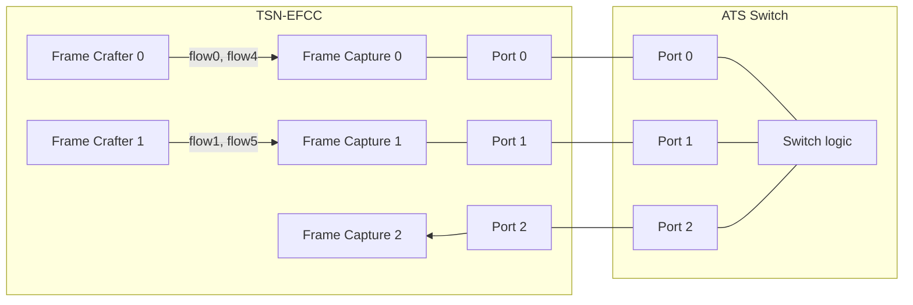
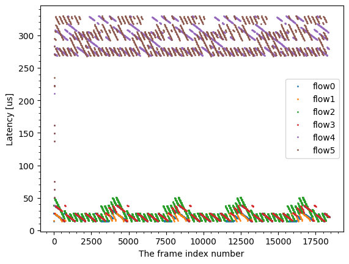
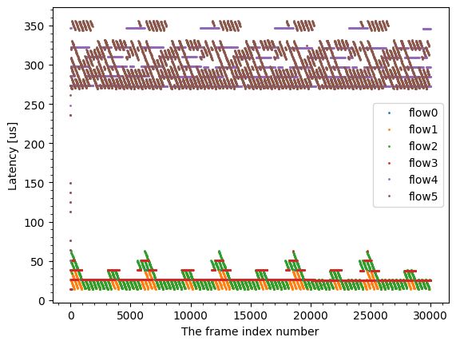

# Evaluation data of generating and capturing multiple flows capability of TSN EFCC.

This evaluation generate and capture multiple flow frames from Frame Crafters, and evaluate frame latencies.  
Each flow has different priorities and prioritized by our developing switch called ATS Switch.  

## Files

```
├── eval_fixed_size.py : evaluation script for Test Pattern 2
├── eval.py            : evaluation script for Test Pattern 1
├── plot.py            : plot script
├── README.md          : this file
├── results            : evaluation result for Test Pattern 1
└── results_fixed_size : evaluation result for Test Pattern 2
```

## Network configuration



### Test Pattern 1

| Name | TC | Length | Burst Length | Rate | Port |
|------|----|--------|--------------|------|------|
| flow0 | 7 | 84   | 1542 | 100 Mbps | Port 0 |
| flow1 | 7 | 1542 | 1542 | 100 Mbps | Port 1 |
| flow2 | 6 | 84   | 1542 | 100 Mbps | Port 1 | 
| flow3 | 6 | 1542 | 1542 | 100 Mbps | Port 0 |
| flow4 | 5 | 1542 | 1542 | 800 Mbps | Port 0 |
| flow5 | 5 | 1542 | 1542 | 800 Mbps | Port 1 |

- Committed Information Rate = 100 Mbps
- Committed Burst Size = 1542 bytes

### Test Pattern 2

| Name | TC | Length | Burst Length | Rate | Port |
|------|----|--------|--------------|------|------|
| flow0 | 7 | 1542 | 3084 | 100 Mbps | Port 0 |
| flow1 | 7 | 1542 | 1542 | 100 Mbps | Port 1 |
| flow2 | 6 | 1542 | 3084 | 100 Mbps | Port 1 | 
| flow3 | 6 | 1542 | 1542 | 100 Mbps | Port 0 |
| flow4 | 5 | 1542 | 1542 | 800 Mbps | Port 0 |
| flow5 | 5 | 1542 | 1542 | 800 Mbps | Port 1 |

- Committed Information Rate = 100 Mbps
- Committed Burst Size = 3084 bytes

## Prerequisites

This experiment requires another KC705 board with Opsero OP031 Ethernet FMC, to implement ATS switch.  

1. Clone tsn-switch repository and generate a bitstream for ats-switch design.
    - For details, please see the tsn-switch README.
2. Connect JTAG cables of both KC705 to the same PC.
3. Write [sample-design-1g](../../docs/sample_design-1g/) bitstream to one KC705 board, and ats-switch bitstream to the other KC705 board.
    - Please check the `JTAG2AXI` target of each design here.
4. Connect the each port of each FMC via Ethernet cable
5. set the tsn-switch repository path to `SWITCH_ROOT` environment variable.
    - `export SWITCH_ROOT=<path-to-tsn-switch>`

## How to run evaluation

### Test Pattern 1

1. run `python3 eval.py`
2. run `python3 plot.py`

```
$ python3 eval.py --efcc-jtag-target <N> --switch-jtag-target <M> --num_frames 30000
Evaluation of TSN EFCC
xsdb server launched.
==== Test sequence of Port 0 ====
Frame0000.ETHER(dst=3, src=1).IPV4(dst=8, src=6).VLAN(id=2, pcp=3).UDP(dst=5201, src=1234).Payload(length=14)
Frame0001.ETHER(dst=3, src=1).IPV4(dst=8, src=6).VLAN(id=2, pcp=3).UDP(dst=5201, src=1234).Payload(length=14)
Frame0002.ETHER(dst=3, src=1).IPV4(dst=8, src=6).VLAN(id=2, pcp=3).UDP(dst=5201, src=1234).Payload(length=14)
Frame0003.ETHER(dst=3, src=1).IPV4(dst=8, src=6).VLAN(id=2, pcp=3).UDP(dst=5201, src=1234).Payload(length=14)
Frame0004.ETHER(dst=3, src=1).IPV4(dst=8, src=6).VLAN(id=2, pcp=3).UDP(dst=5201, src=1234).Payload(length=14)
Frame0005.ETHER(dst=3, src=1).IPV4(dst=8, src=6).VLAN(id=2, pcp=3).UDP(dst=5201, src=1234).Payload(length=14)
Frame0006.ETHER(dst=3, src=1).IPV4(dst=8, src=6).VLAN(id=2, pcp=3).UDP(dst=5201, src=1234).Payload(length=14)
Frame0007.ETHER(dst=3, src=1).IPV4(dst=8, src=6).VLAN(id=2, pcp=3).UDP(dst=5201, src=1234).Payload(length=14)
Frame0008.ETHER(dst=3, src=1).IPV4(dst=8, src=6).VLAN(id=2, pcp=3).UDP(dst=5201, src=1234).Payload(length=14)
Frame0009.ETHER(dst=3, src=1).IPV4(dst=8, src=6).VLAN(id=2, pcp=3).UDP(dst=5201, src=1234).Payload(length=14)
Frame0010.ETHER(dst=3, src=1).IPV4(dst=8, src=6).VLAN(id=2, pcp=3).UDP(dst=5201, src=1234).Payload(length=14)
Frame0011.ETHER(dst=3, src=1).IPV4(dst=8, src=6).VLAN(id=2, pcp=3).UDP(dst=5201, src=1234).Payload(length=14)
Frame0012.ETHER(dst=3, src=1).IPV4(dst=8, src=6).VLAN(id=2, pcp=3).UDP(dst=5201, src=1234).Payload(length=14)
Frame0013.ETHER(dst=3, src=1).IPV4(dst=8, src=6).VLAN(id=2, pcp=3).UDP(dst=5201, src=1234).Payload(length=14)
Frame0014.ETHER(dst=3, src=1).IPV4(dst=8, src=6).VLAN(id=2, pcp=3).UDP(dst=5201, src=1234).Payload(length=14)
Frame0015.ETHER(dst=3, src=1).IPV4(dst=8, src=6).VLAN(id=2, pcp=3).UDP(dst=5201, src=1234).Payload(length=14)
Frame0016.ETHER(dst=3, src=1).IPV4(dst=8, src=6).VLAN(id=2, pcp=3).UDP(dst=5201, src=1234).Payload(length=14)
Frame0017.ETHER(dst=3, src=1).IPV4(dst=8, src=6).VLAN(id=2, pcp=3).UDP(dst=5201, src=1234).Payload(length=14)
Frame0018.ETHER(dst=3, src=1).IPV4(dst=3, src=1).VLAN(id=1, pcp=2).UDP(dst=5201, src=1234).Payload(length=1472)
Frame0019.ETHER(dst=3, src=1).IPV4(dst=3, src=1).VLAN(id=4, pcp=1).UDP(dst=5201, src=1234).Payload(length=1472)
Frame0020.ETHER(dst=3, src=1).IPV4(dst=3, src=1).VLAN(id=4, pcp=1).UDP(dst=5201, src=1234).Payload(length=1472)
Frame0021.ETHER(dst=3, src=1).IPV4(dst=3, src=1).VLAN(id=4, pcp=1).UDP(dst=5201, src=1234).Payload(length=1472)
Frame0022.ETHER(dst=3, src=1).IPV4(dst=3, src=1).VLAN(id=4, pcp=1).UDP(dst=5201, src=1234).Payload(length=1472)
Frame0023.ETHER(dst=3, src=1).IPV4(dst=3, src=1).VLAN(id=4, pcp=1).UDP(dst=5201, src=1234).Payload(length=1472)
Frame0024.ETHER(dst=3, src=1).IPV4(dst=3, src=1).VLAN(id=4, pcp=1).UDP(dst=5201, src=1234).Payload(length=1472)
Frame0025.ETHER(dst=3, src=1).IPV4(dst=3, src=1).VLAN(id=4, pcp=1).UDP(dst=5201, src=1234).Payload(length=1472)
Frame0026.ETHER(dst=3, src=1).IPV4(dst=3, src=1).VLAN(id=4, pcp=1).UDP(dst=5201, src=1234).Payload(length=1472).AdditionalWait(30)
EOL()
==== Test sequence of Port 1 ====
Frame0000.ETHER(dst=3, src=2).IPV4(dst=8, src=7).VLAN(id=2, pcp=3).UDP(dst=5201, src=1234).Payload(length=1472)
Frame0001.ETHER(dst=3, src=2).IPV4(dst=3, src=2).VLAN(id=1, pcp=2).UDP(dst=5201, src=1234).Payload(length=14)
Frame0002.ETHER(dst=3, src=2).IPV4(dst=3, src=2).VLAN(id=1, pcp=2).UDP(dst=5201, src=1234).Payload(length=14)
Frame0003.ETHER(dst=3, src=2).IPV4(dst=3, src=2).VLAN(id=1, pcp=2).UDP(dst=5201, src=1234).Payload(length=14)
Frame0004.ETHER(dst=3, src=2).IPV4(dst=3, src=2).VLAN(id=1, pcp=2).UDP(dst=5201, src=1234).Payload(length=14)
Frame0005.ETHER(dst=3, src=2).IPV4(dst=3, src=2).VLAN(id=1, pcp=2).UDP(dst=5201, src=1234).Payload(length=14)
Frame0006.ETHER(dst=3, src=2).IPV4(dst=3, src=2).VLAN(id=1, pcp=2).UDP(dst=5201, src=1234).Payload(length=14)
Frame0007.ETHER(dst=3, src=2).IPV4(dst=3, src=2).VLAN(id=1, pcp=2).UDP(dst=5201, src=1234).Payload(length=14)
Frame0008.ETHER(dst=3, src=2).IPV4(dst=3, src=2).VLAN(id=1, pcp=2).UDP(dst=5201, src=1234).Payload(length=14)
Frame0009.ETHER(dst=3, src=2).IPV4(dst=3, src=2).VLAN(id=1, pcp=2).UDP(dst=5201, src=1234).Payload(length=14)
Frame0010.ETHER(dst=3, src=2).IPV4(dst=3, src=2).VLAN(id=1, pcp=2).UDP(dst=5201, src=1234).Payload(length=14)
Frame0011.ETHER(dst=3, src=2).IPV4(dst=3, src=2).VLAN(id=1, pcp=2).UDP(dst=5201, src=1234).Payload(length=14)
Frame0012.ETHER(dst=3, src=2).IPV4(dst=3, src=2).VLAN(id=1, pcp=2).UDP(dst=5201, src=1234).Payload(length=14)
Frame0013.ETHER(dst=3, src=2).IPV4(dst=3, src=2).VLAN(id=1, pcp=2).UDP(dst=5201, src=1234).Payload(length=14)
Frame0014.ETHER(dst=3, src=2).IPV4(dst=3, src=2).VLAN(id=1, pcp=2).UDP(dst=5201, src=1234).Payload(length=14)
Frame0015.ETHER(dst=3, src=2).IPV4(dst=3, src=2).VLAN(id=1, pcp=2).UDP(dst=5201, src=1234).Payload(length=14)
Frame0016.ETHER(dst=3, src=2).IPV4(dst=3, src=2).VLAN(id=1, pcp=2).UDP(dst=5201, src=1234).Payload(length=14)
Frame0017.ETHER(dst=3, src=2).IPV4(dst=3, src=2).VLAN(id=1, pcp=2).UDP(dst=5201, src=1234).Payload(length=14)
Frame0018.ETHER(dst=3, src=2).IPV4(dst=3, src=2).VLAN(id=1, pcp=2).UDP(dst=5201, src=1234).Payload(length=14)
Frame0019.ETHER(dst=3, src=2).IPV4(dst=3, src=2).VLAN(id=4, pcp=1).UDP(dst=5201, src=1234).Payload(length=1472)
Frame0020.ETHER(dst=3, src=2).IPV4(dst=3, src=2).VLAN(id=4, pcp=1).UDP(dst=5201, src=1234).Payload(length=1472)
Frame0021.ETHER(dst=3, src=2).IPV4(dst=3, src=2).VLAN(id=4, pcp=1).UDP(dst=5201, src=1234).Payload(length=1472)
Frame0022.ETHER(dst=3, src=2).IPV4(dst=3, src=2).VLAN(id=4, pcp=1).UDP(dst=5201, src=1234).Payload(length=1472)
Frame0023.ETHER(dst=3, src=2).IPV4(dst=3, src=2).VLAN(id=4, pcp=1).UDP(dst=5201, src=1234).Payload(length=1472)
Frame0024.ETHER(dst=3, src=2).IPV4(dst=3, src=2).VLAN(id=4, pcp=1).UDP(dst=5201, src=1234).Payload(length=1472)
Frame0025.ETHER(dst=3, src=2).IPV4(dst=3, src=2).VLAN(id=4, pcp=1).UDP(dst=5201, src=1234).Payload(length=1472).AdditionalWait(30)
Frame0026.ETHER(dst=3, src=2).IPV4(dst=3, src=2).VLAN(id=4, pcp=1).UDP(dst=5201, src=1234).Payload(length=1472).AdditionalWait(100)
EOL()
read_timestamp: |██████████████████████████████| 30000 / 30000
read_timestamp: |██████████████████████████████| 30000 / 30000
read_timestamp: |██████████████████████████████| 30000 / 30000
```

Plot the result.  
The log shows the experimented latency of each flow.

```
$ python3 plot.py
----------------------
Plot latency of all frames
min,max,max-min,avg,std,25%,50%,75%,90%,99%
14.112,38.568,24.456,21.048,5.477,16.632,20.488,24.000,26.984,37.816
14.128,26.512,12.384,20.496,3.536,17.492,20.600,23.516,25.259,26.368
14.128,50.824,36.696,25.885,8.951,19.056,23.640,31.152,39.624,49.544
14.128,39.024,24.896,24.047,6.932,18.296,22.928,29.468,34.981,38.489
38.544,329.912,291.368,290.959,21.584,275.712,288.984,304.448,321.437,329.182
50.880,329.928,279.048,292.743,21.323,275.892,293.940,305.466,322.906,329.293
```

The below figure illustrates the latency of each frames.  



### Test Pattern 2

1. run `python3 eval_fixed_size.py`
2. run `python3 plot.py results_fixed_size`

```
$ python3 eval_fixed_size.py --efcc-jtag-target 3 --switch-jtag-target 6 --num_frames 30000
Evaluation of TSN EFCC
xsdb server launched.
==== Test sequence of Port 0 ====
Frame0000.ETHER(dst=3, src=1).IPV4(dst=8, src=6).VLAN(id=2, pcp=3).UDP(dst=5201, src=1234).Payload(length=1472)
Frame0001.ETHER(dst=3, src=1).IPV4(dst=8, src=6).VLAN(id=2, pcp=3).UDP(dst=5201, src=1234).Payload(length=1472)
Frame0002.ETHER(dst=3, src=1).IPV4(dst=3, src=1).VLAN(id=1, pcp=2).UDP(dst=5201, src=1234).Payload(length=1472)
Frame0003.ETHER(dst=3, src=1).IPV4(dst=3, src=1).VLAN(id=4, pcp=1).UDP(dst=5201, src=1234).Payload(length=1472)
Frame0004.ETHER(dst=3, src=1).IPV4(dst=3, src=1).VLAN(id=4, pcp=1).UDP(dst=5201, src=1234).Payload(length=1472)
Frame0005.ETHER(dst=3, src=1).IPV4(dst=3, src=1).VLAN(id=4, pcp=1).UDP(dst=5201, src=1234).Payload(length=1472)
Frame0006.ETHER(dst=3, src=1).IPV4(dst=3, src=1).VLAN(id=4, pcp=1).UDP(dst=5201, src=1234).Payload(length=1472)
Frame0007.ETHER(dst=3, src=1).IPV4(dst=3, src=1).VLAN(id=4, pcp=1).UDP(dst=5201, src=1234).Payload(length=1472)
Frame0008.ETHER(dst=3, src=1).IPV4(dst=3, src=1).VLAN(id=4, pcp=1).UDP(dst=5201, src=1234).Payload(length=1472)
Frame0009.ETHER(dst=3, src=1).IPV4(dst=3, src=1).VLAN(id=4, pcp=1).UDP(dst=5201, src=1234).Payload(length=1472)
Frame0010.ETHER(dst=3, src=1).IPV4(dst=3, src=1).VLAN(id=4, pcp=1).UDP(dst=5201, src=1234).Payload(length=1472)
Frame0011.ETHER(dst=3, src=1).IPV4(dst=3, src=1).VLAN(id=4, pcp=1).UDP(dst=5201, src=1234).Payload(length=1472)
Frame0012.ETHER(dst=3, src=1).IPV4(dst=3, src=1).VLAN(id=1, pcp=2).UDP(dst=5201, src=1234).Payload(length=1472)
Frame0013.ETHER(dst=3, src=1).IPV4(dst=3, src=1).VLAN(id=4, pcp=1).UDP(dst=5201, src=1234).Payload(length=1472)
Frame0014.ETHER(dst=3, src=1).IPV4(dst=3, src=1).VLAN(id=4, pcp=1).UDP(dst=5201, src=1234).Payload(length=1472)
Frame0015.ETHER(dst=3, src=1).IPV4(dst=3, src=1).VLAN(id=4, pcp=1).UDP(dst=5201, src=1234).Payload(length=1472)
Frame0016.ETHER(dst=3, src=1).IPV4(dst=3, src=1).VLAN(id=4, pcp=1).UDP(dst=5201, src=1234).Payload(length=1472)
Frame0017.ETHER(dst=3, src=1).IPV4(dst=3, src=1).VLAN(id=4, pcp=1).UDP(dst=5201, src=1234).Payload(length=1472)
Frame0018.ETHER(dst=3, src=1).IPV4(dst=3, src=1).VLAN(id=4, pcp=1).UDP(dst=5201, src=1234).Payload(length=1472)
Frame0019.ETHER(dst=3, src=1).IPV4(dst=3, src=1).VLAN(id=4, pcp=1).UDP(dst=5201, src=1234).Payload(length=1472)
EOL()
==== Test sequence of Port 1 ====
Frame0000.ETHER(dst=3, src=2).IPV4(dst=8, src=7).VLAN(id=2, pcp=3).UDP(dst=5201, src=1234).Payload(length=1472)
Frame0001.ETHER(dst=3, src=2).IPV4(dst=3, src=2).VLAN(id=1, pcp=2).UDP(dst=5201, src=1234).Payload(length=1472)
Frame0002.ETHER(dst=3, src=2).IPV4(dst=3, src=2).VLAN(id=1, pcp=2).UDP(dst=5201, src=1234).Payload(length=1472)
Frame0003.ETHER(dst=3, src=2).IPV4(dst=3, src=2).VLAN(id=4, pcp=1).UDP(dst=5201, src=1234).Payload(length=1472)
Frame0004.ETHER(dst=3, src=2).IPV4(dst=3, src=2).VLAN(id=4, pcp=1).UDP(dst=5201, src=1234).Payload(length=1472)
Frame0005.ETHER(dst=3, src=2).IPV4(dst=3, src=2).VLAN(id=4, pcp=1).UDP(dst=5201, src=1234).Payload(length=1472)
Frame0006.ETHER(dst=3, src=2).IPV4(dst=3, src=2).VLAN(id=4, pcp=1).UDP(dst=5201, src=1234).Payload(length=1472)
Frame0007.ETHER(dst=3, src=2).IPV4(dst=3, src=2).VLAN(id=4, pcp=1).UDP(dst=5201, src=1234).Payload(length=1472)
Frame0008.ETHER(dst=3, src=2).IPV4(dst=3, src=2).VLAN(id=4, pcp=1).UDP(dst=5201, src=1234).Payload(length=1472)
Frame0009.ETHER(dst=3, src=2).IPV4(dst=3, src=2).VLAN(id=4, pcp=1).UDP(dst=5201, src=1234).Payload(length=1472)
Frame0010.ETHER(dst=3, src=2).IPV4(dst=8, src=7).VLAN(id=2, pcp=3).UDP(dst=5201, src=1234).Payload(length=1472)
Frame0011.ETHER(dst=3, src=2).IPV4(dst=3, src=2).VLAN(id=4, pcp=1).UDP(dst=5201, src=1234).Payload(length=1472)
Frame0012.ETHER(dst=3, src=2).IPV4(dst=3, src=2).VLAN(id=4, pcp=1).UDP(dst=5201, src=1234).Payload(length=1472)
Frame0013.ETHER(dst=3, src=2).IPV4(dst=3, src=2).VLAN(id=4, pcp=1).UDP(dst=5201, src=1234).Payload(length=1472)
Frame0014.ETHER(dst=3, src=2).IPV4(dst=3, src=2).VLAN(id=4, pcp=1).UDP(dst=5201, src=1234).Payload(length=1472)
Frame0015.ETHER(dst=3, src=2).IPV4(dst=3, src=2).VLAN(id=4, pcp=1).UDP(dst=5201, src=1234).Payload(length=1472)
Frame0016.ETHER(dst=3, src=2).IPV4(dst=3, src=2).VLAN(id=4, pcp=1).UDP(dst=5201, src=1234).Payload(length=1472)
Frame0017.ETHER(dst=3, src=2).IPV4(dst=3, src=2).VLAN(id=4, pcp=1).UDP(dst=5201, src=1234).Payload(length=1472)
Frame0018.ETHER(dst=3, src=2).IPV4(dst=3, src=2).VLAN(id=4, pcp=1).UDP(dst=5201, src=1234).Payload(length=1472)
Frame0019.ETHER(dst=3, src=2).IPV4(dst=3, src=2).VLAN(id=4, pcp=1).UDP(dst=5201, src=1234).Payload(length=1472).AdditionalWait(100)
EOL()
read_timestamp: |██████████████████████████████| 30000 / 30000
read_timestamp: |██████████████████████████████| 30000 / 30000
read_timestamp: |██████████████████████████████| 30000 / 30000
```

Plot the result.  
The log shows the experimented latency of each flow.

```
$ python3 plot.py results_fixed_size
----------------------
Plot latency of all frames
min,max,max-min,avg,std,25%,50%,75%,90%,99%
14.112,38.792,24.680,26.566,2.818,25.672,25.952,26.232,26.392,38.568
14.128,38.416,24.288,21.498,5.052,17.560,20.992,24.432,26.432,37.021
14.136,62.856,48.720,26.847,10.688,18.848,23.552,32.856,44.440,57.866
14.112,62.808,48.696,29.559,6.825,25.736,26.080,26.442,38.536,50.904
51.120,347.184,296.064,290.036,21.214,272.752,284.856,297.800,321.968,346.968
63.456,356.048,292.592,295.102,23.181,277.200,287.416,311.432,327.544,354.400
```

The below figure illustrates the latency of each frames.  


