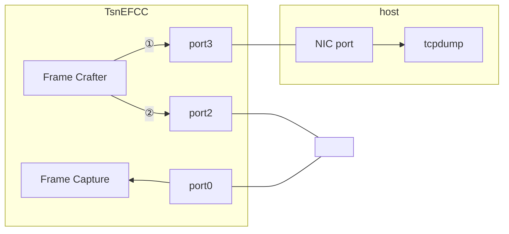
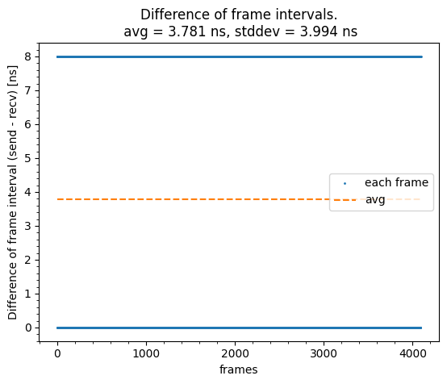
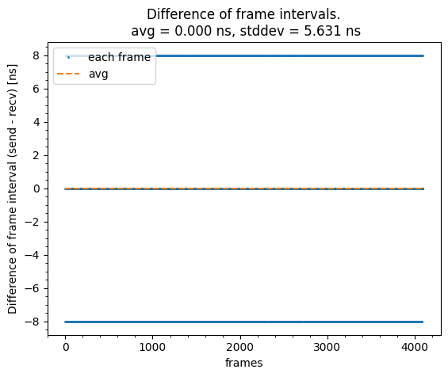

# Evaluation data of Synthesized Frame Crafting of TSN EFCC.

This directory shows the evaluation result of the frame crafting capability of TSN EFCC.  
Random frames are generated by our ef_crafter, and the frame information (header, length, etc.) is validated with tcpdump.  
In addition, the frame interval of ef_crafter is also validated with tcpdump.

## Files

```
├── compare_and_plot.py                        : plot script
├── compare_fcrf_and_fcap.png                  : The difference of frame interval between frame crafter (fcrf) and frame capture (fcap)
├── compare_fcrf_and_tdump.png                 : The difference of frame interval between fcrf and tcpdump (tdump)
├── eval.py                                    : evaluation script
├── frameinfo.csv                              : The header information of input frames
├── hist_fcrf_and_fcap.png                     : Histogram of the difference of frame interval between fcrf and fcap
├── hist_fcrf_and_tdump.png                    : Histogram of the difference of frame interval between fcrf and tdump
├── host.csv                                   : Frame information generated by host.pcap file
├── host.pcap                                  : Capture result of tcpdump
├── parse_pcap_to_csv.py                       : A script to generate host.csv from host.pcap
├── README.md                                  : This file
├── recv_timestamp.csv                         : Capture result of fcap
├── send_interval_vs_diff_fcrf_and_fcap.png    : The difference of frame interval between fcrf and fcap. x axis is fcrf's interval
├── send_interval_vs_diff_fcrf_and_tdump.png   : The difference of frame interval between fcrf and tdump. x axis is fcrf's interval
└── send_timestamp.csv                         : Capture result of fcrf
```

## Network configuration



## How to run evaluation

### Host machine

In host machine, start frame capture with the following command:

```
tcpdump -i <if_name> -w host.pcap --time-stamp-precision nano --time-stamp-type adapter_unsynced ip
```

The `--time-stamp-type` option determines how the timestamp is captured.  
This timestamp is expected to a hardware timestamp, not a software one.  
Available `--time-stamp-type` values can be checked with the following command.

```
$ tcpdump -J
Time stamp types for enp2s0 (use option -j to set):
  host (Host)
  adapter_unsynced (Adapter, not synced with system time)
```

### TSN-EFCC

#### Setup

- Connect KC705's USB port to any host machine.
- Program KC705 by TSN-EFCC bitstream.
- Check the AXI JTAG target value of xsdb, and run `export efcc_target=<this value>`.

#### Run test sequence

This script generates a sequence of test frames and sends them to port 2 and port 3 respectively.

```
$ python3 eval.py --efcc_jtag_target <N>
xsdb server launched.
==== Test sequence ====
Frame0000.ETHER(dst=181, src=109).IPV4(dst=11, src=72).VLAN(id=169, pcp=5).Payload(length=331).AdditionalWait(45)
Frame0001.ETHER(dst=181, src=109).IPV4(dst=11, src=72).VLAN(id=169, pcp=5).Payload(length=59953).Nop().AdditionalWait(70)
Frame0002.ETHER(dst=93, src=42).IPV4(dst=207, src=54).VLAN(id=87, pcp=2).Payload(length=429).AdditionalWait(73)
Frame0003.ETHER(dst=93, src=42).IPV4(dst=207, src=54).VLAN(id=87, pcp=2).Payload(length=37669).Nop().AdditionalWait(87)
Frame0004.ETHER(dst=157, src=235).IPV4(dst=58, src=179).VLAN(id=462, pcp=5).Payload(length=1348).AdditionalWait(77)
Frame0005.ETHER(dst=157, src=235).IPV4(dst=58, src=179).VLAN(id=462, pcp=5).Payload(length=53100).Nop().AdditionalWait(10)
Frame0006.ETHER(dst=169, src=69).IPV4(dst=60, src=155).VLAN(id=34, pcp=5).UDP(dst=38762, src=37845).Payload(length=790).AdditionalWait(78)
Frame0007.ETHER(dst=169, src=69).IPV4(dst=60, src=155).VLAN(id=34, pcp=5).UDP(dst=38762, src=37845).Payload(length=59095).Nop().AdditionalWait(58)
Frame0008.ETHER(dst=246, src=104).IPV4(dst=51, src=33).VLAN(id=2137, pcp=2).Payload(length=780).AdditionalWait(72)
Frame0009.ETHER(dst=246, src=104).IPV4(dst=51, src=33).VLAN(id=2137, pcp=2).Payload(length=44250).Nop().AdditionalWait(51)
...
Frame8180.ETHER(dst=173, src=24).IPV4(dst=68, src=110).VLAN(id=1104, pcp=1).Payload(length=42953).Nop().AdditionalWait(89)
Frame8181.ETHER(dst=243, src=47).IPV4(dst=68, src=191).VLAN(id=2001, pcp=2).Payload(length=1006).AdditionalWait(49)
Frame8182.ETHER(dst=243, src=47).IPV4(dst=68, src=191).VLAN(id=2001, pcp=2).Payload(length=48575).Nop().AdditionalWait(63)
Frame8183.ETHER(dst=184, src=125).IPV4(dst=177, src=147).VLAN(id=1805, pcp=5).Payload(length=1451).AdditionalWait(64)
Frame8184.ETHER(dst=184, src=125).IPV4(dst=177, src=147).VLAN(id=1805, pcp=5).Payload(length=58299).Nop().AdditionalWait(11)
Frame8185.ETHER(dst=29, src=210).IPV4(dst=16, src=35).VLAN(id=2749, pcp=1).Payload(length=1244).AdditionalWait(40)
Frame8186.ETHER(dst=29, src=210).IPV4(dst=16, src=35).VLAN(id=2749, pcp=1).Payload(length=31019).Nop().AdditionalWait(37)
Frame8187.ETHER(dst=248, src=31).IPV4(dst=66, src=182).VLAN(id=1847, pcp=6).UDP(dst=27987, src=25667).Payload(length=1458).AdditionalWait(77)
Frame8188.ETHER(dst=248, src=31).IPV4(dst=66, src=182).VLAN(id=1847, pcp=6).UDP(dst=27987, src=25667).Payload(length=46451).Nop().AdditionalWait(66)
EOL()
#--------------------------------
# Evaluation1: FPGA -> host      
#--------------------------------
input MAC0-RX -> Drop
input MAC1-RX -> Drop
input MAC2-RX -> Drop
input MAC3-RX -> Drop
input EFCrafter0 -> MAC3-TX
input EFCrafter1 -> Drop
input EFCrafter2 -> Drop
input EFCrafter3 -> Drop
Start transfer
  status: Stopped
  repeat: disable
  loopcounter: 0
  framecounter: 0
  com_running: False
  com_repeat: False
  com_fno_reset: False
  sta_send_done: True
  sta_repeat_done: True
  sta_counter_reset_done: True
Done
  status: Stopped
  repeat: disable
  loopcounter: 0
  framecounter: 8183
  com_running: False
  com_repeat: False
  com_fno_reset: False
  sta_send_done: True
  sta_repeat_done: True
  sta_counter_reset_done: True
read_timestamp: |██████████████████████████████| 4095 / 4095
#--------------------------------
# Evaluation2: FPGA -> FPGA      
#--------------------------------
input MAC0-RX -> Drop
input MAC1-RX -> Drop
input MAC2-RX -> Drop
input MAC3-RX -> Drop
input EFCrafter0 -> MAC2-TX
input EFCrafter1 -> Drop
input EFCrafter2 -> Drop
input EFCrafter3 -> Drop
Start transfer
  status: Stopped
  repeat: disable
  loopcounter: 0
  framecounter: 0
  com_running: False
  com_repeat: False
  com_fno_reset: False
  sta_send_done: True
  sta_repeat_done: True
  sta_counter_reset_done: True
Done
  status: Stopped
  repeat: disable
  loopcounter: 0
  framecounter: 8183
  com_running: False
  com_repeat: False
  com_fno_reset: False
  sta_send_done: True
  sta_repeat_done: True
  sta_counter_reset_done: True
read_timestamp: |██████████████████████████████| 4095 / 4095
read_timestamp: |██████████████████████████████| 4095 / 4095
```

After the run, `send_timestamp.csv`, `recv_timestamp.csv` and `frameinfo.csv` is output to the current directory.  

Then, press `Ctrl-C` on tcpdump terminal, and confirm the number of captured frames is the same as the above log of read_timestamp line.

```
$ sudo tcpdump -i enp2s0 -w host.pcap --time-stamp-precision nano --time-stamp-type adapter_unsynced ip
tcpdump: listening on enp2s0, link-type EN10MB (Ethernet), snapshot length 262144 bytes
^C4095 frames captured
4095 frames received by filter
0 frames dropped by kernel
```

#### Evaluate the result

Copy the `host.pcap` file on pcap node to current directory.  
Then, run the following command.

```
$ python3 compare_and_plot.py frameinfo.csv send_timestamp.csv recv_timestamp.csv host.pcap
The frame transmission interval is the same as the value calculated from the header information.
Comparing the header information between the sent frames and received frames...
Success. All information is the same.
```

The log shows that the header information of the sent frames and received frames (got from pcap file) are the same.  
If they are not the same, the log will show an error message.

The below figures show the difference of frame intervals between the sender side and the receiver side.  


- Configuration 1 (to tcpdump)  
  
- Configuration 2 (to our Frame Capture)  
  

Reference information: You can use `parse_pcap_to_csv.py` to generate a comparative CSV file from a pcap file saved with tcpdump.  
Visual confirmation is also possible by comparing `frameinfo.csv` generated during transmission with `host.csv` generated from the received data.
```
$ python3 parse_pcap_to_csv.py host.pcap host.csv
```

